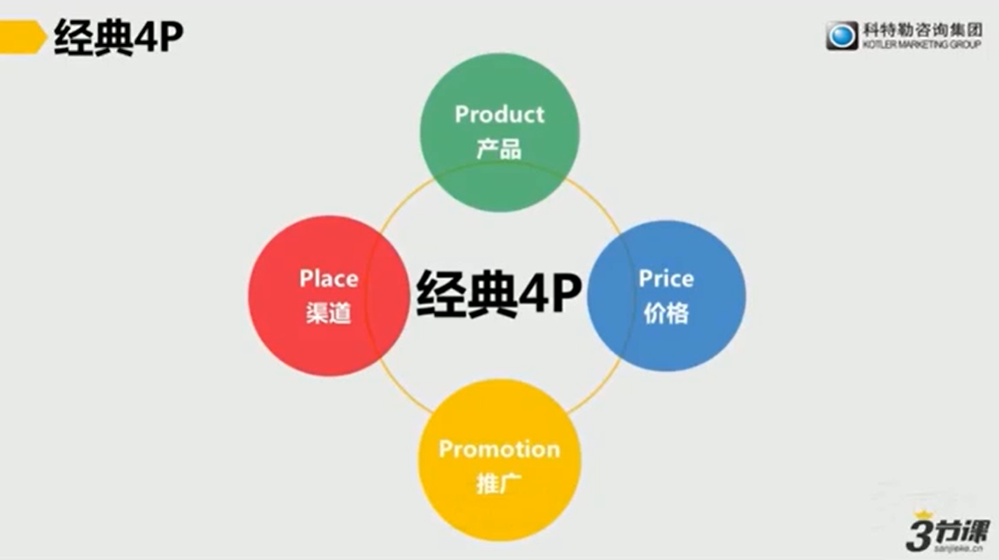
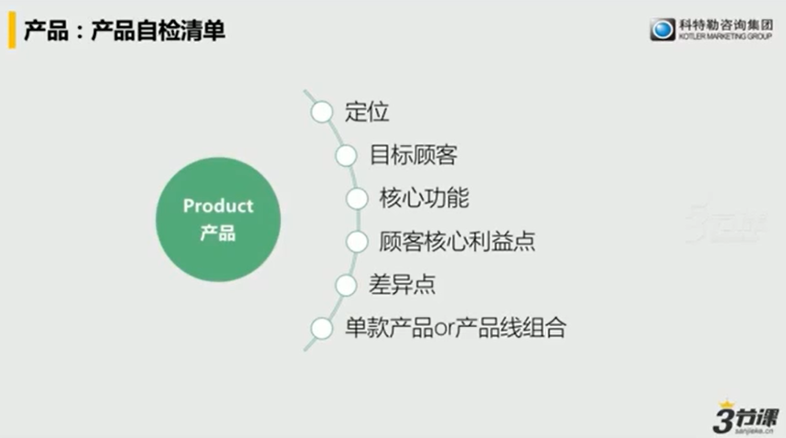
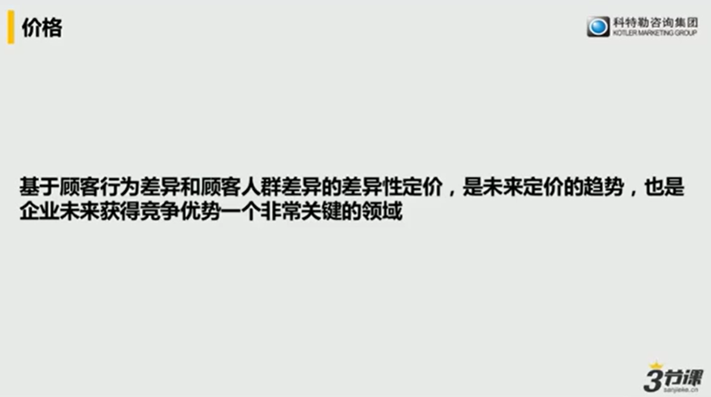

考虑不同产品线中不同产品通过结构化的互相支撑而打赢市场竞争，哪些产品是用来打价格战的，哪些产品是用来获得利润的，哪些产品是用来打造品牌的、获得领先认知的，因此关于产品的决策是营销当中非常重要的决策。在组织当中通常会根据组织的不同、行业的不同，有的设置产品经理有的设置品类经理，来专门负责产品。

- 随行就市定价法

- 成本加成定价法
  - 按照成本+合理利润率，通常用在公共事业，如高速收费站、污水处理厂，通常用在半垄断行业
- 价值定价法
  - 我的产品为顾客提供了比竞争对手更好的质量当定价跟竞争对手一样甚至更低，让消费者觉得物有所值。

- 感知价值
  - 基于顾客对产品的认知价值，为顾客创造的总体价值来定价，包含了顾客的使用价值、经济价值、情感价值。

- 歧视定价法
  - 按照顾客的人群的不同、使用场景不同、需求不同甚至过去购物的经历不同，为同样的产品定不一样的价格。如航空公司同样的座位不同的人购买价格不一样，如保险公司不同的人买的车险价格不同。

丰田汽车的客户，早上一起床打开手机微信收到第一条广告是“丰田八代凯美瑞上市了”，拿这个广告去购买可以获得优惠，起来之后打开报纸其中半版广告是“庆祝丰田凯美瑞八代上市”凭本广告可以获得50元加油券，开车出门，发现一个户外广告“某经销商庆祝丰田凯美瑞八代上市推出抽奖计划，欢迎到店参与活动”，打开车里收音机听到第一个广告也是庆祝凯美瑞八代上市。。。

周末顾客到店里参加活动购买了一台凯美瑞八代，究竟是哪个广告、哪个渠道起带来了最大贡献呢？很难说。

这就是进入了全媒体整合互动的时代，需要构建全媒体整合的投资模型。

除了企业单向的投放广告之外，我们新的传播线索是什么？

是顾客越来越多的成为你的品牌声音的一部分，过去是拍广告、现在是顾客为你创造自己的内容，此时的传播就不再只是传播，是融合化的客户沟通，即融合企业产生的内容、顾客产生的内容合顾客评论之后，形成综合性内容营销。

