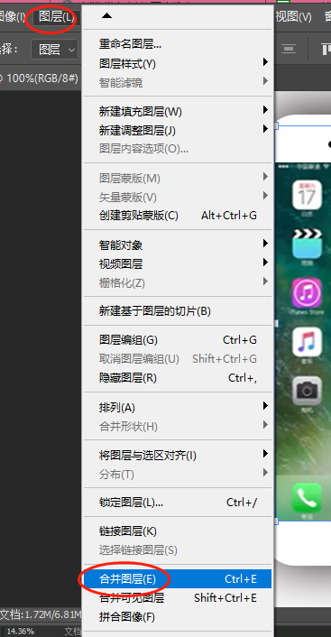
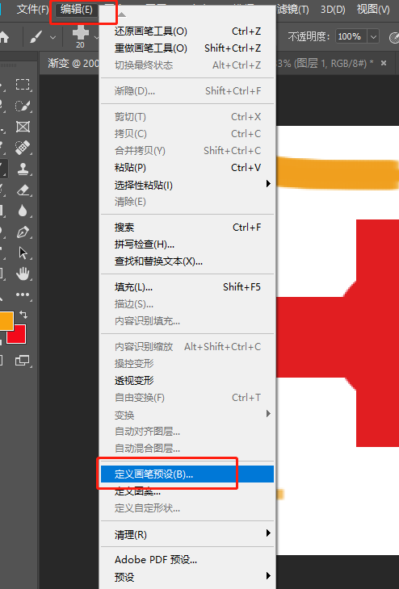
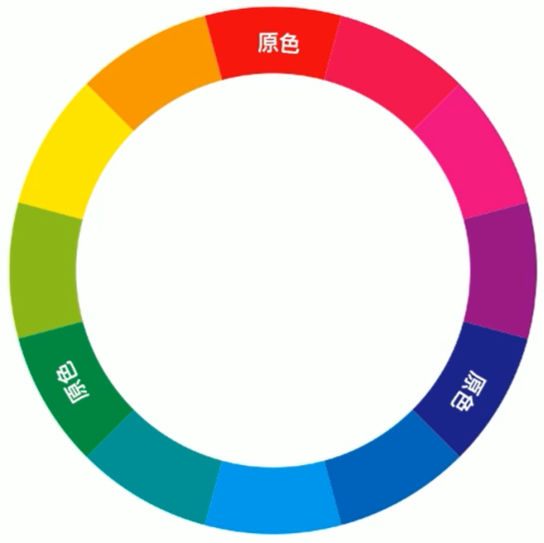

## 基本使用

### 工作区

工作区的浮动面板不见了怎么再次调出来？

方法1：在选项栏右侧点击基本功能，然后选择复位基本功能。

方法2：在菜单栏中点击工作区，再选择复位基本功能

### 设计师常见文件格式

- JPG 图片压缩格式
- PNG 包含有透明像素的格式
- GIF动态图片格式
- PSD PS格式，包含两个以上的图层

### 新建文档以及注意事项

- 快捷键：CTRL + N

- 规范命名文件，根据设计文档进行命名

- 文档类型一般选择默认大小，单位一般选像素(UI行业)，分辨率一般为72，颜色模式一般选RGB

  

### 文件存储和存储为

- 存储
  - 快捷键： CTRL + S
  - 功能是对文档进行保存操作
- 存储为
  - 快捷键: CTRL + SHIFT + S
  - 功能是对设计文档进行备份存储

### 图像的放大、缩小

方法1：

方法2：

按CTRL + "+"/"-"

方法3：

按CTRL + "空格键"，光标会变成“+”号,这时候处于放大模式，左右拖动光标可进行放大缩小

### 画布的移动

使用抓手工具

快捷键： “空格键”

### 移动工具

快捷键： V

功能：移动文档内容的图层、组、参考线，也可以复制图层或组。

### 自动选择图层或组

当文件有多个图层或组，我们可以在移动工具的情况下，将自动选择"图层或组"勾上，软件将自动找到对应的图层或组。

如果不勾选就按CTRL键来自动勾选

### 移动复制

在移动工具的情况下，按ALT键不放，光标变成双箭头，拖动鼠标移动复制对象即可

### 跨文件复制

打开多个文件时，使用移动工具选择其中一个图片，拖拽至另一个文档的选项卡上，然后向下拖拽鼠标、变成加号后松开即可。

### 图层对齐功能

PS软件中包含左中右上中下对齐方式

方法：

按住shift键点击图层，可以加选多个图层，然后顶部面板会激活对齐选项按钮：

### 自由变换

快捷键：Ctrl + T

调用该功能后，可以对图像进行拉伸、旋转（光标放在图像外部）。

### 选框工具组以及选区的取消

选框可以填充颜色

点击鼠标右键可调出其他选框工具

快捷键: M

绘制矩形选区及椭圆选区的工具

绘制正方形以及正圆形选区，需要按shift键。

从中心绘制正方形及正圆形选区：按shift +alt键

**选区的取消：**

- 绘制完成后，在选区工具被激活的情况下，点击空白处
- 绘制完选区后使用快捷键取消：Ctrl + d

###选区的布尔运算

- 新选区：已经存在的话，新的替代旧的
- 全集选区：将新的选区添加到原来的选区
- 差集选区：从原来选区中减去新的选区部分
- 交集选区：新旧选区重合部分

### 填充颜色

关于颜色，在PS软件中分为前景色和背景色

填充前景色：ALT + 退格键 （back）

填充背景色：CTRL + 退格键（back）

**注意：填充颜色前一定要养成新建图层的习惯**

### 填充对话框

快捷键：Shift + F5

### 选区的固定大小

选择选区工具，在选项栏目中选择固定尺寸，点击空白处即可绘制固定好的尺寸选区。

### 选区的修改

### 撤销

CTRL + ALT + Z

打开历史记录面板，对操作的记录进行反复操作。

### 图层操作

#### 隐藏或不显示图层

方法：点击图层前面的眼睛图标切换显示或隐藏图层

#### 复制图层

原位复制方法一：Ctrl + j 通过拷贝图层

原位复制方法二：将图层拖拽至图层面板上的新建图层按钮上

#### 新建图层

- 在图层面板下方点击新建按钮
- 带有对话框新建图层（Ctrl + shift + n）

- 快捷键 Ctrl + Shift + Alt + N

#### 调整图层顺序

- 选中图层，然后拖拽至合适的位置
- 也可以通过图层排列进行调整

#### 载入图层对象的选区

方法：在图层列表，按CTRL键不放，在图层缩略图上点击即可

#### 合并图层

选择要合并的图层，点击菜单栏的【图层】然后选择【合并图层】

#### 图层的选择

挑选图层：Ctrl + 鼠标点选

连续选择图层：按住shift 键，然后点击第一个图层和最后一个图层

#### 图层锁定

1、**锁定透明像素：透明区不能编辑**

2、锁定像素：不能进行任何像素的编辑（改变颜色、删除颜色）可以移动位置

3、锁定位置：不能移动位置

4、画板防止嵌套：如果新建的是画板文档，锁定后不能将画板1中的元素移动到另一个画板

5、**锁定全部：不能对当前图层做任何更改**

### 套索工具

**快捷键：L**

#### 套索工具

功能：可以创建不规则选区

用法：直接使用鼠标左键不放绘制到开始位置即可

#### 多边形套索工具

功能：绘制直角或尖角的选区

用法：单击鼠标左键松开，反复同一步骤，直至完成。如果出现误操作时可以**按退格键或删除键来删除"点"**。

#### 磁性套索

功能：工具可以自动识别背景与前景的边缘部分，适用于背景色单一或者边缘清晰度比较强的图像。

用法：点击鼠标左键松开鼠标顺应的对象边缘，直至完成，如果出现误操作可以按退格键或者删除键来删除“点”

## 图像基础合成

### 1、透底图

一张图片，将我们需要的地方保留（抠图），不需要的制作成透明的

重点：透底图一定要存储为psd或者png格式才支持透明，否则会自动变为白底。

### 2、图像合成

将两张或多张图，放到一起，形成一个新的画面。

#### 方法：

1、打开一张图像，或者新建一个画布

2、将我们需要合成的图片，直接拖动到新的画面中，合成一个新的画面

#### 快速选择

功能：快速选择需要载入选区的部分

用法: 单击鼠标左键拖动，向外拉、拓展，在使用中根据需要不断调整笔触大小。

笔触大小调整方法：左括号“[”变小，右括号“]”变大。

**如果选区选多了，可以按alt键，减少选区。**

## 魔棒工具

功能：可以快速选择背景单一的色彩区域

容差：选择的颜色范围

**连续：如果选择连续那么不连续的颜色将不会被选中**

### **反选**

功能：反向选择，选择当前选区之外的部分

快捷键： ctrl + shift + l

## 渐变编辑器

快捷键：G

阐述：渐变工具应用十分广泛，它可以填充到选区或者整个图层、蒙版、通道、叠加到图层，也可以填充形状或者描边，渐变工具不能用于索引和位图模式。

### 预设区：

- 软件自带的常用渐变库

### 设置不透明度

选择需要的不透明度色标，在下面不透明度框中输入数据即可，删除：向下拉动，添加：点击空白处

### 设置色标

选择色标，双击或者点击颜色更改即可

### 添加色标

在色标轨道上任意位置点击即可添加色标

### 删除色标

选择要删除的色标，向下拖动即可删除

### 色标的位置

选择色标，拖动到合适的位置，也可以输入精确位置数据

### 复制色标

选中色标，点击空白处，也可以按住ALT键拖动复制

### 渐变类型

#### 线性渐变

功能：以直线或角度线的形式表达渐变效果

#### 镜像渐变

以起点到终点为半径，绘制中心向四周扩散或放射的形式表达渐变

#### 角度渐变

以直线为起点，顺时针的形式呈现渐变效果

#### 对称渐变

以中心为轴，向两边延伸出相同的渐变

#### 菱形渐变

以起点为中心向四周延伸菱形渐变效果

### 路径

外观：路径是由一个或多个直线段以及曲线组成，外观上看它是一个黑色实线

#### 用途

抠图、路径描边、绘画

#### 路径的构成

- **锚点**
  - 锚点定义了每一段路径的起点和终点，锚点又分为"平滑锚点"和"角点"

- **路径段**

路径段又分为“直线段”和曲线段

#### 钢笔工具

快捷键：P

一般情况下，使用该工具多用于抠图，所有选择该工具时检查属性栏中的**“路径”**选项

#### 直线段绘制

首先选择钢笔工具，判断锚点与下一个锚点间是直线还是曲线，如果是直线就点击松开鼠标以此类推

#### 曲线段的绘制

首先选择钢笔工具，判断锚点与下一个锚点间是直线还是曲线，如果是曲线段，那么左键不放拖动鼠标到路径吻合后松开鼠标，按alt键在锚点处将多余的控制手柄打断。依次类推操作即可。

**钢笔工具抠图和选区抠图的区别：**

**钢笔抠图：**

- 优点：抠图边缘非常平顺，适合产品抠图
- 缺点：工具需要时间练习方能掌握，抠图较慢

**选区抠图：**

- 优点：选区抠出来的效果非常粗糙，不适合产品抠图
- 缺点：抠出来的效果非常粗糙，不适合产品抠图

#### 路径修改

小白与小黑

快捷键：A

- 路径选择工具（小黑）
  - 功能：用来选择路径，并可以对路径进行自由变换以及复制（按alt键）
- 直接选择工具（小白）
  - 功能：可以选择路径中“锚点”，并且可以修改选中锚点的位置，还可以选中锚点来修改路径弯曲度。

#### 添加或删除锚点

 

- 添加锚点
  - 功能：可以在路径上任意位置点击，以添加锚点
- 删除锚点
  - 功能：可以对路径上的已有锚点进行删除操作
- 转换点工具
  - 可以将角点转换成平滑节点，也可以将平滑点转换成角点
  - 方法：点击或者拖动

#### 路径的存储

方法：勾完路径后直接对图片进行存储即可将路径保存到这张图片，然后打开可以继续使用。

删除: 选中小黑后，点击delete键

#### 路径转换为选区

- 在钢笔工具的选项栏点击“选区”
- 在路径面板中点击下方的路径转换为选区按钮
- 快捷键：ctrl + 回车键

### 图层透明度

功能: 将当前图层进行透明化处理，可以看到下层图像内容。

### 画笔工作组

**快捷键：**B

**功能：**可以使用该工具在画面中进行涂抹以及绘画，也可以利用画笔对设计作品画面进行装饰

#### **画笔的属性**

**画笔的大小更改**

按键盘上的中括号:左括号缩小笔触，右括号放大笔触

**画笔的生硬度更改**

方法：

模糊（柔边）：shift + 左括号

清晰（生硬）：shift + 右括号

#### 画笔的面板

常用设置：

- 大小
- 间距
- 形状动态
- 散布
- 传递

#### 画笔的定义

可以根据需要自己定义画笔的形状

黑色：不透明

灰色：半透明

白色：透明（不要用这个颜色定义画笔）

彩色：半透明

#### 画笔路径描边

**方法一：**

绘制好路径后设置画笔的属性，在画笔工具情况下直接按回车键即可使用画笔对路径进行描边

快捷键：回车

**方法二：**

绘制好路径后设置画笔的属性，在钢笔工具、形状工具、小白小黑工具组的情况下在路径上单击右键即可描边

### 图案定义

可以自定义绘制图案，对其进行定义，方便后续继续使用，也可以将网上下载的图案进行定义

**方法：**

绘制好图案，在编辑菜单中选择定义图案，使用填充选  项中的图案，找到指定的图案使用其进行填充即可。

### 选区描边

功能：对选区边缘（内部、中部、外部）进行描边

方法：在画完选区后，点击“编辑”->“描边”

### 文字工具

**快捷键：**T

**特点：**文字工具输入时不需要新建图层，会自动新建一个图层，文字的颜色是由前景色而定的。

**文字提交的方法：**键入文字后在选项栏中点击“对号”或者按CTRL+回车键提交

 **提交后可更换文字的样式：**（文字工具模式下才会显示一下菜单）

#### 字符面板详解

- 更改字体大小：
  - CTRL + SHIFT + 大于号/小于号
- 更改行距：
  - ALT + 上下方向键
- 更改字距：
  - ALT键 + 左右方向键
- 更改字与字间距：
  - 把光标定位到两字中间按ALT + 左右方向键

#### 段落文字

如何创建一个段落：

使用文字工具在空白处点击拖动拉出文本框即可。

### 位图与矢量图

#### 位图：

组成： 像素的组成，没有任何保护措施所以变化大小后会失真。

优点：颜色非常丰富

缺点：变换大小后会失真

#### 矢量图：

组成：路径 + 像素组成伪矢量（路径在保护它的像素）

优点：变化大小不失真

缺点：颜色单一不丰富

### 形状工具组使用方法

快捷键：U

特点：在创建形状时，图层上会自动创建一个形状属性的图层

应用领域：网页设计，UI设计，创意插画，电商设计

使用方法: 选择工具拖动绘制或者选择工具点击空白处自定义尺寸绘制

注意：通常情况下选择该组工具会选择**形状属性**

**其他选项：**

- 形状：绘制一个形状属性的图层，既有颜色又包含路径属性

- 路径：绘制一个新路径，无色图层
- 像素：绘制一个有颜色，无路径的像素层（需要手动新键图层）

### 常用形状工具

- 矩形工具
  -  绘制正方形或长方形，使用方法与选区绘制相同
- 圆角矩形工具
  - 绘制带有圆角的属性的形状（可以在属性面板中直接更改圆角大小）
- 椭圆形工具
  - 绘制正圆形或椭圆形
- 多边形
  - 可以绘制多边形，也可以绘制星形，根据需要调整参数即可
- 直线工具
  - 绘制时按shift强制水平或垂直
- 自定义形状

### 形状填充颜色与描边颜色属性

#### 填充属性

- 无填充：将当前图层填充颜色设置为无的状态
- 单色填充：颜色为纯色，在对话框的右上角可以点击自定义颜色
- 渐变填充：将填充改为渐变，更改颜色时双击，复制色表按ALT键
- 图案填充: 将形状的填充改为图案填充，可以根据需要更改图案的显示比例

#### 描边颜色属性

**描边的粗细：**可以直接输入数值更改粗细，也可以直接拖动来修改

**描边的选项：**实线描边、虚线描边、圆形虚线描边

**对齐类型：**内部描边、居中描边、外部描边

**角点类型：**直角、圆角、切角，如果对齐类型选择为外部时该项无效

**端点类型：**平头、圆头、包头，该选项是针对开放路径起作用的

#### 形状羽化

选择形状后在属性面板中选择蒙版按钮，根据需要调整羽化属性即可。

#### 形状的尺寸

根据需要可以对形状后期修改它的宽和高。

#### 形状的布尔运算

- **新建图层：**每绘制一个形状就创建已给形状图层
- **合并形状：**后面绘制的形状一直与前面绘制的形状在一个图层上（按SHIFT键）
- **减去顶层：**用后面绘制的形状将前面绘制的形状进行减去。（按ALT键）
- **形状相交：**后面绘制的形状与前面绘制的形状重叠的部分保留下来（按ALT + SHIFT键）
- **排除重叠：**后面绘制的形状与前面绘制的形状重叠的部分区域镂空
- **合并形状组件：**将多个路径合并成一个路径，不能再单独修改

#### 图层编组

快捷键：CTRL + G

### 形状的合并

选择多个形状直接向下合并，多个形状合并时取最上层的颜色为结果色，形状合并后依然保留多个路径

### 形状绘制技巧

在绘制形状时，我们可以在鼠标左键以及SHIFT键不放的同时按空格键可以改变绘制形状的位置。

### 创建剪切蒙版

将上层图层内容放置到下层图层内，并且可以以下层边缘为基准进行蒙版

**快捷键：**Ctrl + Alt + G

**其他方法：**按ALT键，将鼠标悬停到两层之间点击即可

## 色彩

色彩是**可见光**导致的**视觉**现象，光是一种电磁波，不同的波长可见光投射到物体上一部分被吸收，一部分被反射到人眼，大脑把这种刺激反映到色彩信息，所以说没有**光**就没有**色彩**可言。

**大自然界中有多少中颜色？**

255`*`256`*`256

### 颜色模式

在PS软件中，颜色模式分为：位图、灰度、RGB颜色（最常用）、CMYK颜色（常用）。

### RGB:（红、绿、蓝）

基于光学调色原理（调色中最常用的一种模式，多用于显示在电子设备上）

R：红色

G：绿色

B ：蓝色

#### 参数

1、通过0~255（256阶级）之间的整数进行混合

2、红色：R255 G0 B0 绿色：R0 G255 B0 蓝色 R0 G0 B255

3、纯黑：R0 G0 B0 纯白：：R255 G255 B255

### CMYK（青、洋、黄、黑色）

油墨的混色模式（通常应用于印刷或打印）

#### 参数

通过0~100（100阶级）之间的整数进行混合

C：青色

M：洋红（品红）

Y：黄色

K：黑色

C100=青色 M100=洋红 Y100黄色 K=100黑色

### 颜色三要素

**H：**色相

**S：**饱和度

**B：**明度

#### 色相

颜色的样貌，它长什么样？

赤（红）、橙、黄、绿、青、蓝、紫色

#### 饱和度

颜色的浓度，或者颜色的鲜艳程度。

#### 明度

指的是颜色的明暗程度。

#### Tips

### 颜色分类

颜色分为：原色、间色、复色

色彩中不能再进行分解的颜色称为原色，通常指的是红色、绿色、蓝色。

#### 三原色

色彩中不能再进行分解的颜色称为原色，通常指的是红色、绿色、蓝色。

#### 间色

是由两个原色混合得到间色，通常指的是：青色、洋红、黄色

#### 复色

由原色与间色混合或者间色与间色混合得到复色。

### 颜色通道

一个图片中包含：复（综）合通道、红色通道、绿色通道、蓝色通道

### 通道的作用

通道用来存储颜色信息、可以调整颜色或者载入选区。

- 纯白色：表示存储的颜色的色值高为255
- 纯黑色：表示存储当前通道的颜色色值为0
- 灰色：表示存储当前通道的颜色的色值为0~255

总结: 以上三种词汇是指对于当前通道来说，而且如果通道中是白色就两种意思，一种是可能包含当前通道中的颜色的色值较高，一种情况是当前原色为白色。

### 调色与校色

- 调色：指的是将正常图片调整为我们想要的颜色风格
- 校色：将不正常的图片处理为正常的颜色图片

### 亮度对比度

**快捷键：**ALT + I + J + C

**功能：**调整图像中的亮度与对比度，使图像中亮的更亮，暗的部分更暗，也可以单独调整亮度，不调整对比度。

### 直方图基本使用方法

**功能：**用来查看图像彩色信息是否正常。

**技巧：**将直方图下拉菜单中的全部通道视图打开，查看山峰中信息是否平衡。

### 色阶

**快捷键：**CTRL + L

1、通道：可以选择某一个通道进行调整颜色的明暗或鲜艳程度

2、通道：可以选择某一个通道进行调整颜色的明暗或鲜艳程度

2、山峰（直方图）：会有黑场、灰场、白场。将黑场向右调整对应的通道会变暗，将白场向左调整对应的通道会变亮。

3、**注意：**如果需要使用色阶来矫正图像颜色，那么这张图像一定要是原片。否则该方法将不能调整，并不是所有照片都需要对齐所有通道进行调整。

### 色彩平衡（加色命令）

**快捷键：**CTRL + B

**功能：**调整图像中的阴影、**中间调**、高光的色彩平衡度。

### 色相饱和度

**快捷键：**CTRL + U

**功能：**更改图像中的色相、饱和度、明度，也可以选择其中一个颜色进行调整

**手动调整：**选择鼠标左右拖动即可自动识别所要调整的颜色，只调整饱和度

**着色：**为当前图层整体指定一种颜色。

### 去色与黑白区别

#### 去色

**去色：**直接将当前图像变成黑白灰，将彩色信息去除。

**快捷键：**CTRL + SHIFT + U

#### 黑白

**功能：**将图像变成黑白，但是我们可以针对图像中某一个颜色将它的黑白灰程度进行精细的调整。

**快捷键：**CTRL + SHIFT + ALT + B

### 曲线使用

**快捷键：**CTRL+ M

**功能：**它是色相饱和度、色彩平衡、色阶、亮度对比度等功能、

**用法：**直接使用鼠标在基线上进行拖拽，一般左上角提是变亮的，向右下角是变暗的

**手动调整：**选择某一个位置进行上下拖动

### 可选颜色

**功能：**可以与色相饱和度较为接近，它可以更加精细的对某一个颜色进行细致调整，例如增加颜色或减少颜色。

### 渐变映射

