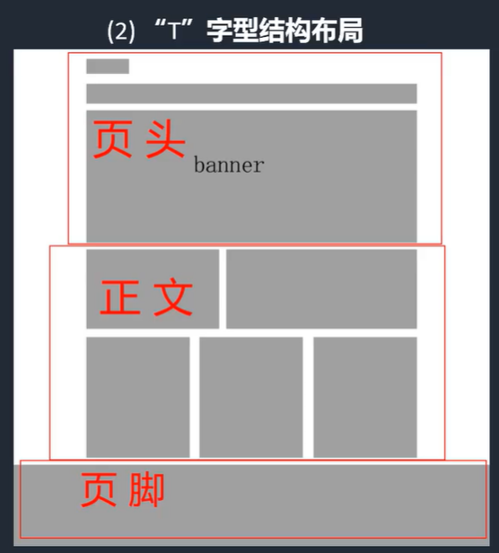
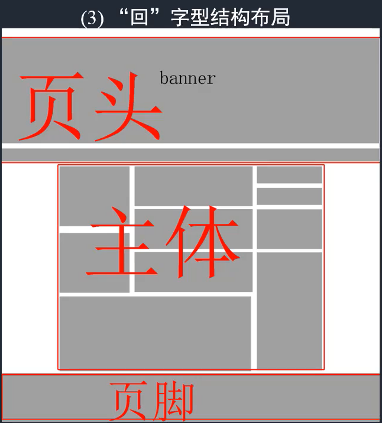
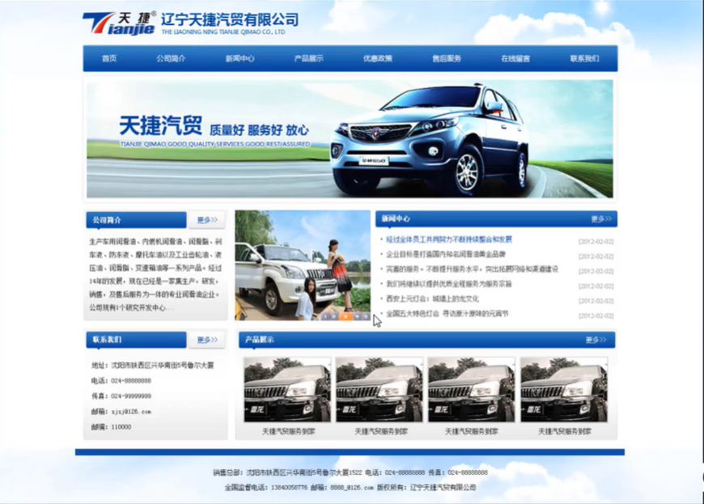

### 网站的分类：

- 门户类网站
- 电子商务类网站
- 企业网站
- 社区网站（个人空间主页微博）
- 游戏类网站

### 网页基础构架

- LOGO网页标志
- 导航条
- 宣传区一般为大图或FLASH
- 内容栏目区
- 版权信息

### 网页设计规范

（1）网页尺寸 分辨率 模式规范

在IE6.0下，宽度为显示器分辨率减21，比如1024的宽度-21就变成1003。在Firefox下，宽度的分辨率减19。

比如1024的宽度-19就变成1005；在Opear下，宽度的分辨率减23.比如1024的宽度-23就变成1001；所以如果是1024的分辨率，你的网页不如设置成1000安全一点。

分辨率：72像素/英寸

色彩模式：RGB模式

### **tips：如何调出标尺**

Ctrl + R

鼠标放到左边的标尺上，按住鼠标向右拖动到画布上，即可调出竖直的参考线， 将鼠标放到上边的标尺上，按住鼠标向下拖动到画布上，即可调出水平的参考线。

最后若想清除这些参考线，点击菜单栏“视图”，“清除参考线”即可。

### 图层命名规范

图片命名规范：建立良好文档规范，养成图片命名习惯，有利于源文件的移交、继承和重用，能有效提高工作效率，利于合作。

**样例：**

### 页脚规范

居中对齐 左对齐右对齐 切在1000范围内

### WEB元素的基本打造

网页元素广泛应用到WEB设计的各个地方，是网页设计最基础也极其重要的部分。

#### **网页视觉区组成部分：**

- 图片/flash素材
- 网页元素
- 文字

#### **网页元素包括：**

- 导航
- 按钮
- 图标（UI）
- 装饰条
- 边框

#### **网页元素基础风格：**

- 平面
- 体积
- 光感
- 凹面

#### 按钮的基本打造

- 有别于背景的外框（这个框可以是任何集合形体。比如方、圆、椭圆等等。最为常用的为圆角矩形）
- 有对应的文字/图标（下载、注册、充值、搜索、登录、抽奖等等）
- 按钮的本质特点就是可以点击

##### 按钮的形状表现

- 按钮尽可能看起来比较饱满
  - 虽然我们可以应用任何形状，不过还是尽可能饱满一点的形状比较靠谱

##### 按钮的尺寸

页面当中按钮的大小也决定了其本身的重要级别，但也不是越大越好，尺寸应该适中，因为按钮大到一定程度，会让人觉得那不像按钮，潜意识的认为那是一块区域，导致没有点击欲望。

##### 文字大小

##### 按钮的角色

按钮本身的颜色（按钮作为需要触动浏览者（用户）来进行点击，本身效果需要更加醒目而突出。）

##### 按钮的状态

常规做一个按钮需要做出他的两种状态，有的需要做出按钮的4种状态

- **link** 正常状态下
- **hover** 鼠标划过状态
- **active** 按下鼠标时的状态
- **visited** 鼠标点击后再次停留在上面的状态

### 导航

网页导航就是指通过一定的技术手段，为网站的访问者提供一定的途径，使其可以方便地访问到所需要的内容。

#### 导航条分类

**主导航**

主导航一般位于网页页眉顶部，或者banner下部。第一时间引导网友指向他所需要的信息栏目。

**次导航**

次导航一般位于网站的两侧。当用户需要浏览网页时，想去别的栏目看看，可以通过次导航栏进入其他栏目。

**面包屑导航**

面包屑导航是一个位置导航，可以清楚地让用户知道，自己所在的网站的位置。面包屑导航（或称为面包屑路径）是一种显示用户在网站或网络应用中的位置的一层层指引的导航。如“主分类>一级分类>二级分类>三级分类>......>最终内容页面”这样的方式。

#### 网站导航条的设计原则

- 网站导航条的色彩要与网站的整体相融合
- 导航的放置位置要明确（一般在网站的banner下面或是网页的顶部.）
- 导航层次要清晰

#### 了解网页导航的基本准则

- **组织良好的链接**
  - 确保你的链接按照重要性有序排列。浏览者能在不同分类中轻松找到他们想搜索的内容。
- **清晰且鲜明**
  - 一旦你决定做链接，需要考虑把它们置于最优位置。导航必须突出且鲜明。
- **连贯性**
  - 导航必须清晰且连贯。在网站每一页的相同位置都应该设有相同的重要链接
- **易于理解**
  - 确保链接言简意赅。通常你不会有很大的空间来设置长链接，确保空间的有效利用。
- **菜单**
  - 如果你的每个一大堆的分类栏和子栏，你需要导航菜单来帮助你组织链接

**总结：**导航表现形式不限，方便用户浏览

### tips：显示/隐藏参考线

CTRL + ;

### tips：图层后移

CTRL + [

### tips：创建剪切蒙版

将上层图层内容放置到下层图层内，并且可以以下层边缘为基准进行蒙版

**快捷键：**Ctrl + Alt + G

**其他方法：**按ALT键，将鼠标悬停到两层之间点击即可

### tips: 合并图层

CTRL + E

### tips：色系视觉效果

深色为“后退色”，表现为远距离；

浅色为“前进色”，表现为近距离。

 

### web网页布局形式详解

优秀的板式设计，都表现出其构成因素间和谐的比例关系。达.芬奇说：“美感完全建立在各部分之间神圣的比例关系上”。

对于一个成功的网站来说，网站的板式布局越来越重要，好的版面设计不但会给浏览者好的印象，而且还会带来一个好心境，所谓好的心境，是指你的网站希望给浏览者带来的心情，如果你做的是娱乐网站，那么你的版面设计应该是明快、亮丽，让浏览者一进入网站，就能产生很愉悦的心情，带着这种愉悦的心情去浏览网站，于你于他都会起到事半功倍的作用，同样，如果你做的是一个历史文化站点，那么你的版面应该古朴、大方；如果是一个军事、政治站点，版面应该是凝重、整齐；如果是一个文学站点，那么就要体现出文化气息的版面设计，反之，如果版面的设计乱七八糟，访问者一进入网站就心烦你了，还没浏览内容就有走的感觉，而且以后再次光临的几率就很小了。

#### 企业网站首页布局常见形式

##### “工”字型结构布局

##### “T”字型结构布局

##### “回”字型结构布局

##### “匡”字型结构布局

##### 瀑布流式布局

美容、美体行业常见于

##### 满版式布局

咖啡厅、服装、蛋糕、手机、汽车展示行业

##### “川”字型结构布局

##### 综合型结构布局

#### 企业网站内容区布局常见形式

- 通栏
- 两栏
- 三栏
- 综合

