首先，在PS中的蒙版可以分为**图层蒙版**、**矢量蒙版**、**剪切蒙版**、**快速蒙版**四类，下面我们逐一简单介绍其不同用途：

## 图层蒙版

### 概念

- 使用蒙版可以保护部分图层，该图层不能被编辑。蒙版可以控制图层区域内部分可隐藏或是显示。更改蒙版可以对图层应用各种效果，不会影响该图层上的图像。
- **图层蒙版是灰度图像，因此用黑色绘制的内容将会隐藏，用白色绘制的内容将会显示，而用灰色色调绘制的内容将以各级透明度显示。**
- 添加蒙版后，我们所做的操作是作用在蒙版上，而不是在图层上
- 其常用于图像的合成中，让两个图像无缝合成在一起

### 常用操作

【添加蒙版】：单击图层面板上的“添加蒙版”按钮

【停用图层蒙版】：在图层栏蒙版缩略图单击右键，弹出命令对话框，选择【停用图层蒙版】

【启用图层蒙版】：在图层栏蒙版缩略图单击右键，弹出命令对话框，选择【启用图层蒙版】

【应用图层蒙版】：在图层栏蒙版缩略图单击右键，选择【应用图层蒙版】，蒙版的效果即应用在图层上，而蒙版会被去除。

【删除蒙版】：用鼠标左键按住蒙版缩略图向右下拖动到“垃圾桶”上

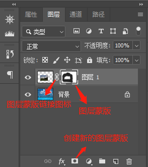

### 图层蒙版和渐变工具的结合

图层蒙版和渐变工具结合，实现倒影效果。

**原理：**图层蒙版是灰度图像，黑色绘制的内容将会隐藏，用白色绘制的内容将会显示，因此不同颜色将以各级透明度显示。

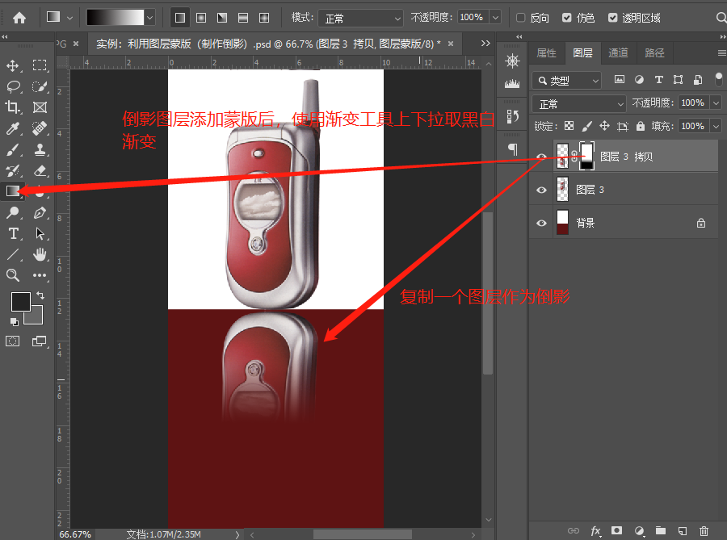

### 图层蒙版的其它形式

使用“粘贴入”实现蒙版的效果。

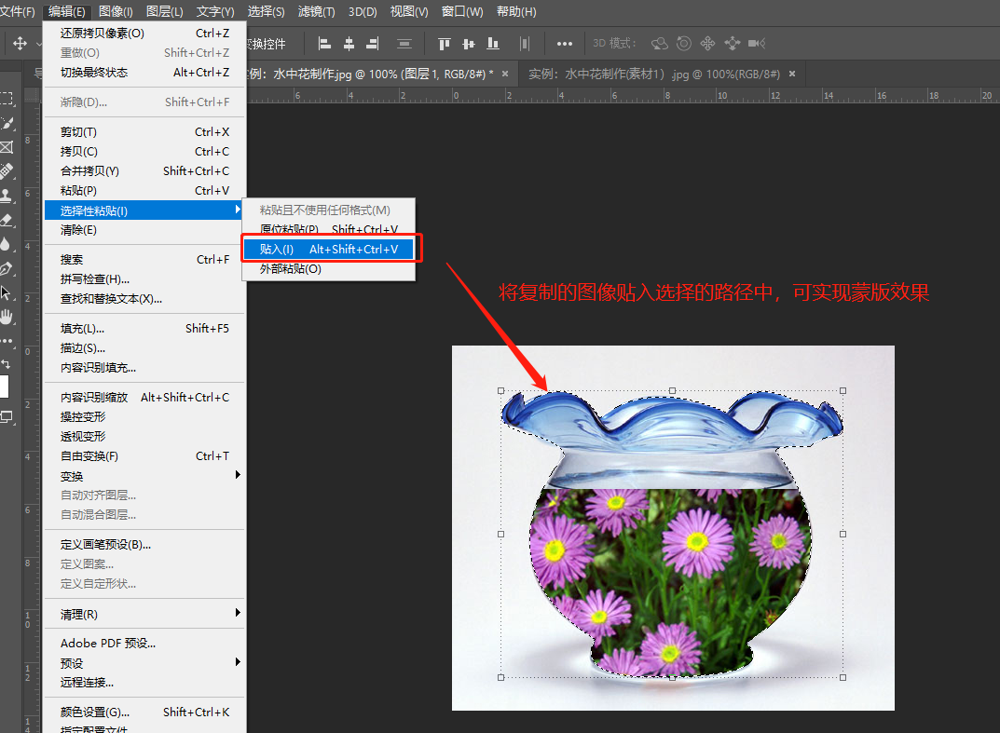

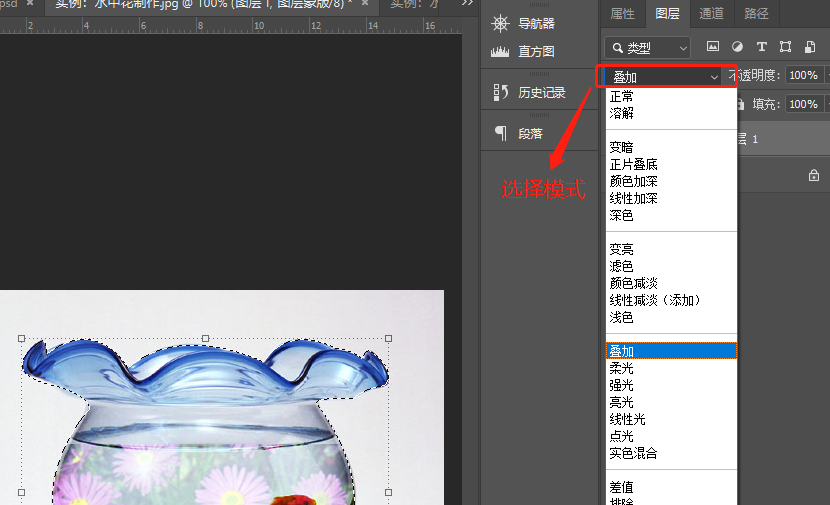

## 快速蒙版

### 概念

快速蒙版主要用于编辑选区

“快速蒙版”模式可以将任何选区作为蒙版进行编辑，而无需使用“通道”调板。将选区作为蒙版来编辑的优点是灵活，而且几乎可以使用任何PS工具或滤镜修改蒙版。例如，如果选框工具创建了一个矩形选区，可以进入“快速蒙版”模式并使用画笔扩展或收缩选区，或者也可以使用滤镜扭曲选区边缘。也可以使用选区工具，因为快速蒙版不是选区。

### 快速蒙版实例1：抠取人物

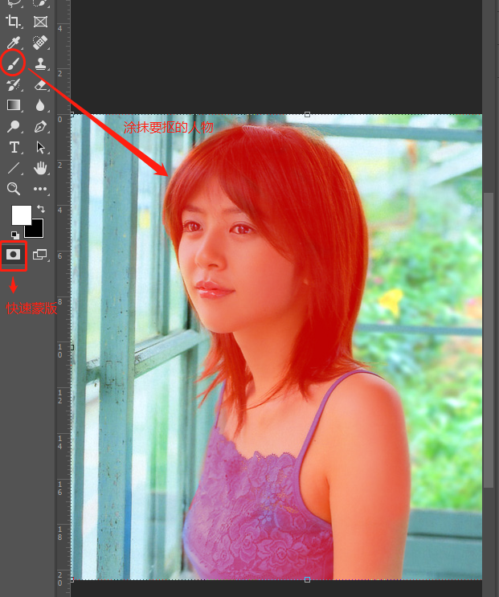

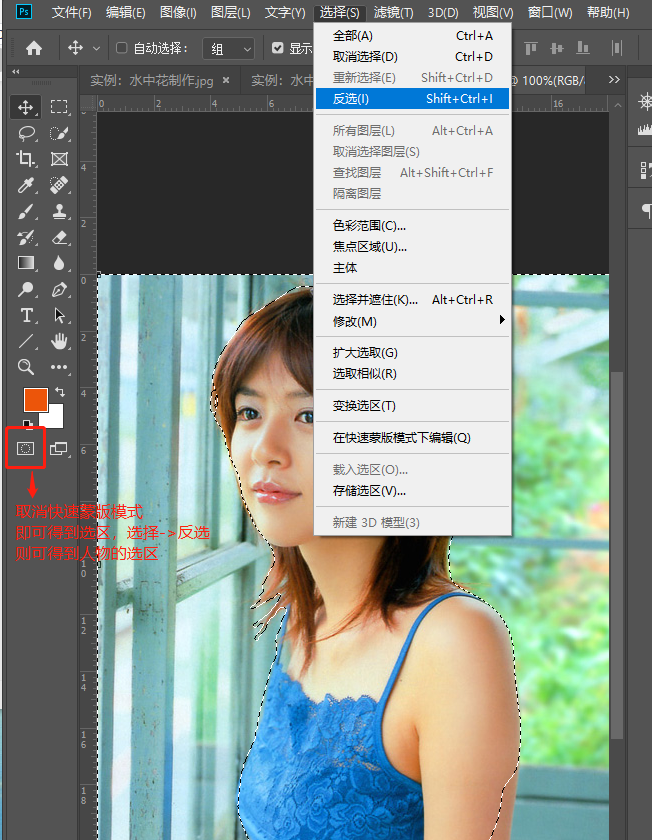

### 快速蒙版实例2：撕纸效果 

**原图：**

- 双击图层，使其转化为普通图层
- 修改画布大小，图像->画布大小，或快捷键Ctrl + Alt + C

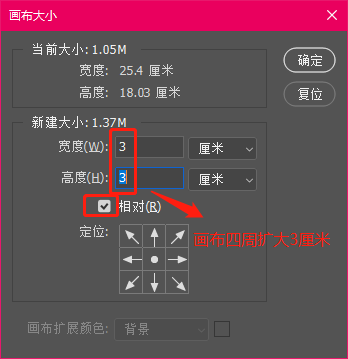

- 新将一个图层打底，将其背景色改为白色(ctrl + 退格键)

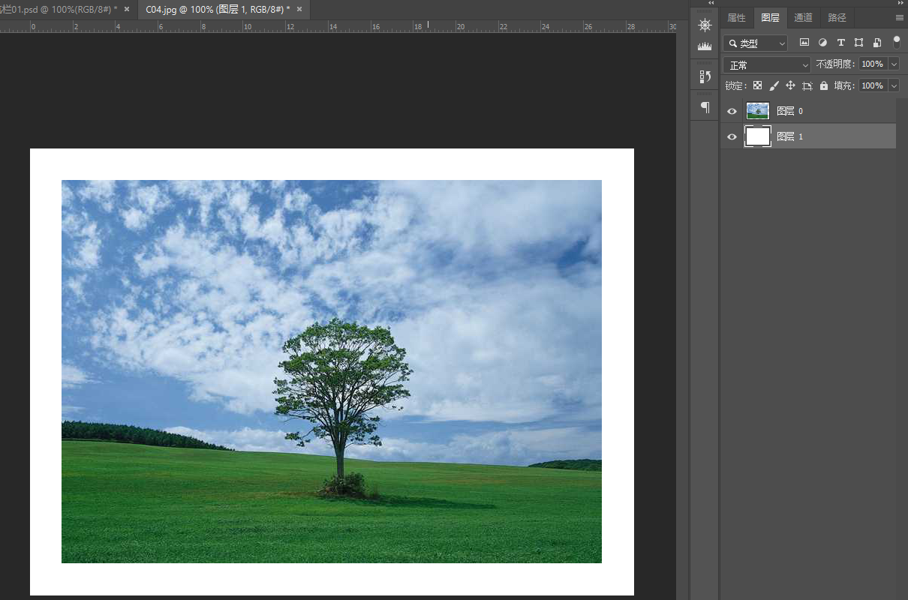

- 使用套索绘制撕裂边框选区，然后使用快速蒙版可修改选区的样式

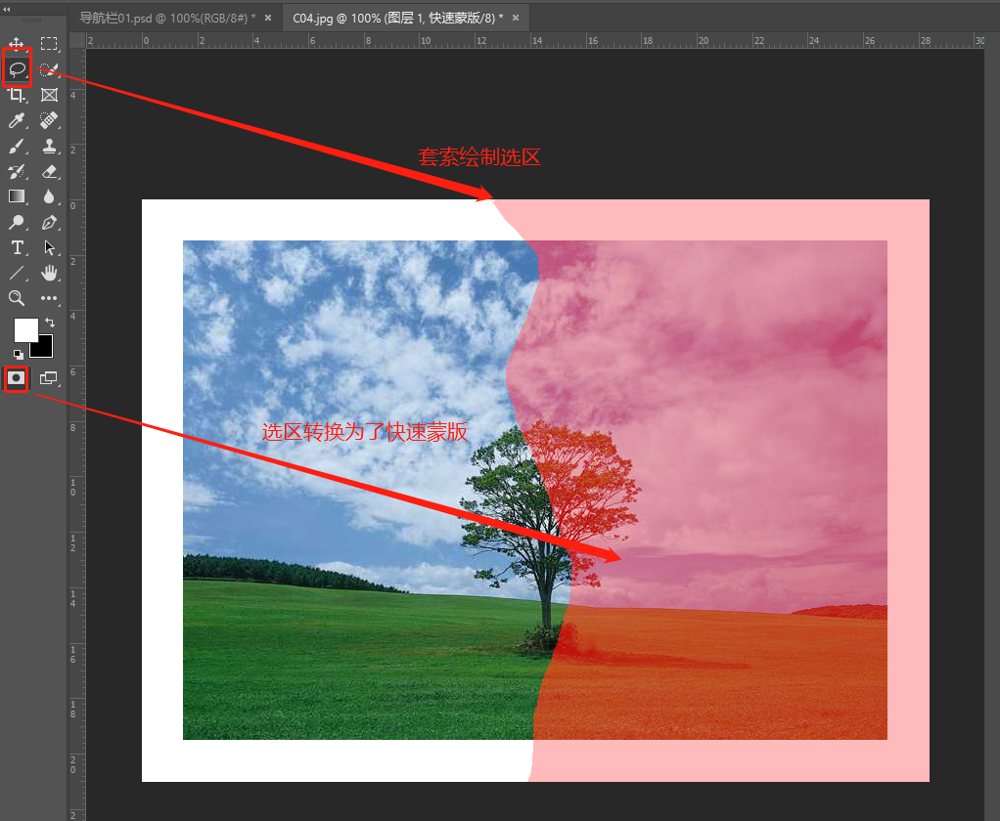

- 使用滤镜对蒙版进行编辑, 像素化->晶格化，以产生锯齿效果

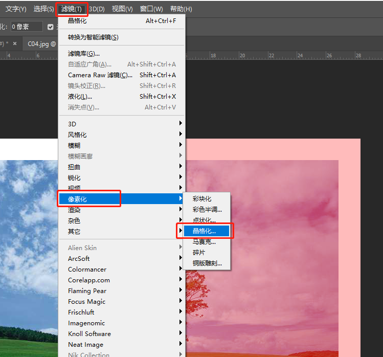

- 取消快速蒙版模式，切换回选区，ctrl + t，快速变换，左移、逆时针旋转，产生撕裂效果

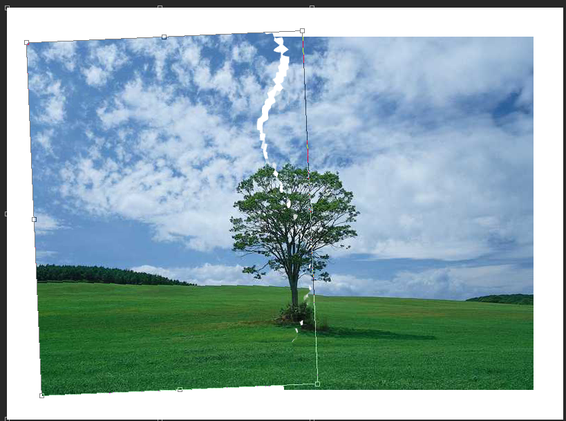

- 为使效果更逼真，给图层添加样式->投影，使其有阴影效果

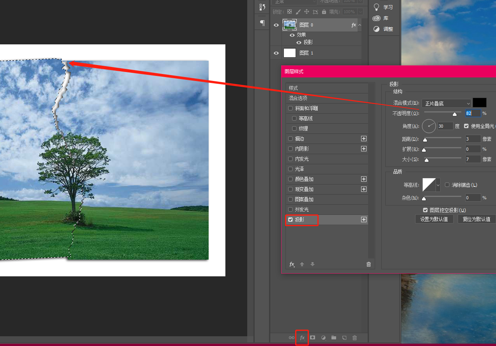

### 小技巧

- X键，切换前景色和背景色
- Q键，快速蒙版模式和标准模式的转换
- Ctrl+空格 放大镜

- 空格键 平移

## 剪切蒙版

剪切蒙版是一个可以用形状遮盖其他图层的对象。

使用剪切蒙版，只能看到蒙版形状内的区域，从效果上来说，就是将图层裁剪为蒙版的形状。

ctrl+alt+G可生成剪切蒙版

## **矢量蒙版**

矢量蒙版一般用于创建基于矢量形状的边缘清晰的效果，我们通常通过编辑路径来编辑矢量蒙版。

按ctrl+蒙版按钮可以添加矢量蒙版

