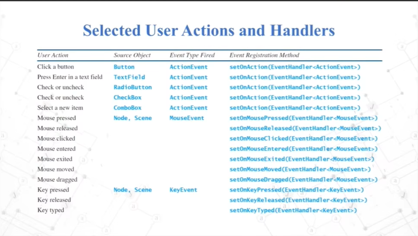

## javafx框架概念


## 最简程序
```java
package sample;

import javafx.application.Application;
import javafx.scene.Scene;
import javafx.scene.control.Button;
import javafx.scene.layout.BorderPane;
import javafx.stage.Stage;

public class Main extends Application {

    public static void main(String[] args) {
        launch(args);
    }

    @Override
    public void init() throws Exception {
        System.out.println("我是init，可以在这里做一些初始化操作。。。");
        super.init();
    }

    @Override
    public void start(Stage primaryStage) throws Exception{
        System.out.println("我是start，启动界面时同步执行");
        Button button = new Button("点击我");
        BorderPane borderPane = new BorderPane(button);

        button.setOnAction(e -> {
            getHostServices().showDocument("www.tanshuhui.com");
        });

        Scene scene = new Scene(borderPane, 300, 200);
        primaryStage.setScene(scene);
        primaryStage.setTitle("Hello World");
        primaryStage.show();
    }

    @Override
    public void stop() throws Exception {
        System.out.println("我是stop，可以在这里做一些资源清理工作，如关闭数据库连接。。。");
        super.stop();
    }
}


```

## stage
[stage类API参考手册网站](https://openjfx.cn/javadoc/19/javafx.graphics/javafx/stage/Stage.html)


常用设置
- Title 窗口标题
- icon logo图标
- resiziable 窗口是否可缩放、拖拽
- x,y, width, height 窗口位置坐标、宽高
- StageStyle 窗口样式
- Modality 是否是模态的
- event 事件，如关闭窗口事件

示例代码
```java

```

## scene

[scene类API参考手册网站](https://openjfx.cn/javadoc/19/javafx.graphics/javafx/scene/package-summary.html)

## UI控件通用方法

- layoutX / layoutY / preWidth / preHeight
- style / visible / opacity / blendMode
- tanslateX / tanslateY  rotate / scaleX / scaleY / scaleZ
- parent / scene / id


## UI属性绑定和设置监听器


## 事件驱动



## color font image


## fxml布局


## Controller的initialize方法


