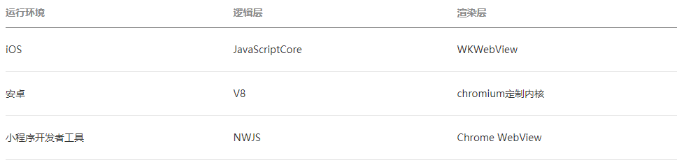

## 小程序与普通网页开发的区别

- 网页开发渲染线程和脚本线程是互斥的; 在小程序中二者是分开的，分别运行在不同的线程中
- 网页开发者可以使用到各种浏览器暴露出来的 DOM API，进行 DOM 选中和操作; 小程序的逻辑层和渲染层是分开的，逻辑层运行在 JSCore 中，并没有一个完整浏览器对象，因而缺少相关的DOM API和BOM API
- 网页开发者需要面对的环境是各式各样的浏览器; 而小程序开发过程中需要面对的是两大操作系统 iOS 和 Android 的微信客户端，以及用于辅助开发的小程序开发者工具

## 初始渲染缓存工作原理

小程序页面的初始化分为两个部分。

- 逻辑层初始化：载入必需的小程序代码、初始化页面 this 对象（也包括它涉及到的所有自定义组件的 this 对象）、将相关数据发送给视图层。
- 视图层初始化：载入必需的小程序代码，然后等待逻辑层初始化完毕并接收逻辑层发送的数据，最后渲染页面。

