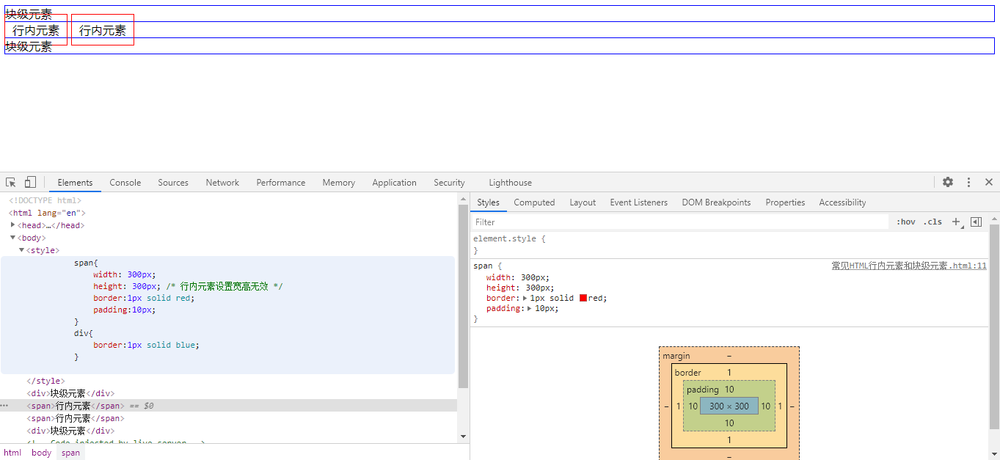
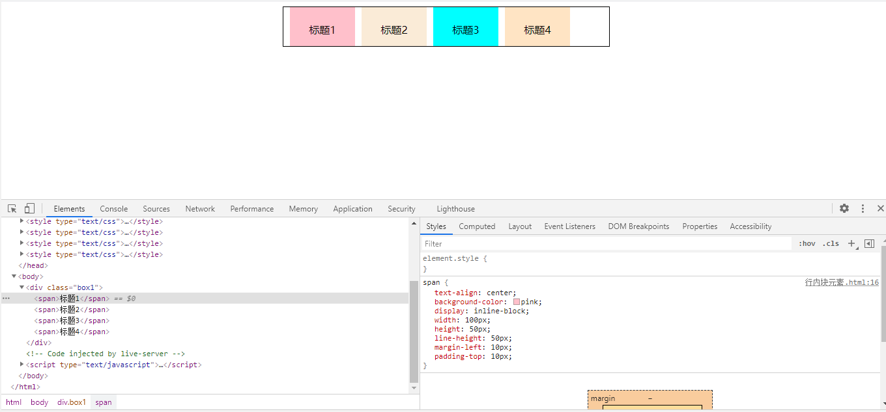

## 行内元素和块元素

​       根据CSS规范的规定，每一个网页元素都有一个display属性，用于确定该元素的类型，每一个元素都有默认的display属性值，比如div元素，它的默认display属性值为“block”，成为“块级”元素(block-level)；

​       而span元素的默认display属性值为“inline”，称为“行内”元素。

​      div这样的块级元素，就会自动占据一定矩形空间，可以通过设置高度、宽度、内外边距等属性，来调整的这个矩形的样子；与之相反，像“span”、“a”这样的行内元素，则没有自己的独立空间，它是依附于其他块级元素存在的，因此，对行内元素设置高度、宽度、内外边距等属性，都是无效的。


## **HTML常见的行内元素有：**

```
<span>、<a>、 、 <input>、<textarea>、<select>、<label>
```


还有包括一些文本元素如：

```
<br> 、<b>、 <strong>、<sup> 、<sub>、 <i> 、<em> 、<del> 、 <u>等。
```


## **HTML常见的块级元素有：** 

```
<div>、<table>、<form>、<p>、<ul>、

<h1>......<h6>、<hr>、<pre>、<address>、<center>、<marquee> 、<blockquote>  等。
```


## **它们之间的区别是什么呢？**

- **块级元素**

  1. 总是从新的一行开始，即各个块级元素独占一行，默认垂直向下排列；

  2. 高度、宽度、margin及padding都是可控的，设置有效，有边距效果；

  3. 宽度没有设置时，默认为100%；

  4. 块级元素中可以包含块级元素和行内元素。

- **行内元素**

  1. 和其他元素都在一行，即行内元素和其他行内元素都会在一条水平线上排列；

  2. **高度、宽度是不可控的，设置无效，由内容决定。**

     >  tips：
     >
     > ① 设置margin上下会撑大空间但是不会产生边距效果（即盒模型margin-top/bottom有值，但页面上没有边距效果）。
     >
     > ② 设置padding左右有效，设置padding上下会撑大空间但是不会产生边距效果。
     >
     > 

     ```html
     <!DOCTYPE html>
     <html lang="en">
     <head>
         <meta charset="UTF-8">
         <meta http-equiv="X-UA-Compatible" content="IE=edge">
         <meta name="viewport" content="width=device-width, initial-scale=1.0">
         <title>常见行内元素和块级元素</title>
     </head>
     <body>
         <style>
     		span{
                 width: 300px;
                 height: 300px; /* 行内元素设置宽高无效 */
     			border:1px solid red;
     			padding:10px;
     		}
     		div{
     			border:1px solid blue;
     		}
     	</style>
        <body>
     	   <div>块级元素</div>
     	   <span>行内元素</span>
     	   <span>行内元素</span>
     	   <div>块级元素</div>
        </body>
     </body>
     </html>
     ```

     

  3. 根据标签语义化的理念，行内元素最好只包含行内元素，不包含块级元素。


## 行内元素与块级元素的转换

HTML可以将元素分为行内元素、块状元素和行内块状元素三种。

**使用display属性能够将三者任意转换：**

- display:inline;转换为行内元素；
- display:block;转换为块状元素；
- display:inline-block;转换为行内块状元素。


**行内块元素综合了行内元素和块状元素的特性：**

- 不自动换行，与其他行内元素都会在一条水平线上排列；

- **高度、宽度、margin及padding都是可控的，设置有效，有边距效果；**

- 默认排列方式为从左到右。



```html
<!DOCTYPE html>
<html lang="en">
<head>
    <meta charset="UTF-8">
    <meta http-equiv="X-UA-Compatible" content="IE=edge">
    <meta name="viewport" content="width=device-width, initial-scale=1.0">
    <title>行内块元素</title>
</head>
<style>
    .box1{
        height: 60px;
        width: 500px;
        border: 1px solid black;
        margin: 0 auto;
    }
    span{
        text-align: center;
        background-color: pink;
        display: inline-block; /* 转换为行内块级元素 */       
        width: 100px; /* 宽度 */
        height: 50px; /* 高度 */
        line-height: 50px; /* 行高 */
        margin-left: 10px; /* 左外边距 */
        padding-top: 10px; /* 上内边距 */
    }
    /* 设置背景色 */
    .box1 span:nth-child(2){
        background-color: antiquewhite;
    }
    .box1 span:nth-child(3){
        background-color:aqua;
    }
    .box1 span:nth-child(4){
        background-color:bisque;
    }
</style>
<body>
    <div class="box1">
        <span>标题1</span><span>标题2</span><span>标题3</span><span>标题4</span>
    </div>
</body>
</html>
```


