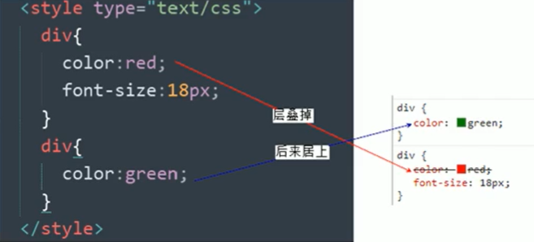
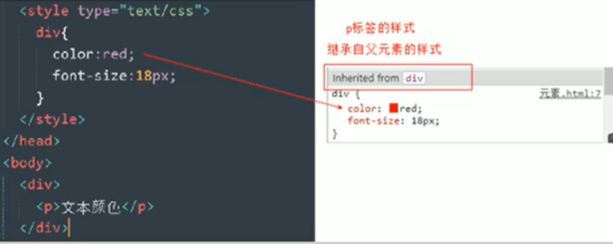

### **层叠性**

相同选择器给设置同样的样式，此时一个样式就会**覆盖（层叠）**另一个冲突的样式。层叠性主要解决样式冲突的问题。

**层叠性原则：**

- 样式冲突，遵循就近原则，哪个样式离结构近，就执行哪个样式
- 样式不冲突，则不会层叠




### 继承性

CSS中的继承，子标签会继承父标签的某些样式，如文本颜色和字号。简单的理解就是：子承父业。

- 恰当地使用继承可以简化代码，降低CSS样式的复杂性
- 子元素可以继承父元素的样式（文字相关的，如text-，font-，line-这些元素开头的元素可以继承，以及color属性）



- 特殊情况——行高的继承

  ```css
  body{
      font: 12px/1.5 Microsoft YaHi;
  }
  ```

  - 行高可用跟单位也可以不跟单位
  - 如果子元素没有设置行高，则会继承父元素的行高为1..5
  - 此时子元素的行高；当前子元素的文字大小*1.5
  - body行高1.5这样写法最大的优势就是里面子元素可以根据自己文字大小自动调整行高


### 优先级

当同一个元素指定多个选择器，就会有优先级的产生

- 选择器相同，则执行层叠性
- 选择器不同，则根据选择器权重执行

**选择器权重表**

| 选择器               | 选择器权重 |
| -------------------- | ---------- |
| 继承或*              | 0,0,0,0    |
| 元素选择器           | 0,0,0,1    |
| 类选择器，伪类选择器 | 0,0,1,0    |
| ID选择器             | 0,1,0,0    |
| 行内样式style=""     | 1,0,0,0    |
| !important 重要的    | 无穷大     |

- 权重是4组数字组成，但是不会有进位
- 可以理解为类选择器永远大于元素选择，id选择器永远大于类选择器，以此类推
- 等级判断从左向右，如果某一位数值相同，则判断下一位数值
- 可以简单记忆法：通配符和继承权重为0，标签选择器为1，类（伪类）选择器为10，id选择器为100，行内样式表为1000，!important无穷大

- 继承的权重是0，如果该元素没有直接选中，不管父元素权重多高，子元素得到的权重都是0


**权重叠加：**如果是复合选择器，则会有权重叠加，需要计算权重叠加

- div ul li ----------> 0,0,0,3
- .nav ul li ----------> 0,0,1,2
- a:hover----------> 0,0,1,1
- .nav a ----------> 0,0,1,1

