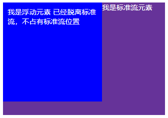
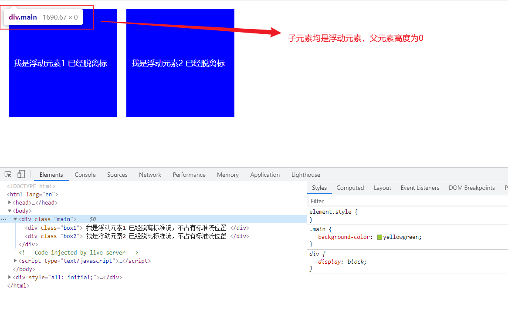
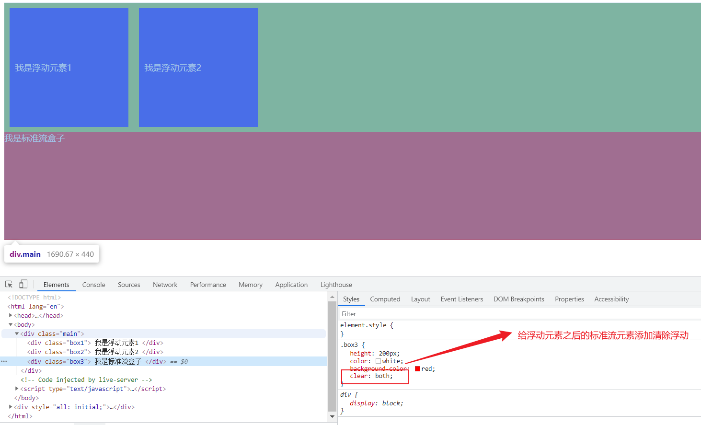
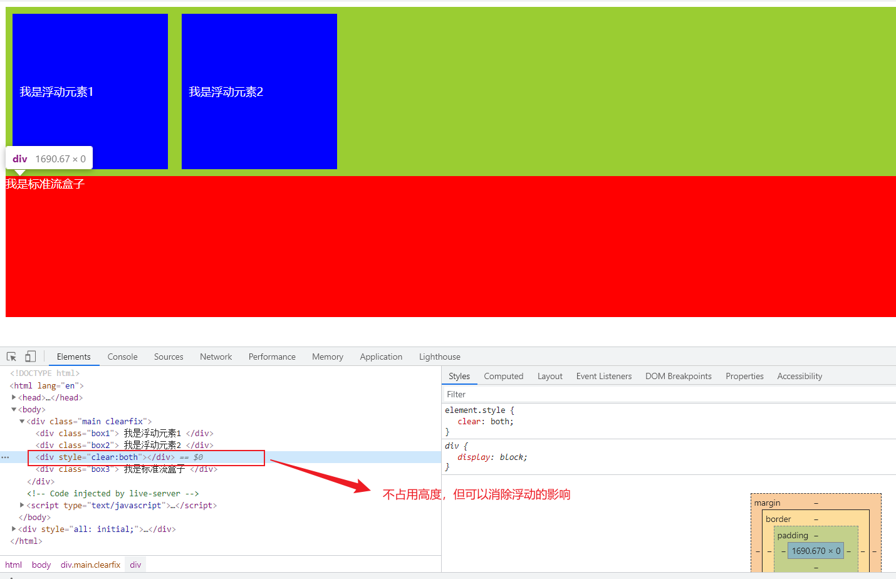
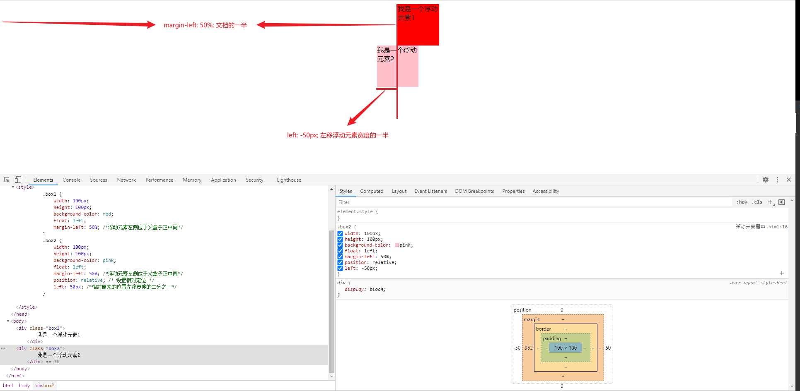

### 传统网页布局的三种方式

CSS提供了三种传统布局方式（简单说就是盒子如何进行排列顺序）

- 普通流（标准流）
- 浮动
- 定位

这三种布局方式都是用来摆放盒子的，盒子摆放到合适位置，布局自然就完成了。

#### 标准流

所谓标准流，就是标签按照规定好默认方式排列。

1. 块级元素会独占一行，从上向下顺序排列。
   - 常用元素：div、hr、p、h1~h6、ul、ol、dl、form、table
2. 行内元素会按照顺序，从左到右顺序排列，碰到父元素边缘则自动换行。
   - 常用元素：span、a、i、em等

以上都是标准流布局，是最基本的布局方式。


### 为什么需要浮动？

用标准流能很方便地实现下面的效果吗？

##### 如何让多个块级元素（div）水平排成一行？


比较难，虽然转换为行内块元素可以实现一行显示，但是他们之间会有大的空白细缝，很难控制。


##### 如何实现两个盒子的左右对齐？


**总结：**有很多布局效果，标准流没有办法完成，此时就可以利用浮动完成布局。因为浮动可以改变元素标签默认的排列方式。

**浮动最典型的应用：**可以让多个块级元素一行内排列显示。

**网页布局第一准则：多个块级元素纵向排列找标准流，多个块级元素横向排列找浮动。**


### 什么是浮动？

**float**属性用于创建浮动框，将其移动到一边，直到左边缘或右边缘触及包含块或另一个浮动框的边缘。

**语法：**

```
选择器 {float: 属性值;}
```

| 属性值 | 描述                 |
| ------ | -------------------- |
| none   | 元素不浮动（默认值） |
| left   | 元素向左浮动         |
| right  | 元素向右浮动         |


#### 浮动的特性

设置了浮动（float）的元素最重要特性：

1. **脱离标准普通流的控制（浮）移动到指定位置（动），俗称脱标**
2. 浮动的盒子不再保留原先的位置




3. 如果多个盒子都设置了浮动，则它们会按照属性值一行内显示并且顶端对齐排列。


**注意：**浮动的元素是互相贴靠在一起的（不会有缝隙），如果父级宽度装不下这些浮动的盒子，多出的盒子会另起一行对齐。


4. **浮动元素会具有行内块元素特性**

任何元素都可以浮动。不管原先是什么模式的元素，添加浮动之后具有**行内块元素**相似的特性。

- **如果块级盒子没有设置宽度，默认宽度和父级一样宽，但是添加浮动后，它的大小根据内容来决定**
- 浮动的盒子中间是没有缝隙的，是紧挨着一起的
- 行内元素同理

**如果行内元素有了浮动,则不需要转换块级\行内块元素，就可以直接给高度和宽度。**


#### 浮动元素常常和标准流父级搭配使用

为了约束浮动元素位置，我们网页布局一般采取的策略是：

先用标准流的父元素排列上下位置，之后内部子元素采取浮动排列左右位置，符合网页布局第一准则。


#### 浮动布局注意点

1. 浮动和标准流的父盒子搭配
   - 先用标准流的父元素排列上下位置，之后内部子元素采取浮动排列左右位置
2. 一个元素浮动了，理论上其余的兄弟元素也要浮动
   - 一个盒子里面有多个盒子，如果其中一个盒子浮动了，那么其他兄弟也应该浮动，以防止引起问题。
   - 浮动的盒子**只会影响浮动盒子后面的标准流**，不会影响前面的标准流


前面浮动元素有一个标准流的父元素，他们有一个共同的特点，都有高度。

但是，所有的父盒子都必须有高度吗？

理想状态中，让盒子撑开父亲，有多少孩子，父盒子就有多高。


### 为什么需要清除浮动?

由于父级盒子很多情况下，不方便给高度，但是子盒子浮动又不占有位置，最后父盒子高度为0时，就会影响下面标准流盒子。

由于浮动元素不再占用原文档流的位置，所以它会对后面的元素排版产生影响



#### 清除浮动本质

- 清除浮动的本质是清除浮动元素造成的影响
- 如果父盒子本身有高度，则不需要清除浮动
- **清除浮动之后，父级就会根据浮动的子盒子自动检测高度。父级有了高度，就不会影响后面的标准流了**


#### 清除浮动语法

```
选择器 {clear: 属性值;}
```

| 属性值 | 描述                                       |
| ------ | ------------------------------------------ |
| left   | 不允许左侧有浮动元素（清除左侧浮动的影响） |
| right  | 不允许右侧有浮动元素（清除右侧浮动的影响） |
| both   | 同时清除左右两侧浮动的影响                 |

我们实际工作中，几乎只用clear: both;

**清除浮动的策略是：闭合浮动.**




### 清除浮动的方法

- 额外标签法也称为隔离法，是W3C推荐的做法
- 父级添加overflow属性
- 父级添加after伪元素
- 父级添加双伪元素


#### 额外标签法

也称隔离法，是W3C推荐的做法。

额外标签法会在浮动元素末尾添加一个空的标签。例如`<div style="clear:both"></div>`,或者其他标签（如`<br/>`等）。

- 优点：通俗易懂，方便书写
- 缺点：添加许多无意义的标签，结构化较差

**注意：要求这个新的空标签必须是块级元素。**




#### 父级添加overflow

可以给父级添加overflow属性，将其属性值设置为hidden、auto或scroll。

- 优点：代码简洁
- 缺点：无法显示溢出的部分


#### :after伪元素

:after方式是额外标签法的升级版本，也是给父元素添加

```css
.clearfix:after{
   content: "";
   display: block;
   height: 0;
   clear: both;
   visibility: hidden;
}
.clearfix{ /* IE6,7专有*/
	*zoom: 1;	
}
```

- 优点: 没有增加标签，结构更简单
- 缺点：照顾低版本浏览器
- 代表网站：百度、淘宝网、网易等


#### 双伪元素清除浮动

父元素添加

```css
.clearfix:before,.clearfix:after{
   content: "";
   display: block;
}
.clearfix: after{
	clear:both;
}
.clearfix{ /* IE6,7专有*/
	*zoom: 1;	
}
```

- 优点：代码更简洁
- 缺点：照顾低版本浏览器
- 代表网站：小米、腾讯等


#### 总结

为什么要清除浮动？

- 父级没高度
- 子盒子浮动了
- 影响下面布局了，就应该清除浮动

| 清除浮动的方式         | 优点               | 缺点                              |
| ---------------------- | ------------------ | --------------------------------- |
| 额外标签法（隔离法）   | 通俗易懂，书写方便 | 添加许多无意义的标签，结构化较差  |
| 父级`overflow:hidden;` | 书写简单           | 溢出隐藏                          |
| 父级after伪元素        | 结构语义化正确     | 由于IE6-7不支持:after，兼容性问题 |
| 父级双伪元素           | 结构语义化正确     | 由于IE6-7不支持:after，兼容性问题 |


### 如何居中一个浮动元素



```html
<!DOCTYPE html>
<html lang="en">
<head>
    <meta charset="UTF-8">
    <meta http-equiv="X-UA-Compatible" content="IE=edge">
    <meta name="viewport" content="width=device-width, initial-scale=1.0">
    <title>如何居中一个浮动元素</title>
    <style>
        .box1 {
            width: 100px;
            height: 100px;
            background-color: red;
            float: left;
            margin-left: 50%; /*浮动元素左侧位于父盒子正中间*/
        }
        .box2 {
            width: 100px;
            height: 100px;
            background-color: pink;
            float: left;
            margin-left: 50%; /*浮动元素左侧位于父盒子正中间*/
            position: relative; /* 设置相对定位 */
            left:-50px; /*相对原来的位置左移宽度的二分之一*/
        }
    </style>
</head>
<body>
    <div class="box1">
        我是一个浮动元素1
    </div>
    <div class="box2">
        我是一个居中的浮动元素2
    </div>
</body>
</html>
```

