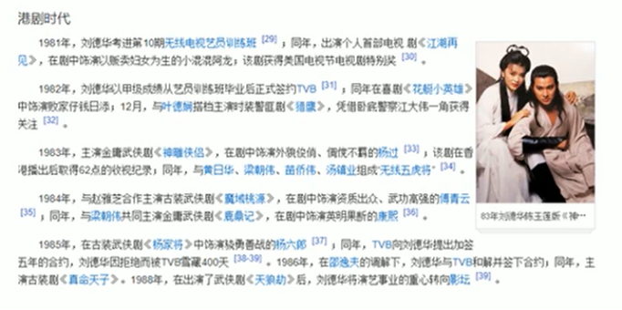

### 为什么需要定位

定位可以让盒子自由地在某个盒子内移动位置或者固定屏幕中某个位置，并且可以压住其他盒子。


### 定位组成

**定位：**

- 将盒子定在某一个位置，所以定位也是在摆放盒子，按照定位的方式移动盒子。
- **定位 = 定位模式 + 边偏移**

#### **定位模式：**

用于指定一个元素在文档中的定位方式。**边偏移则决定了该元素的最终位置。**它通过CSS的position属性来设置，其值可以分为四个：

| 值       | 语义     |
| -------- | -------- |
| static   | 静态定位 |
| relative | 相对定位 |
| absolute | 绝对定位 |
| fixed    | 固定定位 |

#### 边偏移

边偏移就是定位的盒子移动到最终位置。有top、bottom、left和right4个属性。

| 边偏移属性 | 示例         | 语义                                                   |
| ---------- | ------------ | ------------------------------------------------------ |
| top        | top: 80px    | **顶端**偏移量，定义元素相对于其父元素**上边线的距离** |
| bottom     | bottom: 80px | **底部**偏移量，定义元素相对于其父元素**下边线的距离** |
| left       | left: 80px   | **左侧**偏移量，定义元素相对于其父元素**左边线**的距离 |
| right      | right: 80px  | **右侧**偏移量，定义元素相对于其父元素**右边线**的距离 |


### 静态定位

静态定位是元素的默认定位方式，无定位的意思。

**语法：**

```
选择器: {position:static;}
```

- 静态定位按照标准流特性摆放位置，它没有边偏移
- 静态定位在布局时很少用到


### 相对定位relative（重要）

相对定位是元素在移动位置的时候，是相当于它原来的位置来说的（自恋型）。

**语法：**

```
选择器 {position: relative;}
```

**相对定位的特点：**

- 它是相对于自己原来的位置来移动的（移动位置的时候**参照点是自己原来的位置**）
- 原来的位置在标准流的位置继续占有，后面的盒子仍然以标准的方式对待它（**不脱标，继续保留原来的位置**）

### 绝对定位 absolute（重要）

**绝对定位**是元素在移动位置的时候，是相对于它祖先元素来说的

**语法：**

```
选择器 {position: absolute;}
```

**绝对定位的特点：**

- 如果**没有祖先元素**或者**祖先元素没有定位**，则以浏览器为准定位（Document文档)
- 如果祖先元素有定位（相对、绝对、固定定位），则以最近一级的有定位祖先元素为参考点移动位置
- **绝对定位不再占有原先的位置（脱标）**


**子绝父相**

子级是绝对定位的话，父级要用相对定位。

- 子级绝对定位，不会占有位置，可以放到父盒子里面的任何一个地方，不会影响其他的兄弟盒子
- 父盒子需要定位限制盒子在父盒子内显示
- 父盒子布局时，需要占有位置，因此父亲只能是相对定位

**总结**：因为父级需要占有位置，因此是相对定位，子盒子不需要占有位置，则是绝对定位。（当然也不是一定的，有的场景也许需要子绝父绝）


### 固定定位 fixed（重要）

**固定定位**是元素固定于浏览器可视区的位置。主要使用场景：可以在浏览器页面滚动时元素的位置不会变。

**语法：**

```
选择器 {position: fixed; }
```

**固定定位的特点：**

- 以浏览器的可视窗口为参照点移动元素
  - **跟父级元素没有任何关系**
  - **不随滚动条滚动**
- **固定定位不在占有原先的位置**
  - **固定定位也是脱标的**，其实固定定位也可以看作是一种特殊的绝对定位。
  - 

#### 固定定位小技巧：固定在版心右侧位置

小算法：

- 让固定定位的盒子left:50%，走到浏览器可视区（也可以看作版心）的一半位置
- 让固定定位的盒子margin-left：版心宽度的一半距离。

就可以让固定定位的盒子贴着版心右侧对齐了。


### 粘性定位 sticky （了解）

粘性定位可以被认为是相对定位和固定定位的混合。

**语法：**

```
选择器 {position: sticky;}
```

**粘性定位的特点：**

- 以浏览器的可视窗口为参照点移动元素（固定定位特点）
- 粘性定位**占有原先的位置**（相对定位特点）
- 必须添加top、left、right、bottom其中一个才有效

跟页面滚动搭配使用，兼容性较差，IE不支持。


### 定位的总结

| 定位模式         | 是否脱标         | 移动位置           | 是否常用   |
| ---------------- | ---------------- | ------------------ | ---------- |
| static静态定位   | 否               | 不能使用边偏移     | 很少       |
| relative相对定位 | 否（占有位置）   | 相对于自身位置移动 | 常用       |
| absolute绝对定位 | 是（不占有位置） | 带有定位的父级     | 常用       |
| fixed固定定位    | 是（不占有位置） | 浏览器可视区       | 常用       |
| sticky粘性定位   | 否（占有位置）   | 浏览器可视区       | 当前阶段少 |

1. 相对定位、固定定位、绝对定位的两大特点
   1. 是否占有位置（脱标否）
   2. 以谁为基准点移动位置
2. 理解子绝父相


### 定位叠放次序

在使用定位布局时，可能会出现盒子重叠的情况。此时，可以使用z-index来控制盒子的前后次序（z轴）

**语法：**

```
选择器 {z-index:1}
```

- 数值可以是正整数、父整数或0，默认是auto，数值越大，盒子越靠上
- 如果属性值相同，则按照书写顺序，后来居上
- 数字后面不能加单位
- 只有定位的盒子才有z-index属性


### 绝对定位水平居中实现

加了绝对定位的盒子不能通过margin: 0 auto水平居中，但是可以通过以下计算方法实现水平和垂直居中。

① left: 50%; /* 让盒子的左侧移动到父级元素的水平中心位置 */

② margin-left: -100px; /* 让盒子向左移动自身宽度的一半。*/


### 定位的拓展

#### 定位的特殊性

绝对定位和固定定位也和浮动类似

- 行内元素添加绝对或固定定位，可以直接设置高度和宽度
- 块级元素添加绝对或固定定位，如果不给宽度或者高度，默认大小是内容的大小
- 脱标的盒子不会触发外边距塌陷（浮动元素、绝对定位、固定定位元素都不会触发外边距合并的问题
- 绝对定位（固定定位）会完全压住盒子
  - 浮动元素不同，只会压住它下面标准流的盒子，但是不会压住下面标准流里面的文字（图片），但是绝对定位（固定定位）会压住下面标准流所有的内容
  - 浮动之所以不会压住文字，因为浮动产生的目的最初是为了左文字环绕效果的，文字会围绕浮动元素。



