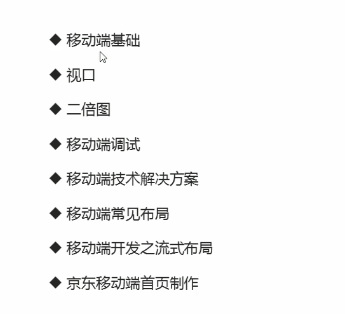

## 移动端开发基础


### 浏览器现状

- **PC端浏览器**

  - 360浏览器、谷歌浏览器、火狐浏览器、QQ浏览器、百度浏览器、搜狗浏览器、IE浏览器

    

- **移动端常见浏览器**

  - UC浏览器、QQ浏览器、opera浏览器、百度手机浏览器、360安全浏览器、谷歌浏览器、搜狗手机浏览器、猎豹浏览器等

- 国内的UC、QQ和百度等手机浏览器都是根据webkit内核修改过来的，国内尚无自主研发的内核。因此兼容移动端主流浏览器，处理webkit内核浏览器即可。


### 手机屏幕现状

- 移动端设备屏幕尺寸非常多，碎片化严重
- Android设备有多种分辨率：480 * 800，480 * 854，540 * 960，720 * 1280，1080 * 1920等，还有传说中的2k、4k屏
- 近年来iPhone的碎片化也加剧了，其设备的分辨率主要有: 640 * 860，640 * 1136，750 * 1334，1242 * 2208等
- 作为开发者无需关注这些分辨率，因为我们常用的尺寸单位是px

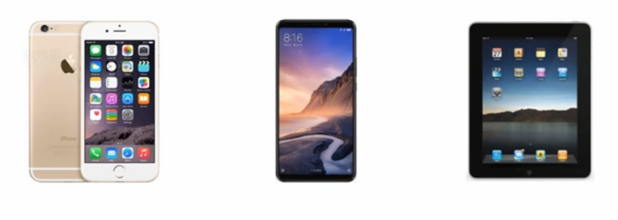


### 常见移动端屏幕尺寸

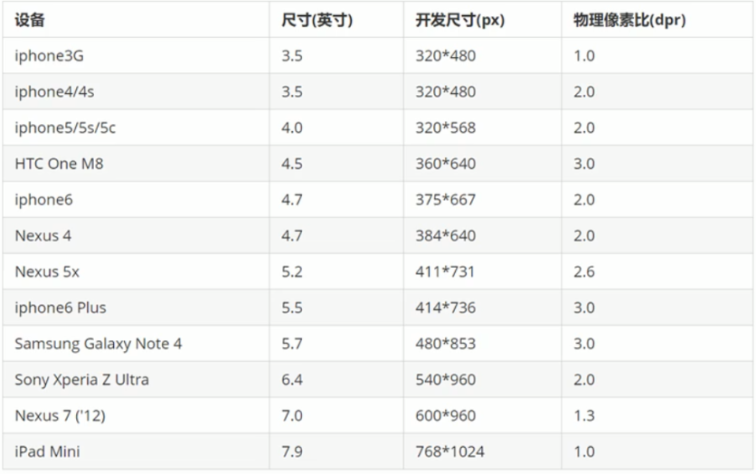


### 移动端调试方法

- Chrome DevTools（谷歌浏览器）的模拟手机调试
- 搭建本地web服务器，手机和服务器一个局域网内，通过手机访问服务器
- 使用外网服务器，直接IP或域名访问


### 总结

- 移动端浏览器主要对webkit内核进行兼容
- 移动端主要针对手机端开发
- 现在移动端碎片化比较严重，分辨率和屏幕尺寸大小不一
- 学会用谷歌浏览器模拟手机界面以及调试


## 视口

视口（viewport）就是浏览器显示页面内容的屏幕区域。视口可以分为布局视口，视口和理想视口


### 布局视口 layout viewport

- 一般移动设备的浏览器都默认设置了一个布局视口，用于解决早期的PC端页面在手机上显示的问题
- iOS、Android基本都将这个视口分辨率设置为980px，所以PC上的网页大多都能在手机上呈现，只不过元素看上去很小，一般默认可以通过手动缩放网页。

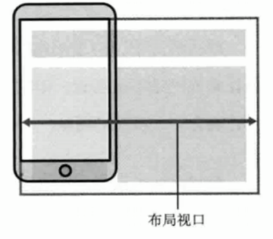


### 视觉视口 visual viewport

- 字面意思，它是用户正在看到的网站的区域。注意：是网站的区域
- 我们可以通过缩放去操作视觉视口，但不会影响布局视口，布局视口仍保持原来的宽度

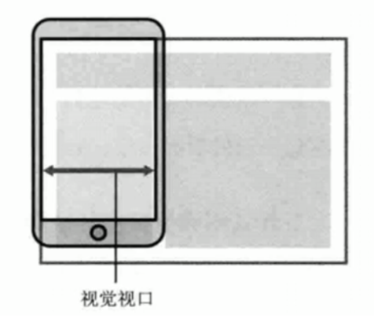

### 理想视口 ideal viewport

- 为了使网站在移动端有理想的浏览和阅读宽度而设定
- 理想视口，对设备来讲，是最理想的视口尺寸
- 需要手动添写meta视口标签通知浏览器操作
- meta视口标签的主要目的：布局视口的宽度应该与理想视口的宽度一致，简单理解就是设备有多宽，我们布局的视口就多宽


### 总结

- 视口就是浏览器显示页面内容的屏幕区域
- 视口分为布局视口、视觉视口和理想视口
- 移动端布局想要的是理想视口，即手机屏幕有多宽，布局视就有多宽
- 想要理想视口，我们需要给我们的移动端页面添加meta视口标签


### meta视口标签

```html
<meta name="viewport" content="width=device-width, initial-scale=1.0,maximum-scale=1.0, minimum-scale=1.0, user-scalable=no">
```

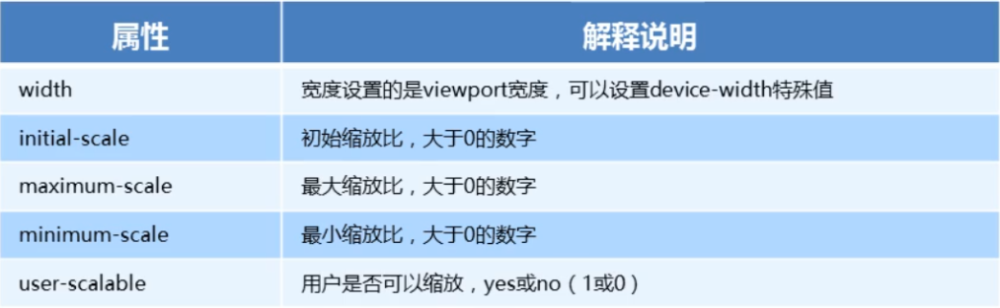

**标准的viewport**

- 视口宽度和设备保持一致
- 视口的默认缩放比例1.0
- 不允许用户自行缩放
- 最大允许的缩放比例1.0
- 最最小允许的缩放比例1.0


## 物理像素&物理像素比

### **物理像素**

- 物理像素点指的是屏幕显示的最小颗粒，是物理真实存在的。这是厂商在出厂时就设置好了，比如苹果6/7/8是750 * 1334
- 我们开发时候的1px不是一定等于1个物理像素的
- PC端页面，1个px等于1个物理像素，但是移动端就不尽相同
- 1个px能显示的物理像素点的个数，称为物理像素比或屏幕像素比

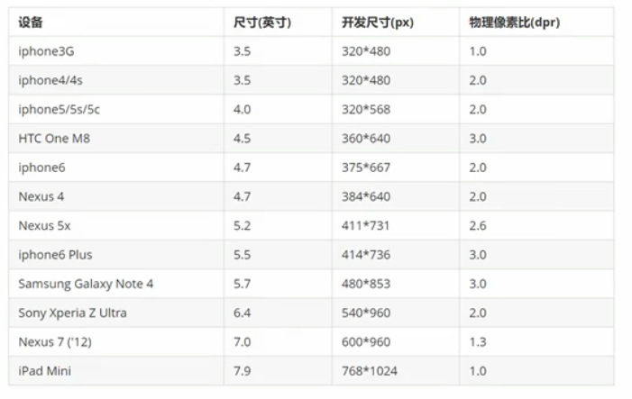

### **物理像素比**

- PC端和早期的手机屏幕 / 普通手机屏幕：1CSS像素 = 1物理像素
- Retina（视网膜屏幕）是一种显示技术，可以将更多的物理像素点压缩在一块屏幕里，从而达到更高的分辨率，并提高屏幕显示的细腻程度

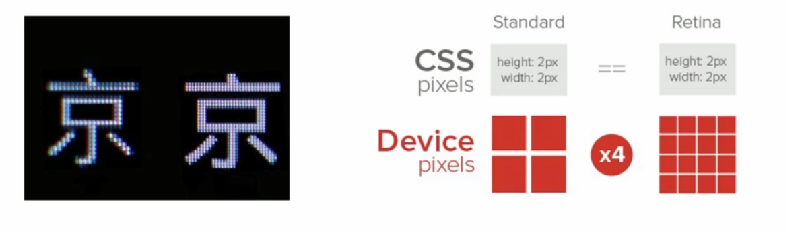


### 多倍图

- 对于一张50px * 50px的图片，在手机Retina屏幕中打开，安装刚才的物理像素比会放大倍数，这样会造成图片模糊
- 在标准的viewport设置中，使用倍图来提高图片质量，解决在高清设备中的模糊问题
- 通常使用二倍图，由于iPhone6\7\8的影响，但是现在还存在3倍图、4倍图的情况，这个看实际开发公司需求
- 背景图片注意缩放问题

```
/* 在iPhone8下面 */
img{
	/* 原始图片100*100px*/
	width: 50px;
	height: 50px;
}
.box{
	/* 原始图片100 * 100px */
	background-size: 50px 50px;	
}
```


### 背景缩放 background-size

background-size 属性规定背景图像的尺寸

```
background-size: 背景图片宽度 背景图片高度;
```

- 单位：长度|百分比|cover|contain；
- cover把背景图像扩展至足够大，以使背景图像完全覆盖背景区域
- contain把图像扩展至最大尺寸，以使其宽度和高度完全适应内容区域


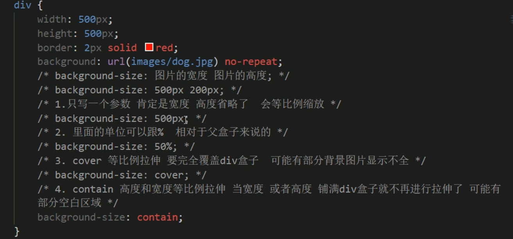


### 多倍图切图 cutterman


## 移动端主流方案

- 单独制作移动端页面（主流）
  - 京东商城手机版
  - 淘宝触屏版
  - 苏宁易购手机版
  - ...
- 响应式页面兼容移动端(其次)
  - 三星手机官网
  - ...

### 单独移动端页面（主流）

通常情况下，网址域名前面加**m（mobile）**可以打开移动端。通过判断设备，如果是移动设备打开，则跳到移动端页面。


### 响应式兼容PC移动端

三星电子官网：www.samsung.com/cn/，通过判断屏幕宽度来改变样式，以适应不同终端。

**缺点：**制作麻烦，需要花费很大精力去调兼容性问题

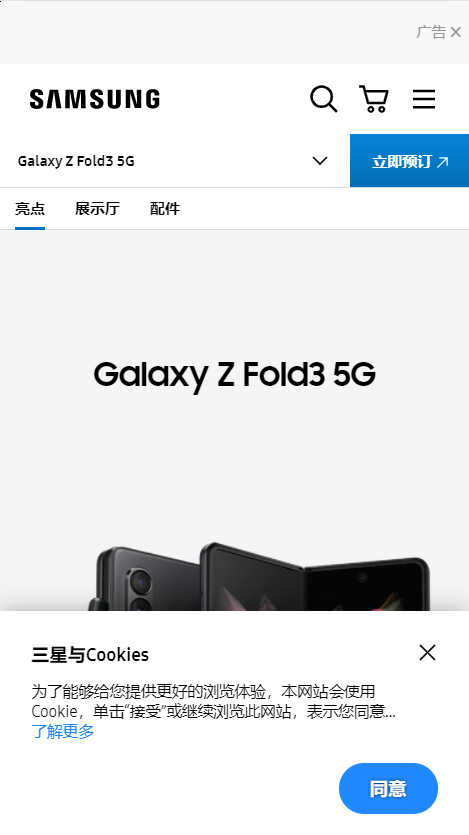

### 总结

现在市场常见的移动端开发有单独制作移动端页面和响应式页面两种方案

现在市场主流的选择还是单独制作移动端


### 移动端浏览器

移动端浏览器基本以webkit内核为主，因此我们就考虑webkit兼容性问题。

我们可以放心使用H5标签和CSS3样式。

同时我们浏览器的私有前缀我们只需要考虑添加webkit即可

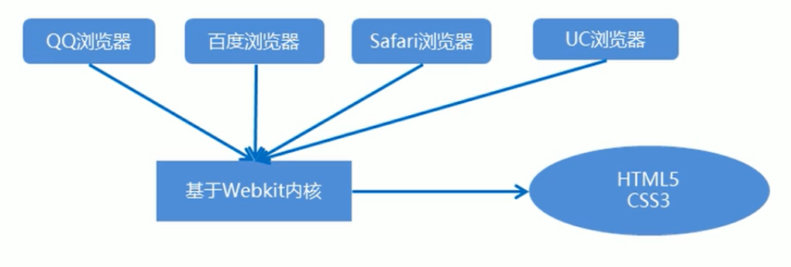


### CSS初始化normalize.css

官网：http://necolas.github.io/normalize.css

**移动端CSS初始化推荐使用normalize.css**

- 保护了有价值的默认值
- 修复了浏览器的bug
- 是模块化的
- 拥有详细的文档

**Normalize.css到底有什么用**

- 不同的浏览器在对于CSS没有定义的一些样式属性是不一样的，
- 比如没有在自己的CSS里面规定超链接有没有下划线的时候，有些浏览器有，有些浏览器没有；
- 再比如有一些浏览器规定的超链接默认颜色是蓝色，有一些又是黑色。
- 而这个CSS的功能就是对几乎所有的默认样式进行重置，让所有的浏览器上对于未定义的样式浏览效果达到一致
- （虽然说无法完全一致，但至少可以消除掉大部分差距）
- 当然如果你自己的CSS已经对默认样式进行了重置，不使用它也是可以的。


### CSS3 盒子模型 box-sizing

- 传统模式宽度计算：盒子的宽度 = CSS中设置的width + border + padding
- CSS盒子模型：盒子的宽度 = CSS中设置的宽度width里面包含了border和padding

也就是说，我们的CSS3中的盒子模型，padding和border不会撑大盒子了

```css
/*CSS3盒子模型*/
box-sizing: border-box;
/*传统盒子模型*/
box-sizing: content-box;
```

怎么选择传统orCSS3盒子模型？

- 移动端可以全部CSS3盒子模型
- PC端如果完全需要兼容，我们就用传统模式，如果不考虑兼容性，我们就选择CSS3盒子模型


### 特殊样式

```css
/*CSS3盒子模型*/
box-sizing: border-box;
-webkit-box-sizing: border-box;
/*点击高亮我们需要清除 设置transparent 完全透明*/
-webkit-tap-hightlight-color: transparent;
/*在移动端浏览器默认的外观在iOS上加这个属性才能给按钮和输入框自定义样式*/
-webkit-appearance: none;
/*禁用长按页面时弹出菜单*/
img,a{-webkit-touch-callout: none;}
```


### 移动端技术选型

- 单独制作移动端页面（主流）
  - 流式布局（百分比布局）
  - flex弹性布局（强烈推荐）
  - less+rem+媒体查询布局
  - 混合布局
- 响应式页面兼容移动端(其次)
  - 媒体查询
  - bootstrap


## 流式布局（百分比布局）

- 流式布局，就是百分比布局，也称非固定像素布局
- 通过盒子的宽度设置成百分比来根据屏幕的宽度来进行伸缩，不受固定像素的限制，内容向两侧填充
- 流式布局方式是移动web开发使用的比较常用的布局方式

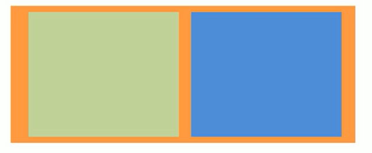

- max-width 最大宽度 (max-height 最大高度)
- min-width 最小宽度 (min-height 最小高度)


#### 常用初始化样式

```css
body {
	margin: 0 auto;
	min-width: 320px;
	max-width: 640px;
	background: #fff;
	font-size: 14px;
	font-family: -apple-system, Helvetica, sans-serif;
	line-height: 1.5;
	color: #666;
}
```


## 二倍精灵图做法

- 在firework里面把精灵图等比例缩放为原来的一半
- 之后根据大小测量坐标
- 注意代码里面background-size也要写：精灵图原来宽度的一半

