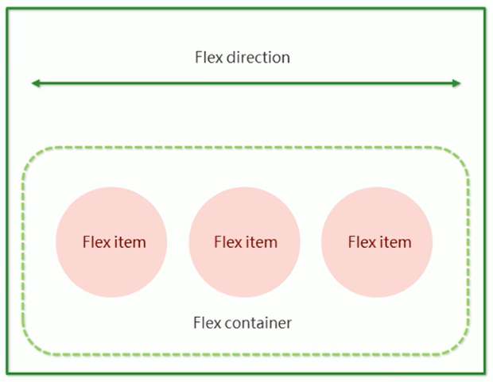
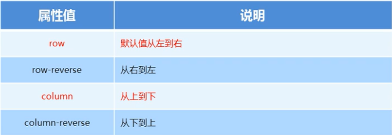
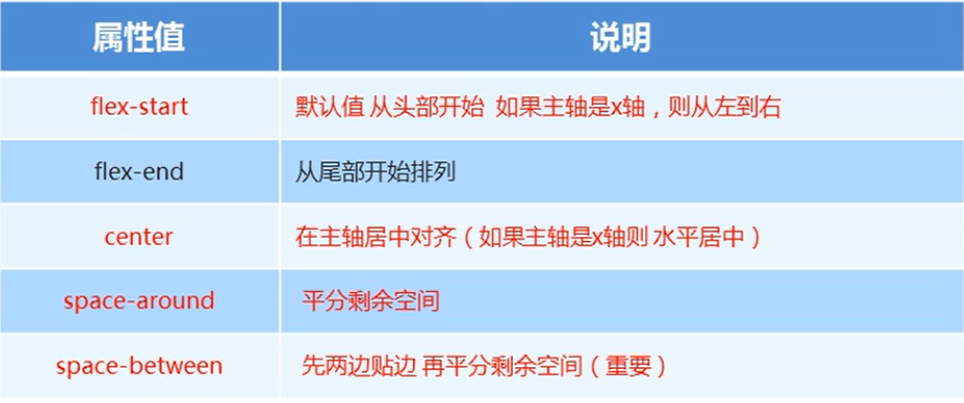
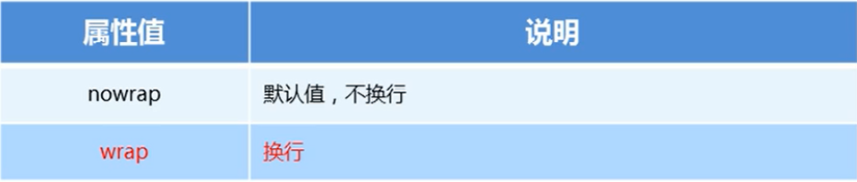
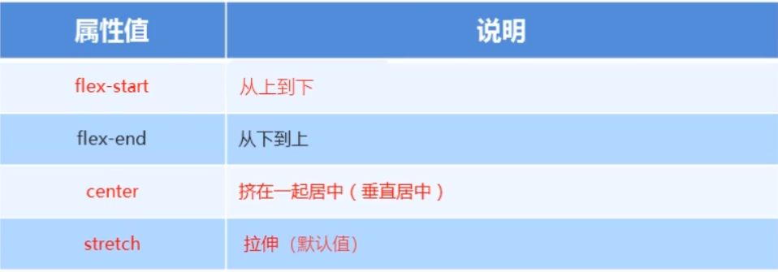

## 传统布局与flex布局

**传统布局：**

- 兼容性好
- 布局繁琐
- 局限性，不能在移动端很好的布局

**flex弹性布局：**

- 操作方便，布局极为简单，移动端应用很广泛
- PC端浏览器支持情况较差
- IE 11或更低版本，不支持或仅部分支持

**建议：**

- 如果是PC端页面布局，选传统布局
- 如果是移动端或不考虑兼容性问题的PC页面布局，选flex弹性布局


## 布局原理

flex是flexible Box的缩写，意为“弹性布局”，用来为盒状模型提供最大的灵活性，任何一个容器都可以指定为flex布局

- 当我们为父盒子设为flex布局后，子元素的float、clear和vertic-align属性将失效
- 伸缩布局 = 弹性布局 = 伸缩盒布局 = 弹性盒布局 = flex布局


## 布局原理

采用flex布局的元素，称为flex容器（flex container），简称“容器”，它的所有子元素自动成为容器成员，称为flex项目（flex item），简称“项目”。

- div就是flex父容器
- span就是子容器flex项目
- 子容器可以横向排列也可以纵向排列
- 通过给父盒子添加flex属性，来控制子盒子的位置和排列方式




## 常见父项属性

- flex-direction: 设置主轴的方向
- justify-content：设置主轴上的子元素排列方式
- flex-wrap：设置子元素是否换行
- align-content：设置侧轴上的子元素的排列方式（多行）
- align-items：设置侧轴上的子元素排列方式（单行）
- flex-flow：复合属性，相当于同时设置了flex-direction和flex-wrap


### flex-direction 设置主轴的方向

flex-direction属性决定主轴的方向（即项目的排列方向）

**注意：**主轴和侧轴是会变化的，就看flex-direction设置谁为主轴，剩下的就是侧轴。而我们的子元素是跟着主轴来排列的。




### justify-content 设置主轴上的子元素排列方式

justify-content属性定义了项目在主轴上的对齐方式

**注意：**使用这个属性之前一定要确定好主轴是哪一个




### flex-wrap 设置子元素是否换行

默认情况下，项目都排在一条线（又称“轴线”）上。flex-wrap属性定义，flex布局中默认是不换行的。




### align-items设置侧轴上的子元素排列方式（单行）

该属性是控制子项在侧轴（默认是y轴）上的排列方式，在子项为单项的时候使用




### flex-flow

flex-flow属性是flex-direction和flex-wrap属性的复合属性

```css
flex-flow: row wrap;
```


## 子项属性

### flex属性

flex属性定义子项目分配剩余空间，用flex来表示**占多少份数**。

```css
.item {
  flex: <number>; /* default 0 */
}
```


### align-self控制子项自己在侧轴上的排列方式

align-self属性允许单个项目有与其他项目不一样的对齐方式，可覆盖align-items属性。

默认值为auto，表示继承父元素的align-items属性，如果没有父元素，则等同于stretch。

```css
span:nth-child(2){
  /* 设置自己在侧轴上的排列方式 */
  align-self: flex-end;
}
```


### order属性定义项目的排列顺序

数值越小，排列越靠前，默认为0。

注意：和z-index不一样。
