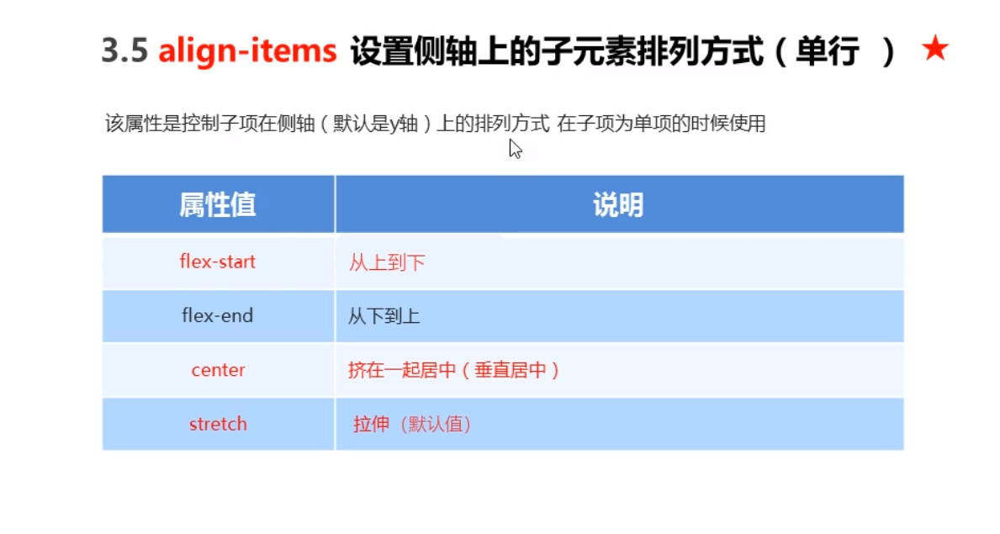
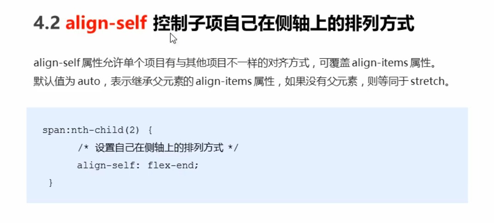
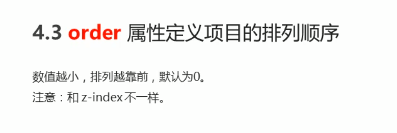

## 传统布局与flex布局

**传统布局：**

- 兼容性好
- 布局繁琐
- 局限性，不能在移动端很好的布局

**flex弹性布局：**

- 操作方便，布局极为简单，移动端应用很广泛
- PC端浏览器支持情况较差
- IE 11或更低版本，不支持或仅部分支持

**建议：**

- 如果是PC端页面布局，选传统布局
- 如果是移动端或不考虑兼容性问题的PC页面布局，选flex弹性布局

## 布局原理

flex是flexible Box的缩写，意为“弹性布局”，用来为盒状模型提供最大的灵活性，任何一个容器都可以指定为flex布局

- 当我们为父盒子设为flex布局后，子元素的float、clear和vertic-align属性将失效
- 伸缩布局 = 弹性布局 = 伸缩盒布局 = 弹性盒布局 = flex布局

## 布局原理

采用flex布局的元素，称为flex容器（flex container），简称“容器”，它的所有子元素自动成为容器成员，称为flex项目（flex item），简称“项目”。

- div就是flex父容器
- span就是子容器flex项目
- 子容器可以横向排列也可以纵向排列
- 通过给父盒子添加flex属性，来控制子盒子的位置和排列方式

## 常见父项属性

