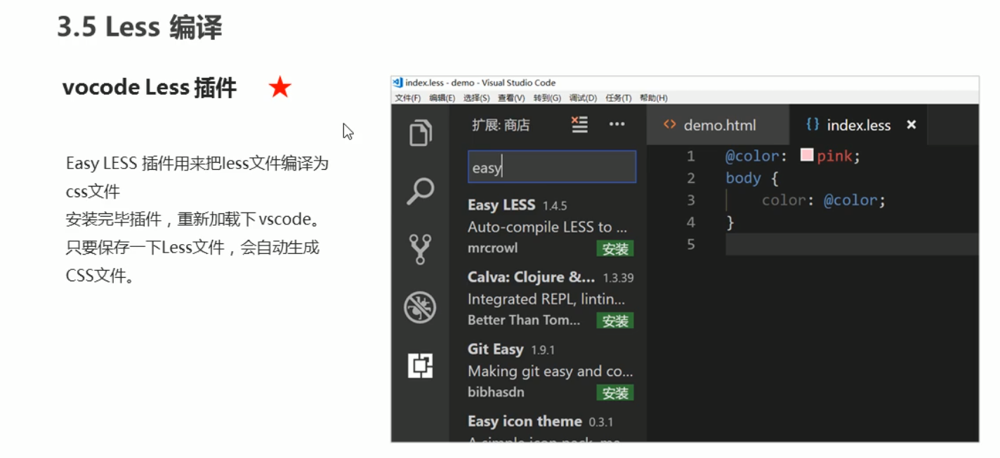

媒体查询一般按照从大到小或者 从小到大的顺序来

5. screen 还有 and 必须带上不能省略的 

6. 我们的数字后面必须跟单位 970px  这个 px 不能省略的 


```
@media screen and (min-width: 540px) {
   body {
     background-color: green;
   }
}
```


```html
<!DOCTYPE html>
<html lang="en">

<head>
    <meta charset="UTF-8">
    <meta name="viewport" content="width=device-width, initial-scale=1.0">
    <meta http-equiv="X-UA-Compatible" content="ie=edge">
    <title>Document</title>
    <style>
        * {
            margin: 0;
            padding: 0;
        }
        /* html {
            font-size: 100px;
        } */
        /* 从小到大的顺序 */
        
        @media screen and (min-width: 320px) {
            html {
                font-size: 50px;
            }
        }
        
        @media screen and (min-width: 640px) {
            html {
                font-size: 100px;
            }
        }
        
        .top {
            height: 1rem;
            font-size: .5rem;
            background-color: green;
            color: #fff;
            text-align: center;
            line-height: 1rem;
        }
    </style>
</head>

<body>
    <div class="top">购物车</div>
</body>

</html>
```


### less





