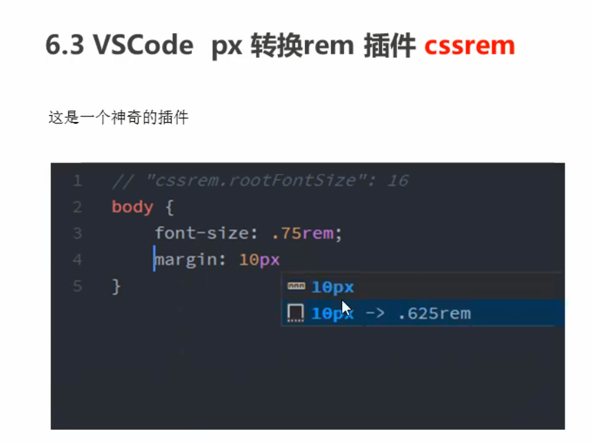

## 什么是媒体查询

媒体查询（Media Query）是CSS3新语法。

- 使用@media查询，可以针对不同的媒体类型定义不同的样式
- @media可以针对不同屏幕尺寸设置不同的样式
- 当你重置浏览器大小的过程中，页面也会根据浏览器的宽度和高度重新渲染页面
- 目前针对很多苹果手机、Android手机、平板等设备都用得到多媒体查询


## 语法规范

```css
@media mediatype and|not|only (media feature) {
  css-code;
}
```

- 用@media开头 注意@符号
- mediatype 媒体类型
- 关键字 and not only
- media feature 媒体特性 必须有小括号包含


## 语法规范

### mediatype查询类型

将不同的终端设备划分成不同的 类型，称为媒体类型

| 值    | 解释说明                           |
| ----- | ---------------------------------- |
| all   | 用于所有设备                       |
| print | 用于打印机和打印预览               |
| scree | 用于电脑屏幕，平板电脑，智能手机等 |


### 关键字

关键字将媒体类型或多个媒体特性连接到一起作为媒体查询的条件。

- and: 可以将多个媒体特性连接到一起，相当于“且”的意思
- not: 排除某个媒体类型，相当于“非”的意思，可以省略
- only: 指定某个的媒体类型，可以省略


### 媒体特性

每种媒体类型都具体有各自不同的特性，根据不同媒体类型的媒体特性设置不同的展示风格。我们暂且了解三个。

注意他们要加小括号包含


媒体查询一般按照从大到小或者 从小到大的顺序来

5. screen 还有 and 必须带上不能省略的 

6. 我们的数字后面必须跟单位 970px  这个 px 不能省略的 

```css
@media screen and (min-width: 540px) {
   body {
     background-color: green;
   }
}
```


## 媒体查询 + rem实现元素动态大小变化

rem单位是跟着html来走的，有了rem页面元素可以设置不同大小尺寸，媒体查询可以根据不同设备宽度来修改样式，媒体查询+rem就可以实现不同设备宽度，实现页面元素大小的动态变化


```html
<!DOCTYPE html>
<html lang="en">

<head>
    <meta charset="UTF-8">
    <meta name="viewport" content="width=device-width, initial-scale=1.0">
    <meta http-equiv="X-UA-Compatible" content="ie=edge">
    <title>Document</title>
    <style>
        * {
            margin: 0;
            padding: 0;
        }
        /* html {
            font-size: 100px;
        } */
        /* 从小到大的顺序 */
        
        @media screen and (min-width: 320px) {
            html {
                font-size: 50px;
            }
        }
        
        @media screen and (min-width: 640px) {
            html {
                font-size: 100px;
            }
        }
        
        .top {
            height: 1rem;
            font-size: .5rem;
            background-color: green;
            color: #fff;
            text-align: center;
            line-height: 1rem;
        }
    </style>
</head>

<body>
    <div class="top">购物车</div>
</body>

</html>
```


## less

### 维护CSS的弊端

CSS是一门非程序式的语言，没有变量、函数、SCOPE（作用域）等概念。

- CSS需要书写大量看似没有逻辑的代码，CSS冗余度是比较高的。
- 不方便维护以及扩展，不利于复用
- CSS没有很好的计算能力
- 非前端开发工程师，往往会因缺少CSS编写经验而很难写出组织良好且易于维护的CSS代码


### Less编译

可以下载VScode less插件：Easy LESS。

Easy LESS插件用来把less文件编译为css文件，安装完毕插件，只要保存less文件，就会自动生成对应的css文件


### less嵌套

CSS:

```css
#header .logo{
  width: 300px;
}
```

LESS:

```less
#header {
  .logo{
     width: 300px;
  }
}
```


如果遇见（交集|伪类|伪元素选择器）

- 内层选择器的前面没有&符号，则它被解析为父选择器的后代；
- 如果有&符号，它就被解析为父元素自身或父元素的伪类

CSS

```css
a:hover{
  color: red;
}
```

LESS

```less
a {
  &:hover{
    color: red;
  }
}
```


### less运算

任何数字、颜色或者变量都可以参与运算。就是less提供了加（+）、减（-）、乘（*）、除（/）算术运算。

```less
@width 10px + 5;
div {
  border: @width solid red;
}

.box{
  width: (@width + 10) * 2;
}
```

**注意：**

- 乘号（*)和除号（/）的写法
- 运算符中间左右有个空格隔开1px + 5
- 对于两个不同的单位的值之间的运算，运算结果的值取第一个的单位
- 如果两个值只有一个值有单位，则运算结果就取该单位


## rem适配方案

- 让一些不能等比自适应的元素，达到当设备尺寸发生改变的时候，等比例适配当前设备。
- 使用媒体查询根据不同设备按比例设置html的字体大小，然后页面元素使用rem做尺寸单位，当html字体大小变化，元素尺寸也会发生变化，从而达到等比缩放的适配。


### rem实际开发适配方案

- 按照设计稿与设备宽度的比例，动态计算并设置html根标签的font-size大小：（媒体查询）
- CSS中，设计稿元素的宽、高、相对位置等取值，按照同等比例换算为rem为单位的值；


### rem适配方案技术使用（市场主流）

**技术方案1：**

- less
- 媒体查询
- rem

**技术方案2（推荐）：**

- flexible.js
- rem

**总结：**

- 两种方案现在都存在
- 方案2更简单


#### rem实际开发适配方案1

rem + 媒体查询 + less技术

**1、设计稿常见尺寸宽度**


一般情况下，我们以一套或两套效果图适应大部分的屏幕，放弃极端屏或对其优雅降级，牺牲一些效果，现在基本以750为准。


**2、动态设置html标签font-size大小**

- 假设设计稿是750px
- 假设我们把整个屏幕划分为15等份（划分标准不一，可以是20份也可以是10等份）
- 每一份作为html字体大小，这里就是50px
- 那么在320px设备的时候，字体大小为320/15就是21.33px
- 用我们页面元素的大小除以不同的html字体大小会发现他们比例还是相同的
- 比如我们以750为标准设计稿
- 一个100*100像素的页面元素在750屏幕下，就是100/50转换为rem就是2rem * 2rem比例是1比1
- 320屏幕下，html字体大小为21.33则2rem = 42.66px此时宽和高都是42.66，但是宽和高的比例还是1比1
- 此时已经能实现不同屏幕下，页面元素盒子等比例缩放的效果了


3、元素大小取值方法

- 页面元素的rem值 = 页面元素值（px） / （屏幕宽度 / 划分的份数)
- 屏幕宽度/划分的份数就是html font-size的大小
- 或者：页面元素的rem值 = 页面元素值（px） / html font-size字体大小


#### rem实际开发适配方案2：简洁高效的rem适配方案flexible.js

手机淘宝团队出的简洁高效移动端适配库

不需要在写不同屏幕的媒体查询，因为里面js做了处理

它的原理是把当前设备划分为10等份，但是不同设备下，比例还是一致的。

**我们要做的，就是确定好我们当前设备的html文字大小就可以了**

比如当前设计稿是750px，那么我们只需要把html文字大小设置为75px（750px/10）就可以了

里面页面元素rem值：页面元素的px值 / 75

剩余的交给flexible.js去计算




