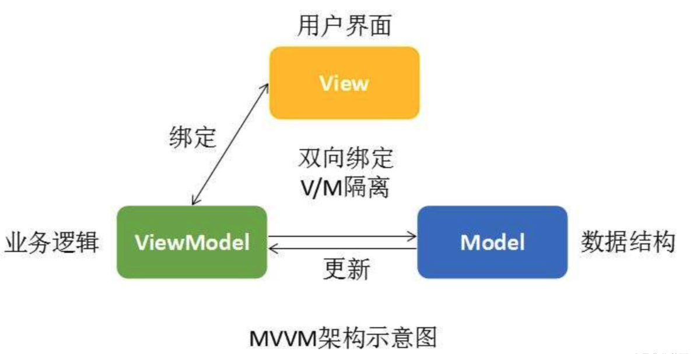

# Vue2 数据响应式原理


## 一、相关概念

### 渲染

从状态生成DOM，再输出到用户界面显示的一整套流程叫作**渲染**，应用在运行时会不断地进行重新渲染。而**响应式系统**赋予框架重新渲染的能力，其重要组成部分是**变化侦测**。变化侦测是响应式系统的核心，没有它，就没有重新渲染。框架s在运行时，视图也就无法随着状态的变化而变化。

### MVVM模式

即**Model-View-ViewModel**的简写，是M-V-VM三部分组成。它本质上就是MVC 的改进版。MVVM 就是将其中的View 的状态和行为抽象化，其中ViewModel将视图UI和业务逻辑分开，它可以取出 Model 的数据同时帮忙处理View 中由于需要展示内容而涉及的业务逻辑。

​      MVVM采用双向数据绑定，view中数据变化将自动反映到viewmodel上，反之，model中数据变化也将会自动展示在页面上。把Model和View关联起来的就是ViewModel。ViewModel负责把Model的数据同步到View显示出来，还负责把View的修改同步回Model。

​       也就是说**视图模型(ViewModel)是 MVVM 模式的核心**，它是连接 view 和 model 的桥梁：

**一是将模型（Model）转化成视图 (View)**，即将后端传递的数据转化成所看到的页面。实现的方式是：数据绑定。

 **二是将视图 (View)转化成模型(Model)**，即将所看到的页面转化成后端的数据。实现的方式是：DOM事件监听。这两个方向都实现的，我们称之为数据的双向绑定。

​      MVVM核心思想，是关注model的变化，让MVVM框架利用自己的机制自动更新DOM，也就是所谓的**数据-视图分离**，数据不会影响视图。

**模板**

```html
<p>我{{age}}岁了</p>
```

**数据变化**

```html
this.age++;
```

**数据变化，视图会自动变化**




### 侵入式和非侵入式

侵入式，指的是***引入或继承了别的包或框架***，从字面意思理解，就是你的代码里已经嵌入了别的代码，这些代码可能是你引入过的框架，也可能是你通过接口继承得来的（比如：java中的继承），这样你就可以拥有侵入代码的一些功能。所以我们就称这段代码是侵入式代码。非侵入式与侵入式正好相反，用户的代码不需要引入框架代码的信息，从类的编写者角度来看，察觉不到框架的存在。

**非侵入式**

Vue数据变化

```js
this.a++
```

**侵入式**

- React数据变化

```js
this.setState({a: this.data.a +1});
```

- 小程序数据变化

```js
this.setData({a: this.data.a +1});
```


### Object.defineProperty实现数据劫持/代理

> 利用JavaScript引擎赋予的功能，检测对象属性变化

 **`Object.defineProperty()`** 方法会直接在一个对象上定义一个新属性，或者修改一个对象的现有属性，并返回此对象。

```js
Object.defineProperty(obj, prop, descriptor)
```

- **obj**

要定义属性的对象。

- **prop**

要定义或修改的属性的名称或 [`Symbol`](https://developer.mozilla.org/zh-CN/docs/orphaned/Web/JavaScript/Reference/Global_Objects/Symbol) 。

- **descriptor**

要定义或修改的属性描述符。

| 1.属性描述符     | 含义                                                         |
| ---------------- | ------------------------------------------------------------ |
| **configurable** | 当且仅当该属性的 `configurable` 键值为 `true` 时，该属性的描述符才能够被改变，同时该属性也能从对应的对象上被删除。**默认为** **`false`**。 |
| **enumerable**   | 当且仅当该属性的 `enumerable` 键值为 `true` 时，该属性才会出现在对象的枚举属性中。**默认为 `false`**。 |
| **2.数据描述符** | **含义**                                                     |
| **value**        | 该属性对应的值。可以是任何有效的 JavaScript 值（数值，对象，函数等）**默认为undefined**。 |
| **writable**     | 当且仅当该属性的 `writable` 键值为 `true` 时，属性的值，也就是上面的 `value`，才能被[`赋值运算符` (en-US)](https://developer.mozilla.org/en-US/docs/Web/JavaScript/Reference/Operators#assignment_operators)改变。**默认为 `false`。** |
| **3.存取描述符** | **含义**                                                     |
| **get**          | 属性的 getter 函数，如果没有 getter，则为 `undefined`。**当访问该属性时，会调用此函数。**执行时不传入任何参数，但是会传入 `this` 对象（由于继承关系，这里的`this`并不一定是定义该属性的对象）。该函数的返回值会被用作属性的值。**默认为 undefined**。 |
| **set**          | 属性的 setter 函数，如果没有 setter，则为 `undefined`。**当属性值被修改时，会调用此函数。**该方法接受一个参数（也就是被赋予的新值），会传入赋值时的 `this` 对象。**默认为 undefined**。 |


**返回值**

被传递给函数的对象。


**例子**

```js
Object.defineProperty(obj, 'a',{
  //getter
  get() {
    console.log('你试图访问obj的a属性');
  },
  //setter  
  set(){
    console.log('你试图改变obj的a属性');
  }
});
console.log(obj.a);  // 会触发get回调函数
obj.a =10; // 会触发set函数
```


## 二、侦测单个数据对象

有了Object.defineProperty()这个方法来将对象的key转换成getter/setter的形式来检测对象属性变化，从而在属性发生变化的时候引入其他操作（如：动态更新视图）。

### defineReactive

```js
export default function defineReactive(data, key, val) {
  // 获取对象属性原来的值
  if (arguments.length == 2) {
    val = data[key];
  }
  Object.defineProperty(data, key, {
    enumerable: true,
    configurable: true,
    get(){
      console.log("获取数据: ", val);
      // todo：在此可执行获取时数据的钩子操作
      return val
    },
    set(newValue){
      console.log("设置新的值：", newValue);
      // todo：在此可执行数据设置时的钩子操作
      if (val === newValue) {
        return;
      }
      val = newValue;
    }
  })
}
```

### index

```js
import defineReactive from "./defineReactive";
// 测试该函数
let obj = {
  a: "aaaa",
  b: "bbbb",
  c: [{ cc: "ggg", dd: "lll" }],
  e: { f: 'ooo',g: 'ppp'}
}
// 侦测obj的a属性
defineReactive(obj, 'a');
// 设置值
obj.a = "update obj.a"
// 读取值
console.log(obj.a)
```


**输出结果：**

```shell
> "设置新的值：" "update obj.a"
> "获取数据: " "update obj.a"
> "update obj.a"
```


## 三、依赖收集

前面我们已经实现了对对象属性的侦测，我们之所以要侦测数据，其目的是当数据的属性发生变化时，**可以通知那些曾经使用了该数据的地方**，比如“数据改变时自动重新渲染视图“的功能。**需要用到数据的地方，称为依赖**。

- Vue1.x，细粒度依赖，**用到数据的DOM都是依赖**；
- Vue2.x，中等粒度依赖，**用到数据的组件是依赖**；(从Vue.js 2.0开始，它引入了虚拟DOM，将粒度调整为中等粒度，即一个状态所绑定的依赖不再是具体的DOM节点，而是一个组件。这样状态变化后，会通知到组件，组件内部再使用虚拟DOM进行比对。这可以大大降低依赖数量，从而降低依赖追踪所消耗的内存。)

### Dep


- **在getter中收集依赖，在setter中触发依赖;**
- 把依赖收集的代码封装成一个**Dep类**，它专门用来**管理依赖**，每个Observer的实例，成员中都有一个Dep的实例；

```js
let uid = 0;
export default class Dep{
  constructor(){
    this.id = uid++;
    // 存放订阅者（watcher）
    this.subs = [];
  }

  // 添加订阅者
  addSub(sub){
    this.subs.push(sub)
  }

  // 添加依赖
  depend(){
    if(Dep.target){
      console.log("depend添加一个依赖", Dep.target);
      this.addSub(Dep.target);
    }
  }

  // 通知更新
  notify(){
    console.log("notify有数据更新");
    let flag = true;
    // 浅克隆一份
    const subs = this.subs.slice();
    for (let i = 0; i < subs.length; i++) {  
      flag = false;
      subs[i].update(); // Watcher的update方法
      console.log(`----------------------------【执行订阅者${i}的更新操作】--------------------`);
    }
    if(flag)console.log("----------------------------【目前没有订阅者】--------------------");
  }
}
```


### Watcher

Watcher是一个中介的角色，数据发生变化时通知它，然后它再通知其他地方（自动触发callback回调函数，用户可在回调函数里面做操作）。

- Watcher是一个中介，数据发生变化时通过**Watcher中转，通知组件**

- 依赖就是Watcher。**只有Watcher触发的getter才会收集依赖**，哪个Watcher触发了getter，就把哪个Watcher收集到Dep中。
- Dep使用发布订阅模式，当数据发生变化时，会**循环依赖列表，把所有的Watcher都通知一遍**。
- 代码实现的巧妙之处：Watcher把自己设置到全局的一个指定位置，然后读取数据，因为读取了数据，所以会触发这个数据的getter。在getter中就能得到当前正在读取数据的Watcher，并把这个Watcher  收集到Dep中。

```js
import Dep from "./Dep";
var uid = 0;
// 属性监听器
export default class Watcher{
  constructor(target, expression, callback){
    this.id = uid++;
    this.target = target;
    this.getter = parsePath(expression);
    this.callback = callback;
    this.value = this.get();
  }

  get() {
    // 进入依赖收集阶段。让全局的Dep.target设置为Watcher本身，那么就是进入依赖收集阶段
    Dep.target = this;
    const obj = this.target; // obj对象
    var value;

    try {
      // 取出obj.expression的值,这个操作读取了obj属性的值因此会触发defineProperty中的get()
      // 此时Dep.target有值，条件成立，因此会在这个阶段执行dep.depend()收集依赖
      value = this.getter(obj); 
    } finally {
      Dep.target = null;
    }
    return value;
  }

  update(){
    // 触发回调函数
    this.getAndInvoke(this.callback);
  }

  getAndInvoke(cb) {
    const value = this.get();

    if (value !== this.value || typeof value == 'object') {
      const oldValue = this.value;
      this.value = value;
      cb.call(this.target, value, oldValue);
    }
  }

}

// 对象值获取器，解析对象属性简单路径，'obj.a.b'字符串转换为其真实的值。返回一个回调函数
function parsePath(str) {
  var segments = str.split('.');

  return (obj) => {
    for (let i = 0; i < segments.length; i++) {
      if (!obj) return;
      obj = obj[segments[i]]
    }
    return obj;
  };
}
```

### defineReactive

```js
import Dep from "./Dep";

export default function defineReactive(data, key, val) {
  const dep = new Dep();

  // 获取对象属性原来的值
  if (arguments.length == 2) {
    val = data[key];
  }
  Object.defineProperty(data, key, {
    enumerable: true,
    configurable: true,
    get(){
      // 依赖收集阶段的条件成立
      if (Dep.target) {
        console.log("get收集依赖: ", val);
        dep.depend();        
      }
      return val
    },
    set(newValue){
      if (val === newValue) {
        return;
      }
      val = newValue;      
      console.log("set触发依赖：", newValue);      
      dep.notify();
    }
  })
}
```

### 测试

```js
import defineReactive from "./defineReactive";
// 测试该函数
let obj = {
  a: "aaaa",
  b: "bbbb",
  c: [{ cc: "ggg", dd: "lll" }],
  e: { f: 'ooo',g: 'ppp'}
}
// 将obj的a属性变为可侦测属性
console.log("-----------------------------将obj的a属性变为可侦测属性-----------------------------------------")
defineReactive(obj, 'a');
// 监听obj的a属性
new Watcher(obj, 'a', (val, oldVal) => {
  console.log('★★★★★★★★★★★★我是watcher的回调函数,我监控的a属性值发生了改变★★★★★★★★★★');
  console.log("oldVal", oldVal, "newVal", val);
});
console.log("-----------------------------更改obj.a的值-----------------------------------------")
obj.a = "uuuuuuuuuuuuuuuuuuuuuuuuuuuuuu";
```

输出：

```shell
-----------------------------将obj的a属性变为可侦测属性-----------------------------------------
index.js:16 get收集依赖:  aaaa
Dep.js:17 depend添加一个依赖 Watcher {id: 0, target: {…}, getter: ƒ, callback: ƒ}
index.js:46 -----------------------------更改obj.a的值-----------------------------------------
index.js:26 set触发通知： Dep {id: 0, subs: Array(1)}
Dep.js:24 notify有数据更新
index.js:16 get收集依赖:  uuuuuuuuuuuuuuuuuuuuuuuuuuuuuu
Dep.js:17 depend添加一个依赖 Watcher {id: 0, target: {…}, value: 'aaaa', getter: ƒ, callback: ƒ}
index.js:43 ★★★★★★★★★★★★我是watcher的回调函数,我监控的a属性值发生了改变★★★★★★★★★★
index.js:44 oldVal aaaa newVal uuuuuuuuuuuuuuuuuuuuuuuuuuuuuu
Dep.js:31 ----------------------------【执行订阅者0的更新操作】--------------------
```


## 四、递归侦测对象全部属性

我们希望把数据中的所有属性（包括子属性）都侦测到，所以要封装一个Observer类。这个类的作用是将一个数据内的所有属性（包括子属性）都转换成getter/setter的形式，然后去追踪它们的变化。

如：

```json
ar obj ={  
  a: {
    m: { n: 5 }
  },
  b: 4
};
```

需要对`obj.a`、`obj.a.m`、`obj.b`进行侦测

### 实现思路


### 目录结构

```
--------Observer.js // Observer类, 将一个正常的object转换为每个层级的属性都是响应式（可以被侦测的）的object
|
|-------def.js // 定义某个对象属性的函数
|
|-------defineReactive.js // 侦测对象某个属性的函数
|
|-------observe.js // 将某个对象转换为可被侦测对象的函数
|
|-------index.js // 测试代码
```


### Observer

我们定义了Observer类，它用来将一个正常的object转换成被侦测的object。然后判断数据的类型，只有Object类型的数据才会调用walk将每一个属性转换成getter/setter的形式来侦测变化。最后，在defineReactive中新增new Observer(val)来递归子属性，这样我们就可以把data中的所有属性（包括子属性）都转换成getter/setter的形式来侦测变化。

```js
import { def } from './utils.js';
import defineReactive from './defineReactive.js';
import { arrayMethods } from './array.js';
import observe from './observe.js';
import Dep from './Dep.js';

export default class Observer {
    constructor(value) {
        // 每一个Observer的实例身上，都有一个dep
        this.dep = new Dep();
        // 给实例（this，一定要注意，构造函数中的this不是表示类本身，而是表示实例）添加了__ob__属性，值是这次new的实例
        def(value, '__ob__', this, false);
        // 不要忘记初心，Observer类的目的是：将一个正常的object转换为每个层级的属性都是响应式（可以被侦测的）的object
        // 检查它是数组还是对象
        if (Array.isArray(value)) {
            // 让这个数组变的observe
            this.observeArray(value);
        } else {
            this.walk(value);
        }
    }
    // 遍历
    walk(value) {
        for (let k in value) {
            defineReactive(value, k);
        }
    }
    // 数组的特殊遍历
    observeArray(arr) {
        for (let i = 0, l = arr.length; i < l; i++) {
            // 逐项进行observe
            observe(arr[i]);
        }
    }
};
```


### def

```js
export default function def(obj, key, value, enumerable) {
  Object.defineProperty(obj, key, {
    value,
    enumerable,
    writable: true,
    configurable: true
  });
};
```


### defineReactive

```js
import observe from './observe.js';
import Dep from './Dep.js';

export default function defineReactive(data, key, val) {
    const dep = new Dep();
    if (arguments.length == 2) {
        val = data[key];
    }

    // 子元素要进行observe，至此形成了递归。这个递归不是函数自己调用自己，而是多个函数、类循环调用
    let childOb = observe(val);

    Object.defineProperty(data, key, {
        // 可枚举
        enumerable: true,
        // 可以被配置，比如可以被delete
        configurable: true,
        // getter
        get() {
            // 如果现在处于依赖收集阶段
            if (Dep.target) {
                dep.depend();
                if (childOb) {
                    childOb.dep.depend();
                }
            }
            return val;
        },
        // setter
        set(newValue) {
            if (val === newValue) {
                return;
            }
            val = newValue;
            // 当设置了新值，这个新值也要被observe
            childOb = observe(newValue);
            // 发布订阅模式，通知dep
            dep.notify();
        }
    });
};
```


### observe

```js
import Observer from "./Observer";
export default function observe(value) {
  // 判断value是否是对象，否则直接返回
  if(typeof value != 'object')return
  // 将value转换为可被侦测的对象
  let ob;
  // 如果value存在__ob__属性，说明已经被转换过了
  if (typeof value.__ob__ !== 'undefined') {
    ob = value.__ob__;
  } else {
    ob = new Observer(value);
  }
  return ob;
}
```

### index

```js
import observe from "./observe";
import Watcher from "./Watcher";

let obj = {
  a: "aaaa",
  b: "bbbb",
  c: [
    {
      cc: "ggg",
      dd: "lll"
    },
  ],
  e: {
    f: 'ooo',
    g: 'ppp'
  }
}

observe(obj)
console.log("---------------------【测试普通属性obj.a的修改和读取】----------");
// 监听obj的a属性
new Watcher(obj, 'a', (val, oldVal) => {
  console.log('★★★★★★★★★★★★我是watcher的回调函数,我监控的a属性值发生了改变★★★★★★★★★★');
  console.log("oldVal", oldVal, "newVal", val);
});
obj.a = 999

console.log("---------------------【测试子属性obj.e.f的修改和读取】----------");
// 监听obj的e.f属性
new Watcher(obj, 'e.f', (val, oldVal) => {
  console.log('★★★★★★★★★★★★我是watcher的回调函数,我监控的e.f属性值发生了改变★★★★★★★★★★');
  console.log("oldVal", oldVal, "newVal", val);
});
obj.e.f = 'modify f'
console.log("---------------------【测试数组元素属性obj.c的修改和读取】---------");
// 监听obj的c属性
new Watcher(obj, 'c', (val, oldVal) => {
  console.log('★★★★★★★★★★★★我是watcher的回调函数,我监控的c属性值发生了改变★★★★★★★★★★');
  console.log("oldVal", oldVal, "newVal", val);
});
console.log("---------------------【测试数组属性使用赋值改变数据是否有被侦测】---------");
obj.c = [{'ccc': 'gggg'}]

console.log("---------------------【测试数组属性使用push()改变数据是否有被侦测】---------");
obj.c.push({'ee': 'push'})

```

**输出：**

```shell
index.js:20 ---------------------【测试普通属性obj.a的修改和读取】----------
Dep.js:17 depend添加一个依赖 Watcher {id: 0, target: {…}, getter: ƒ, callback: ƒ}
Dep.js:24 notify有数据更新
Dep.js:17 depend添加一个依赖 Watcher {id: 0, target: {…}, value: 'aaaa', getter: ƒ, callback: ƒ}
index.js:23 ★★★★★★★★★★★★我是watcher的回调函数,我监控的a属性值发生了改变★★★★★★★★★★
index.js:24 oldVal aaaa newVal 999
Dep.js:31 ----------------------------【执行订阅者0的更新操作】--------------------
index.js:28 ---------------------【测试子属性obj.e.f的修改和读取】----------
Dep.js:17 depend添加一个依赖 Watcher {id: 1, target: {…}, getter: ƒ, callback: ƒ}
Dep.js:17 depend添加一个依赖 Watcher {id: 1, target: {…}, getter: ƒ, callback: ƒ}
Dep.js:17 depend添加一个依赖 Watcher {id: 1, target: {…}, getter: ƒ, callback: ƒ}
Dep.js:24 notify有数据更新
Dep.js:17 depend添加一个依赖 Watcher {id: 1, target: {…}, value: 'ooo', getter: ƒ, callback: ƒ}
Dep.js:17 depend添加一个依赖 Watcher {id: 1, target: {…}, value: 'ooo', getter: ƒ, callback: ƒ}
Dep.js:17 depend添加一个依赖 Watcher {id: 1, target: {…}, value: 'ooo', getter: ƒ, callback: ƒ}
index.js:31 ★★★★★★★★★★★★我是watcher的回调函数,我监控的e.f属性值发生了改变★★★★★★★★★★
index.js:32 oldVal ooo newVal modify f
Dep.js:31 ----------------------------【执行订阅者0的更新操作】--------------------
index.js:35 ---------------------【测试数组元素属性obj.c的修改和读取】---------
Dep.js:17 depend添加一个依赖 Watcher {id: 2, target: {…}, getter: ƒ, callback: ƒ}
Dep.js:17 depend添加一个依赖 Watcher {id: 2, target: {…}, getter: ƒ, callback: ƒ}
index.js:41 ---------------------【测试数组属性使用赋值改变数据是否有被侦测】---------
Dep.js:24 notify有数据更新
Dep.js:17 depend添加一个依赖 Watcher {id: 2, target: {…}, value: Array(1), getter: ƒ, callback: ƒ}
Dep.js:17 depend添加一个依赖 Watcher {id: 2, target: {…}, value: Array(1), getter: ƒ, callback: ƒ}
index.js:38 ★★★★★★★★★★★★我是watcher的回调函数,我监控的c属性值发生了改变★★★★★★★★★★
index.js:39 oldVal [{…}, __ob__: Observer] newVal [{…}, __ob__: Observer]
Dep.js:31 ----------------------------【执行订阅者0的更新操作】--------------------
index.js:44 ---------------------【测试数组属性使用push()改变数据是否有被侦测】---------
index.js:52 [WDS] Live Reloading enabled.
```

可看出目前数组类型的属性的push操作无法被侦测。


## 五、数组的响应式处理

Array追踪变化的方式和Object不一样。因为它是通过方法来改变内容的，所以我们通过**创建拦截器**去**覆盖数组原型**的方式来追踪变化。

**当侦测到数组发生变化时，会向依赖发送通知**。

为了不污染全局Array.prototype，我们在Observer中只针对那些需要侦测变化的数组使用__proto__ 来覆盖原型方法，但 __proto__ 在ES6之前并不是标准属性，不是所有浏览器都支持它。因此，针对不支持 __proto__ 属性的浏览器，我们直接循环拦截器，把拦截器中的方法直接设置到数组身上来拦截Array.prototype上的原生方法。


 **Object.setPrototypeOf(obj, prototype) 方法**

设置一个指定的对象的原型 ( 即, 内部[[Prototype]]属性）到另一个对象或 null。

 - obj

 要设置其原型的对象。.

 - prototype

 该对象的新原型(一个对象 或 null）.


### array.js

```js
import def from "./def";

// 得到Array.prototype
const arrayPrototype = Array.prototype;

// 以Array.prototype为原型创建arrayMethods对象，并暴露
export const arrayMethods = Object.create(arrayPrototype);

// 要被改写的7个数组方法
const methodsNeedChange = [
  "push",
  "pop",
  "shift",
  "unshift",
  "splice",
  "sort",
  "reverse",
];

methodsNeedChange.forEach((methodName) => {
  // 备份原来的方法，因为push、pop等7个函数的功能不能被剥夺
  const original = arrayPrototype[methodName];
  // 定义新的方法
  def(
    arrayMethods,
    methodName,
    function () {
      // 恢复原来的功能
      const result = original.apply(this, arguments);
      // 把类数组对象变为数组
      const args = [...arguments];
      // 把这个数组身上的__ob__取出来，__ob__已经被添加了，为什么已经被添加了？因为数组肯定不是最高层，比如obj.g属性是数组，obj不能是数组，第一次遍历obj这个对象的第一层的时候，已经给g属性（就是这个数组）添加了__ob__属性。
      const ob = this.__ob__;

      // 有三种方法push\unshift\splice能够插入新项，现在要把插入的新项也要变为observe的
      let inserted = [];

      switch (methodName) {
        case "push":
        case "unshift":
          inserted = args;
          break;
        case "splice":
          // splice格式是splice(下标, 数量, 插入的新项)
          inserted = args.slice(2);
          break;
      }

      // 判断有没有要插入的新项，让新项也变为响应的
      if (inserted) {
        ob.observeArray(inserted);
      }
      // 向依赖发消息
      ob.dep.notify();

      return result;
    },
    false
  );
});

```


### Observer

修改后的Observer类代码，新增了`Object.setPrototypeOf(value, arrayMethods);`这句代码，用于覆写数组的7个操作数组元素的方法。

```js

import def from "./def";
import defineReactive from "./defineReactive";
import observe from "./observe";
import {arrayMethods} from './array'
import Dep from "./Dep";
// Observer类的目的是：将一个正常的object转换为每个层级的属性都是响应式（可以被侦测的）的object
export default class Observer {
  constructor(value) {
    // 每一个Observer的实例身上，都有一个dep
    this.dep = new Dep();
    // 给实例添加了__ob__属性，值是这次new的实例
    def(value, '__ob__', this, false);    
    // 检查它是数组还是对象
    if (Array.isArray(value)) {
      // 如果是数组：将这个数组的原型，指向arrayMethods
      Object.setPrototypeOf(value, arrayMethods);
      // 让这个数组变的observe
      this.observeArray(value);
    } else {
      this.walk(value);
    }
  }
  // 遍历
  walk(value) {
    for (let k in value) {
      defineReactive(value, k);
    }
  }
  // 数组的特殊遍历
  observeArray(arr) {
    for (let i = 0, l = arr.length; i < l; i++) {
      // 逐项进行observe
      observe(arr[i]);
    }
  }
};
```

### index

测试数组类型的数据修改是否可以侦测：

```js
import observe from "./observe";
let obj = {
  a: "aaaa",
  b: "bbbb",
  c: [{ cc: "ggg", dd: "lll" }],
  e: { f: 'ooo',g: 'ppp'}
}
// 将obj转换为可被侦测的对象
observe(obj)
console.log("---------------------【测试数组元素属性obj.c的修改和读取】---------");
// 监听obj的c属性
new Watcher(obj, 'c', (val, oldVal) => {
  console.log('★★★★★★★★★★★★我是watcher的回调函数,我监控的c属性值发生了改变★★★★★★★★★★');
  console.log("oldVal", oldVal, "newVal", val);
});
console.log("---------------------【测试数组属性使用赋值改变数据是否有被侦测】---------");
obj.c = [{'ccc': 'gggg'}]

console.log("---------------------【测试数组属性使用push()改变数据是否有被侦测】---------");
obj.c.push({'ee': 'push'})

```

**输出：**

```shell
---------------------【测试数组元素属性obj.c的修改和读取】---------
Dep.js:17 depend添加一个依赖 Watcher {id: 0, target: {…}, getter: ƒ, callback: ƒ}
Dep.js:17 depend添加一个依赖 Watcher {id: 0, target: {…}, getter: ƒ, callback: ƒ}
index.js:41 ---------------------【测试数组属性使用赋值改变数据是否有被侦测】---------
Dep.js:24 notify有数据更新
Dep.js:17 depend添加一个依赖 Watcher {id: 0, target: {…}, value: Array(1), getter: ƒ, callback: ƒ}
Dep.js:17 depend添加一个依赖 Watcher {id: 0, target: {…}, value: Array(1), getter: ƒ, callback: ƒ}
index.js:38 ★★★★★★★★★★★★我是watcher的回调函数,我监控的c属性值发生了改变★★★★★★★★★★
index.js:39 oldVal [{…}, __ob__: Observer] newVal [{…}, __ob__: Observer]
Dep.js:31 ----------------------------【执行订阅者0的更新操作】--------------------
index.js:44 ---------------------【测试数组属性使用push()改变数据是否有被侦测】---------
Dep.js:24 notify有数据更新
Dep.js:17 depend添加一个依赖 Watcher {id: 0, target: {…}, value: Array(2), getter: ƒ, callback: ƒ}
Dep.js:17 depend添加一个依赖 Watcher {id: 0, target: {…}, value: Array(2), getter: ƒ, callback: ƒ}
index.js:38 ★★★★★★★★★★★★我是watcher的回调函数,我监控的c属性值发生了改变★★★★★★★★★★
index.js:39 oldVal (2) [{…}, {…}, __ob__: Observer] newVal (2) [{…}, {…}, __ob__: Observer]
Dep.js:31 ----------------------------【执行订阅者0的更新操作】--------------------
```

