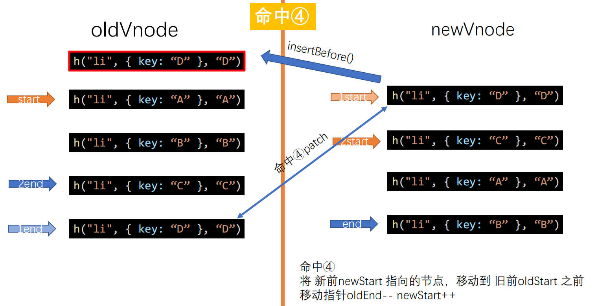

## 什么是虚拟DOM？

虚拟DOM（Virtual   Dom），也就是我们常说的虚拟节点，是**用JS对象来模拟真实DOM中的节点**，该对象包含了真实DOM的结构及其属性，用于对比虚拟DOM和真实DOM的差异，从而进行局部渲染来达到优化性能的目的。

```html
<div class="box">
  <h3>我是一个标题</h3>
  <ul>
    <li>牛奶</li>
    <li>咖啡</li>
    <li>可乐</li>
  </ul>
</div>
```

```js
{
  "sel": "div",
  "data": { 
    "class": { "box": true } 
  },
  "children": [
    {
      "sel": "h3",
      "data": {},
      "text": "我是一个标题"
    },
    {
      "sel": "ul",
      "data": {},
      "children": [
        { "sel": "li", "data": {}, "text": "牛奶" },
        { "sel": "li", "data": {}, "text": "咖啡" },
        { "sel": "li", "data": {}, "text": "可乐" }
      ]
    }
  ]
}

```

## 虚拟DOM的作用是什么？

兼容性好。因为Vnode本质是JS对象，所以不管Node还是浏览器环境，都可以操作；
减少了对Dom的操作。页面中的数据和状态变化，都通过Vnode对比，只需要在比对完之后更新DOM，不需要频繁操作，提高了页面性能；


## 虚拟DOM和真实DOM的区别？

总结大概如下：

- 虚拟DOM不会进行回流和重绘；
- 真实DOM在频繁操作时引发的回流重绘导致性能很低；
- 虚拟DOM频繁修改，然后一次性对比差异并修改真实DOM，最后进行依次回流重绘，减少了真实DOM中多次回流重绘引起的性能损耗；
- 虚拟DOM有效降低大面积的重绘与排版，因为是和真实DOM对比，更新差异部分，所以只渲染局部；


## 虚拟DOM是如何实现的降低操作真实DOM的频率的？

当数据变化时，vue如何来更新视图的？其实很简单，一开始会根据真实DOM生成虚拟DOM，当虚拟DOM某个节点的数据改变后会生成一个新的Vnode，然后采用DOM Diff算法对VNode和oldVnode进行比较，**算出应该如何最小量更新，最后反映到真正的DOM上**，最后再使得oldVnode的值为Vnode，因此**diff是发生在虚拟DOM上的diff**。


## snabbdom虚拟 DOM 库

snabbdom是著名的虚拟DOM库，是diff算法的鼻祖，Vue源码借鉴了snabbdom；

官方git：https://github.com/snabbdom/snabbdom

- 主要特点
  - 200 行 - 你可以通过简单地阅读所有核心代码来充分理解其工作原理
  - 通过模块化实现可拓展
  - 对于 vnode 和全局模块都提供了 hook，你可以在 patch 过程或者其他地方调用 hook
  - 性能卓越：Snabbdom 是目前最高效的虚拟 DOM 库之一
  - Patch 函数有一个相当于 reduce/scan 函数的函数声明，这将更容易集成其他函数式库
- 模块特点
  - 函数`h`： 轻松创建虚拟 DOM 节点
  - [SVG 需要与 `h` 函数结合使用](https://github.com/snabbdom/snabbdom/blob/master/README-zh_CN.md#svg)
  - 支持复杂的 CSS 动画实现
  - 提供强大的事件监听功能
  - 通过 [Thunks](https://github.com/snabbdom/snabbdom/blob/master/README-zh_CN.md#thunks) 进一步优化 diff 和 patch 过程
  - [支持 JSX 及 Typrscript](https://github.com/snabbdom/snabbdom/blob/master/README-zh_CN.md#jsx)

```shell
npm i -D snabbdom
```

## 三个方面进行探究

- 研究1：虚拟DOM如何被渲染函数（h函数）产生？我们要手写h函数
- 研究2：diff算法原理
- 研究3：虚拟DOM如何通过diff变为真正的DOM的(事实上，虚拟DOM变回真正的DOM，是涵盖在diff算法里面的)

> DOM如何变为虚拟DOM，属于模板编译原理范畴，在此不做探究

## h函数-产生Vnode虚拟节点

### 目标功能

- 形态① h('div', {}, '文字')
- 形态② h('div', {}, [])
- 形态③ h('div', {}, h())

**虚拟节点的属性**

```json
{
  children: undefined,
  data: {},
  elm: undefined,
  key: undefined,
  sel: "div",
  text: "文字"
}
```


- 如调用 h('a', {props: {href: 'http://www.baidu.com'}}, '百度)
得到：

```json
{"sel": "a", "data":{"props": {"href": "http://www.baidu.com"}}, "text": "百度"}
```

- 如调用h('ul', {}, [
h('li', {}, '苹果'),
  h('li', {}, '香蕉'),
  h('li', {}, '梨子'),
  ])
```html
<ul>
  <li>苹果</li>
  <li>香蕉</li>
  <li>梨子</li>
</ul>
```

- 如调用h('div', {}, h('a', {props: {href: 'http://www.baidu.com'}}, '百度))
```html
<div>
  <a href="http://www.baidu.com">百度</a>
</div>
```

### 实现h函数

**定义vnode**

```js
/**
 * 产生虚拟节点
 * 将传入的参数组合成对象返回
 * @param {string} sel 选择器
 * @param {object} data 属性、样式
 * @param {Array} children 子元素
 * @param {string|number} text 文本内容
 * @param {object} elm 对应的真正的dom节点(对象)，undefined表示节点还没有上dom树
 * @returns
 */
export default function (sel, data, children, text, elm) {
  const key = data.key;
  return { sel, data, children, text, elm, key };
}
```

**h函数生成vnode：**

```js
import vnode from "./vnode";
/**
 * 产生虚拟DOM树 返回的是一个对象
 * 低配版本的h函数，这个函数必须接受三个参数，缺一不可
 * @param {*} sel dom元素或选择器
 * @param {*} data 属性等数据
 * @param {*} c 子节点，可能为文本、数组或嵌套的h函数
 * 调用只有三种形态
 * ① h('div', {}, '文字') 文本类型的节点
 * ② h('div', {}, []) 包含多个节点，数组元素必须为vnode类型
 * ③ h('div', {}, h()) 包含子节点
 */
export default function (sel, data, c) {
  // 检查参数个数
  if (arguments.length !== 3) {
    throw new Error("请传入三个参数！");
  }
  // 检查参数c的类型
  if (typeof c === "string" || typeof c === "number") {
    // 说明现在是 ① h('div', {}, '文字')
    return vnode(sel, data, undefined, c, undefined);
  } else if (Array.isArray(c)) {
    // 说明是 ② h('div', {}, [])
    let children = [];
    // 遍历 数组 c
    for (let item of c) {
      if (!(typeof item === "object" && item.hasOwnProperty("sel"))) {
        throw new Error("传入的数组有不是h函数的项");
      }
      // 不用执行c[i], 调用的时候执行了，只要收集
      children.push(item);
    }
    return vnode(sel, data, children, undefined, undefined);
  } else if (typeof c === "object" && c.hasOwnProperty("sel")) {
    // 说明是 ③ h('div', {}, h())
    let children = [c];
    return vnode(sel, data, children, undefined, undefined);
  } else {
    throw new Error("传入的参数类型不对！");
  }
}
```

**测试：**

```js
import h from "./h";
const myVNode1 = h("div", {}, [
  h("p", {}, "嘻嘻"),
  h("p", {}, "哈哈"),
  h("p", {}, h('span', {}, '呵呵')),
]);
console.log(myVNode1);
```

**输出：**

```shell
{
    "sel": "div",
    "data": {},
    "elm": undefined
		"key": undefined
		"text": undefined
    "children": [
        {
            "sel": "p",
            "data": {},
            "text": "嘻嘻",
            "elm": undefined
            "key": undefined
            "text": undefined,
            "children": undefined
        },
        {
            "sel": "p",
            "data": {},
            "text": "哈哈",
            "elm": undefined
            "key": undefined
            "text": undefined,
            "children": undefined
        },
        {
            "sel": "p",
            "data": {},
            "elm": undefined
            "key": undefined
            "text": undefined
            "children": [
                {
                    "sel": "span",
                    "data": {},
                    "text": "呵呵",
                    "elm": undefined
                    "key": undefined
                    "text": undefined,
                    "children": undefined
                }
            ]
        }
    ]
}
```


## patch函数，将Vnode虚拟节点挂载到真实DOM树

patch也可以叫作patching算法，通过它渲染真实DOM时，并不是暴力覆盖原有DOM，而是比对新旧两个vnode之间有哪些不同，然后根据对比结果找出需要更新的节点进行更新。这本质上其实是使用JavaScript的运算成本来替换DOM操作的执行成本，而JavaScript的运算速度要比DOM快很多，这样做很划算，所以才会有虚拟DOM。

patch(oldVnode, newVnode)函数的逻辑：
- oldVnode和newVnode是否是同一个节点
  + 是则需要进行精细化的比较
  + 否则，创建newVnode的真实dom，并将其插入到旧节点之前

### patch函数

#### **逻辑：**

```js
// 1、newVnode和oldVnode是不同类型元素的节点：插入新节点删除旧节点
oldVnode = h("p", {}, "你好p");
newVnode = h("span", {}, "你好span");

// 2、newVnode和oldVnode是相同类型元素的节点：需要精细化比较
oldVnode1 = h("p", {}, ""); // 或 oldVnode1 = h("p", {}, [...]); 或 oldVnode1 = h("p", {}, h());
newVnode1 = h("p", {}, ""); // 或 newVnode1 = h("p", {}, [...]); 或 newVnode1 = h("p", {}, h());

```

#### **代码：**

```js
// patch Vnode虚拟节点挂载到真实DOM树
function patch(oldVnode, newVnode) {
  // 判断第一个参数是dom节点还是虚拟节点
  if(oldVnode.sel == '' || oldVnode.sel == undefined) {
    // 如果是dom节点，创建虚拟节点
    oldVnode = vnode(oldVnode.tagName.toLowerCase(), {}, [], undefined, oldVnode);
  }
  // 判断oldVnode和newVnode是否是同一个节点
  if(oldVnode.key == newVnode.key && oldVnode.sel == newVnode.sel) {
    // 是同一个节点，进行精细化比较
    patchVnode(oldVnode, newVnode)
  } else {
    // 不是同一个节点则创建newVnode的真实dom，并将其插入到旧节点之前
    let newVnodeElm = createElement(newVnode);
    // 将新节点插入到旧节点之前
    if(oldVnode.elm && newVnodeElm) {
      oldVnode.elm.parentNode.insertBefore(newVnodeElm, oldVnode.elm);
    }
  }
}
```


### createElement函数，虚拟节点转为真实DOM
```js
// createElement 将虚拟节点变为dom
function createElement(vnode) {
  let domNode = document.createElement(vnode.sel);
  // 有子节点还是文本
  if(vnode.text != '' && (vnode.children == undefined || vnode.children.length == 0)) {
    domNode.innerText = vnode.text;
  
  // 它内部是子节点，需要递归创建节点    
  } else if(Array.isArray(vnode.children) && vnode.children.length > 0) {
    for (let i = 0; i < vnode.children.length; i++) {
      // 子节点
      let ch = vnode.children[i];
      // 递归创建出子节点的dom
      let chDOM = createElement(ch);
      domNode.appendChild(chDOM);
    }
  }
  // 补充elm属性
  vnode.elm = domNode;
  // elm是一个纯dom对象
  return vnode.elm
}
```
### patchVnode函数，相同节点的子节点比较

#### **逻辑：**

```js
// （1）新节点是文本节点: 判断两者的text属性不相同则直接oldVnode.elm.innerText = newVnode.text;
oldVnode1 = h("p", {}, ""); // 或 oldVnode1 = h("p", {}, [...]); 或 oldVnode1 = h("p", {}, h());
newVnode1 = h("p", {}, "你好span");

// （2）新节点不是文本节点，旧节点是文本节点：清空oldVnode的内容，插入newVnode
oldVnode1 = h("div", {}, "");
newVnode1 = h("div", {}, [
    h("p", {}, "A"),
    h("p", {}, "B"),
    h("p", {}, "C"),
]);

// （3）新节点不是文本节点，旧节点含有children属性，即新老节点都有children：需要对这两个节点进行diff精细化比较以提升性能
oldVnode1 = h("div", {}, [
    h("p", {}, "A"),
    h("p", {}, "B"),
]);
newVnode1 = h("div", {}, [
    h("p", {}, "A"),
    h("p", {}, "B"),
    h("p", {}, "C"),
]);
```

#### **代码：**

```js
function patchVnode(oldVnode, newVnode) {  
  // 判断newVnode是不是text
  if(newVnode.text != '' && (newVnode.children == undefined || newVnode.children.length == 0)) {
    if(newVnode.text != oldVnode.text) {
      // 将新节点覆盖旧节点
      oldVnode.elm.innerText = newVnode.text;
    }
    // newVnode有子节点
  } else if(Array.isArray(newVnode.children) && newVnode.children.length > 0){
    // 旧节点有子节点
    if(oldVnode.children != undefined && oldVnode.children.length > 0) {
      // 子节点精细化比较
      updateChildren(oldVnode.elm, oldVnode.children, newVnode.children);
    // 旧节点是文本节点，直接清空老节点、插入新节点
    } else {
      // 清空老节点内容
      oldVnode.elm.innerHTML = ''
      for (let i = 0; i < newVnode.children.length; i++) {
        let dom = createElement(newVnode.children[i]);
        // 上树
        oldVnode.elm.appendChild(dom);
      }
    }
  }
}
```

### updateChildren函数，子节点精细化比较，diff算法的实现

**之所以需要通过算法来比对两个节点之间的差异，并针对不同的节点进行更新，主要是为了性能考虑。**

可将节点的变换情况归纳如下：

1、新增

2、删除

3、更新

dff算法可对这些情况做最优的处理

#### **逻辑：**

需要四个指针oldStart、newStart、newEnd、oldEnd来记录节点位置

**四种命中策略（前指的未处理的第一个，后指的未处理的最后一个）**

从前往后，命中一种就不再进行命中判断了

- ① 新前与旧前(如命中，移动新旧头指针oldStart++、newStart++)
- ② 新后与旧后(如命中，移动新旧尾指针oldEnd--、newEnd--)
- ③ 新后与旧前(如命中，此时需要移动节点，移动新前指向的节点到老节点的旧后的后面，移动指针oldStart++、newEnd--)
- ④ 新前与旧后(如命中，此时需要移动节点，移动新前指向的节点到老节点的旧前的前面，移动指针oldEnd--、newStart++)
- 循环结束
  + 如果newStartIdx <= newEndIdx，则说明新节点有剩余，需要新增节点
  + 否则表示需要删除节点

**四种都没有命中**

- 查找newStart指向的节点在oldVnode中有没有？有就Patch
  - patchVnode该节点
  - 将oldVnode中找到的节点设置为undefined
  - 将找到的节点插入到oldStart前面
- 没有找到则创建新虚拟节点的dom，并插入到oldStartVnode的dom节点前面
- 移动指针newStart++

**可以使用keyMap缓存从oldStart开始到oldEnd的节点，key为节点的key，值为节点的序号**





#### **代码：**

```js
// 判断是否是同一个节点
function checkSameVnode(a, b){
  return a.sel == b.sel && a.key == b.key;
}

function updateChildren(parentElm, oldCh, newCh) {
  // 旧前
  let oldStartIdx = 0;
  // 新前
  let newStartIdx = 0;
  // 旧后
  let oldEndIdx = oldCh.length - 1;
  // 新后
  let newEndIdx = newCh.length - 1;

  // 旧前节点
  let oldStartVnode = oldCh[0];
  // 旧后节点
  let oldEndVnode = oldCh[oldEndIdx];
  // 新前节点
  let newStartVnode = newCh[0];
  // 新后节点
  let newEndVnode = newCh[newEndIdx];
  // key map
  let keyMap = null;

  while(oldStartIdx <= oldEndIdx && newStartIdx <= newEndIdx) {
    // 首先应该不是判断四种命中，而是略过已经加了undefined标记的项
    if (oldStartVnode === null || oldCh[oldStartIdx] === undefined) {
      oldStartVnode = oldCh[++oldStartIdx];
    } else if (oldEndVnode === null || oldCh[oldEndIdx] === undefined) {
      oldEndVnode = oldCh[--oldEndIdx];
    } else if (newStartVnode === null || newCh[newStartIdx] === undefined) {
      newStartVnode = newCh[++newStartIdx];
    } else if (newEndVnode === null || newCh[newEndIdx] === undefined) {
      newEndVnode = newCh[--newEndIdx];
    // 新前和旧前
    } else if (checkSameVnode(oldStartVnode, newStartVnode)) {
      console.log("【1】 新前和旧前命中");
      patchVnode(oldStartVnode, newStartVnode);
      oldStartVnode = oldCh[++oldStartIdx];
      newStartVnode = newCh[++newStartIdx];
    } else if(checkSameVnode(oldEndVnode, newEndVnode)) {
       // 新后和旧后
       console.log("【2】 新后和旧后命中");
       patchVnode(oldEndVnode, newEndVnode);
       oldEndVnode = oldCh[--oldEndIdx];
       newEndVnode = newCh[--newEndIdx];
    } else if(checkSameVnode(oldStartVnode, newEndVnode)) {
      // 新后旧前
      console.log("【3】 新后旧前");
      patchVnode(oldStartVnode, newEndVnode);
      // 此时需要移动节点，移动新前指向的节点到老节点的旧后的后面
      parentElm.insertBefore(oldStartVnode.elm, oldEndVnode.elm.nextSibling);

      oldStartVnode = oldCh[++oldStartIdx];
      newEndVnode = newCh[--newEndIdx];
    } else if(checkSameVnode(oldEndVnode, newStartVnode)) {
      // 新后旧前
      console.log("【4】 新前和旧后命中");
      patchVnode(oldEndVnode, newStartVnode);
      // 此时需要移动节点，移动新前指向的节点到老节点的旧前的前面
      parentElm.insertBefore(oldStartVnode.elm, oldEndVnode.elm.nextSibling);

      oldEndVnode = oldCh[--oldEndIdx];
      newStartVnode = newCh[++newStartIdx];
    } else {
      console.log("【5】都没命中");
      // 都没有匹配
      if (!keyMap) {
        keyMap = {};
        // 从oldStartIdx开始到oldEndIdx结束，创建keyMap
        for (let i = oldStartIdx; i <= oldEndIdx; i++) {
          const key = oldCh[i].key;
          if (key !== undefined) {
            keyMap[key] = i;
          }
        }
      }
      const idxInOld = keyMap[newStartVnode.key];      
      // 寻找当前项（newStartIdx）在keyMap中映射的序号
      if (idxInOld === undefined) {
        // 如果 idxInOld 是 undefined 说明是全新的项，要插入
        // 被加入的项（就是newStartVnode这项)现不是真正的DOM节点
        parentElm.insertBefore(createElement(newStartVnode), oldStartVnode.elm);
      } else {
        // 说明不是全新的项，要移动
        const elmToMove = oldCh[idxInOld];
        patchVnode(elmToMove, newStartVnode);
        // 把这项设置为undefined，表示我已经处理完这项了
        oldCh[idxInOld] = undefined;
        // 移动，调用insertBefore也可以实现移动。
        parentElm.insertBefore(elmToMove.elm, oldStartVnode.elm);
      }
      // 新前下移一个节点
      newStartVnode = newCh[++newStartIdx];
    }
  }

  // 继续看有没有剩余的，循环结束start是否比old小
  console.log("循环结束，判断是否需要新增或删除节点")
  if (newStartIdx <= newEndIdx) {
    // new有剩余, 表示需要新增节点
    // const before = newCh[newEndIdx + 1] == null ? null : newCh[newEndIdx + 1].elm;
    for (let i = newStartIdx; i <= newEndIdx; i++) {
      parentElm.insertBefore(createElement(newCh[i]), oldCh[oldStartIdx]?.elm);
    }
  } else if (oldStartIdx <= oldEndIdx) {
    // old有剩余，表示需要删除节点
    for (let i = oldStartIdx; i <= oldEndIdx; i++) {
      parentElm.removeChild(oldCh[i].elm);
    }
  }
}

```

## 参考
- 【尚硅谷】Vue源码解析之虚拟DOM和diff算法 https://www.bilibili.com/video/BV1v5411H7gZ
- 一篇文章带你搞懂Vue虚拟Dom与diff算法 https://www.jb51.net/article/194147.htm

