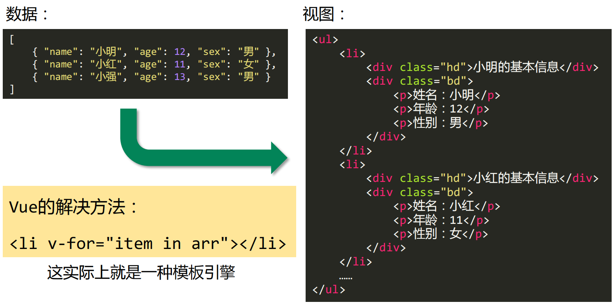

## 基本概念

### 什么是模板引擎

模板引擎是为了使用户界面与业务数据（内容）分离而产生的，它可以生成特定格式的文档，用于网站的模板引擎就会生成一个标准的文档，就是将模板文件和数据通过模板引擎生成一个HTML代码。




### 数据变为视图发展历程

**纯DOM法**： 

非常笨拙，没有实战价值

**数组join法**： 

曾几何时非常流行，是曾经的前端必会知识

**ES6的反引号法**： 

ES6中新增的`${a}`语法糖，很好用

 **模板引擎**： 

解决数据变为视图的最优雅的方法


### 模板引擎库

mustache是最早的模板引擎库，比Vue诞生的早多了，它的底层实现机理在当时是非常有创造性的、轰动性的，为后续模板引擎的发展提供了崭新的思路。

mustache官方git： https://github.com/janl/mustache.js

mustache是“胡子”的意思，因为它的嵌入标记{{ }}非常像胡子

引入模板引擎后，在html中也可以写带有逻辑的代码了：


## 模板引擎实现

### 原理

① 将模板字符串编译为tokens形式

② 将tokens结合数据，解析为DOM字符串


### 扫描字符串，生成tokens

#### 逻辑分析

**1、扫描字符串，找到左双括号`{{`的位置pos，并收集开始标记出现之前的文字text**

- 需要对象text做去除空格处理，但是不能将标签里的空格去除了，比如<div class="box">不能去掉class前面的空格
  - 扫描text字符串，判断是普通文字的空格，还是标签中的空格
  - 如果这项不是空格，拼接上
  - 如果这项是空格，只有当它在标签内的时候，才拼接上

- 将去除完空格的text存起来，记做 ['text', '<div><ul>']，同时要记录从当前指针这个字符开始，到最后的全部字符存给tail，每次使用tail进行扫描即可完成对后续未处理字符串的解析

**2、跳过`{{`的位置，继续扫描tail，开始收集右双括号`}}`之前的文字，即双大括号`{{}}`之间的内容**

- 双大括号之间的内容word可能是普通变量`name` 也可能是数组`#students`，需要判别后做相应处理
  - 如果word[0]是`#`，那么就是数组的开始，将其记作['#', 'students']
  - 如果word[0]是`/`，那么就是数组的结尾，记作['/', 'students']
  - 以上都不是，则只能是普通变量了，记作['name', 'name']

**3、跳过`}}`的位置，循环执行步骤1、2，直到扫描完所有字符**

得到初步的tokens

```json
[
  ["text", "<div><ul>"],
  ["#", "students"],
  ["text", '<li class="myli">学生'],
  ["name", "name"],
  ["text", "的爱好是<ol>"],
  ["#", "hobbies"],
  ["text", "<li>"],
  ["name", "."],
  ["text", "</li>"],
  ["/", "hobbies"],
  ["text", "</ol></li>"],
  ["/", "students"],
  ["text", "</ul></div>"],
];
```

**4、得到初步的tokens后，接下来还需要处理数组的子项，如` ['#', 'students']`和['/', 'students']之间的内容就是它的子项**

- 将#和/之间的tokens能够整合起来，作为它的下标为3的项，遍历tokens，分析子元素token是否时是`#`或`/`
  - token[0]为`#`，表示数组开始了，后面的token都是子项，需要收集起来
  - token[0]为`/`，表示数组结束了，下个token不再是子项，恢复到上一层级

此时tokens的结构如下：

```json
[
  ["text", "<div><ul>"],
  [
    "#",
    "students",
    [
      ["text", '<li class="myli">学生'],
      ["name", "name"],
      ["text", "的爱好是<ol>"],
      [
        "#",
        "hobbies",
        [
          ["text", "<li>"],
          ["name", "."],
          ["text", "</li>"],
        ],
      ],
      ["text", "</ol></li>"],
    ],
  ],
  ["text", '<li class="myli">学生'],
  ["name", "name"],
  ["text", "的爱好是<ol>"],
  [
    "#",
    "hobbies",
    [
      ["text", "<li>"],
      ["name", "."],
      ["text", "</li>"],
    ],
  ],
  ["text", "<li>"],
  ["name", "."],
  ["text", "</li>"],
  ["/", "hobbies"],
  ["text", "</ol></li>"],
  ["/", "students"],
  ["text", "</ul></div>"],
];
```


#### 代码实现

##### **parseTemplateToTokens函数**

```js
import Scanner from './Scanner.js';
import nestTokens from './nestTokens.js';

/* 
    将模板字符串变为tokens数组
*/
export default function parseTemplateToTokens(templateStr) {
    var tokens = [];
    // 创建扫描器
    var scanner = new Scanner(templateStr);
    var words;
    // 让扫描器工作
    while (!scanner.eos()) {
        // 收集开始标记出现之前的文字
        words = scanner.scanUtil('{{');
        if (words != '') {
            console.log('words', words);
            // 尝试写一下去掉空格，智能判断是普通文字的空格，还是标签中的空格
            // 标签中的空格不能去掉，比如<div class="box">不能去掉class前面的空格
            let isInJJH = false;
            // 空白字符串
            var _words = '';
            for (let i = 0; i < words.length; i++) {
                // 判断是否在标签里
                if (words[i] == '<') {
                    isInJJH = true;
                } else if (words[i] == '>') {
                    isInJJH = false;
                }
                // 如果这项不是空格，拼接上
                if (!/\s/.test(words[i])) {
                    _words += words[i];
                } else {
                    // 如果这项是空格，只有当它在标签内的时候，才拼接上
                    if (isInJJH) {
                        _words += ' ';
                    }
                }
            }
            // 存起来，去掉空格
            tokens.push(['text', _words]);
        }
        // 过双大括号
        scanner.scan('{{');
        // 收集开始标记出现之前的文字
        words = scanner.scanUtil('}}');
        if (words != '') {
            // 这个words就是{{}}中间的东西。判断一下首字符
            if (words[0] == '#') {
                // 存起来，从下标为1的项开始存，因为下标为0的项是#
                tokens.push(['#', words.substring(1)]);
            } else if (words[0] == '/') {
                // 存起来，从下标为1的项开始存，因为下标为0的项是/
                tokens.push(['/', words.substring(1)]);
            } else {
                // 存起来
                tokens.push(['name', words]);
            }
        }
        // 过双大括号
        scanner.scan('}}');
    }
    console.log('tokens', tokens);

    // 返回折叠收集的tokens
    return nestTokens(tokens);
}
```

##### **Scanner类**

```js
/* 
    扫描器类
*/
export default class Scanner {
    constructor(templateStr) {
        // 将模板字符串写到实例身上
        this.templateStr = templateStr;
        // 指针
        this.pos = 0;
        // 尾巴，一开始就是模板字符串原文
        this.tail = templateStr;
    }

    // 功能弱，就是走过指定内容，没有返回值
    scan(tag) {
        if (this.tail.indexOf(tag) == 0) {
            // tag有多长，比如{{长度是2，就让指针后移多少位
            this.pos += tag.length;
            // 尾巴也要变，改变尾巴为从当前指针这个字符开始，到最后的全部字符
            this.tail = this.templateStr.substring(this.pos);
        }
    }

    // 让指针进行扫描，直到遇见指定内容结束，并且能够返回结束之前路过的文字
    scanUtil(stopTag) {
        // 记录一下执行本方法的时候pos的值
        const pos_backup = this.pos;
        console.log('pos_backup', pos_backup)
        // 当尾巴的开头不是stopTag的时候，就说明还没有扫描到stopTag
        // 写&&很有必要，因为防止找不到，那么寻找到最后也要停止下来
        while (!this.eos() && this.tail.indexOf(stopTag) != 0) {
            this.pos++;
            // 改变尾巴为从当前指针这个字符开始，到最后的全部字符
            this.tail = this.templateStr.substring(this.pos);
            // console.log('this.tail', this.pos, stopTag, this.tail);
        }

        return this.templateStr.substring(pos_backup, this.pos);
    }

    // 指针是否已经到头，返回布尔值。end of string
    eos() {
        return this.pos >= this.templateStr.length;
    }
};
```

##### **nestTokens函数**

```js
/* 
    函数的功能是折叠tokens，将#和/之间的tokens能够整合起来，作为它的下标为3的项
*/
export default function nestTokens(tokens) {
    // 结果数组
    var nestedTokens = [];
    // 栈结构，存放小tokens，栈顶（靠近端口的，最新进入的）的tokens数组中当前操作的这个tokens小数组
    var sections = [];
    // 收集器，天生指向nestedTokens结果数组，引用类型值，所以指向的是同一个数组
    // 收集器的指向会变化，当遇见#的时候，收集器会指向这个token的下标为2的新数组
    var collector = nestedTokens;

    for (let i = 0; i < tokens.length; i++) {
        let token = tokens[i];

        switch (token[0]) {
            case '#':
                // 收集器中放入这个token
                collector.push(token);
                // 入栈
                sections.push(token);
                // 收集器要换人。给token添加下标为2的项，并且让收集器指向它
                collector = token[2] = [];
                break;
            case '/':
                // 出栈。pop()会返回刚刚弹出的项
                sections.pop();
                // 改变收集器为栈结构队尾（队尾是栈顶）那项的下标为2的数组
                collector = sections.length > 0 ? sections[sections.length - 1][2] : nestedTokens;
                break;
            default:
                // 甭管当前的collector是谁，可能是结果nestedTokens，也可能是某个token的下标为2的数组，甭管是谁，推入collctor即可。
                collector.push(token);
        }
    }

    return nestedTokens;
};
```


### 将tokens数组变为DOM字符串

#### 逻辑分析

1、遍历tokens数组，分类型处理token

2、如果token[0]为`text`，则直接拼接该字符串即可

3、如果token[0]为`name`，name则需对token[1]字符串进行解析，找到data中对应的属性值替换该字符串，然后拼接到结果字符串后面

4、如果token[0]为`#`，即表名该项是数组，需要递归处理，然后将处理后得到的字符串拼接到结果字符串后面


#### 代码实现

##### **renderTemplate函数**

```js
import lookup from './lookup.js';
import parseArray from './parseArray.js';
/* 
    函数的功能是让tokens数组变为dom字符串
*/
export default function renderTemplate(tokens, data) {
    // 结果字符串
    var resultStr = '';
    // 遍历tokens
    for (let i = 0; i < tokens.length; i++) {
        let token = tokens[i];
        // 看类型
        if (token[0] == 'text') {
            // 拼起来
            resultStr += token[1];
        } else if (token[0] == 'name') {
            // 如果是name类型，那么就直接使用它的值，当然要用lookup
            // 因为防止这里是“a.b.c”有逗号的形式
            resultStr += lookup(data, token[1]);
        } else if (token[0] == '#') {
            resultStr += parseArray(token, data);
        }
    }

    return resultStr;
}
```


##### **lookup函数实现**

```js
/* 
    功能是可以在dataObj对象中，寻找用连续点符号的keyName属性
    比如，dataObj是
    {
        a: {
            b: {
                c: 100
            }
        }
    }
    那么lookup(dataObj, 'a.b.c')结果就是100
*/
export default function lookup(dataObj, keyName) {
    // 看看keyName中有没有点符号，但是不能是.本身
    if (keyName.indexOf('.') != -1 && keyName != '.') {
        // 如果有点符号，那么拆开
        var keys = keyName.split('.');
        // 设置一个临时变量，这个临时变量用于周转，一层一层找下去。
        var temp = dataObj;
        // 每找一层，就把它设置为新的临时变量
        for (let i = 0; i < keys.length; i++) {
            temp = temp[keys[i]];
        }
        return temp;
    }
    // 如果这里面没有点符号
    return dataObj[keyName];
};
```


##### **parseArray函数实现**

```js
import lookup from './lookup.js';
import renderTemplate from './renderTemplate.js';
/* 
    处理数组，结合renderTemplate实现递归
    注意，这个函数收的参数是token！而不是tokens！
    token是什么，就是一个简单的['#', 'students', [

    ]]
    
    这个函数要递归调用renderTemplate函数，调用多少次？？？
    千万别蒙圈！调用的次数由data决定
    比如data的形式是这样的：
    {
        students: [
            { 'name': '小明', 'hobbies': ['游泳', '健身'] },
            { 'name': '小红', 'hobbies': ['足球', '蓝球', '羽毛球'] },
            { 'name': '小强', 'hobbies': ['吃饭', '睡觉'] },
        ]
    };
    那么parseArray()函数就要递归调用renderTemplate函数3次，因为数组长度是3
*/

export default function parseArray(token, data) {
    // 得到整体数据data中这个数组要使用的部分
    var v = lookup(data, token[1]);
    // 结果字符串
    var resultStr = '';
    // 遍历v数组，v一定是数组
    // 注意，下面这个循环可能是整个包中最难思考的一个循环
    // 它是遍历数据，而不是遍历tokens。数组中的数据有几条，就要遍历几条。
    for(let i = 0 ; i < v.length; i++) {
        // 这里要补一个“.”属性
        // 拼接
        resultStr += renderTemplate(token[2], {
            ...v[i],
            '.': v[i]
        });
    }
    return resultStr;
};
```


### 测试

#### **html**

```html
<!DOCTYPE html>
<html lang="en">
<head>
    <meta charset="UTF-8">
    <meta name="viewport" content="width=device-width, initial-scale=1.0">
    <title>Document</title>
</head>
<body>
    <div id="container"></div>
    <script src="/xuni/bundle.js"></script>
    <script>
        // 模板字符串
        var templateStr = `
            <div>
                <ul>
                    {{#students}}
                    <li class="myli">
                        学生{{name}}的爱好是
                        <ol>
                            {{#hobbies}}
                            <li>{{.}}</li>
                            {{/hobbies}}
                        </ol>
                    </li>
                    {{/students}}
                </ul>
            </div>
        `;
        // 数据
        var data = {
            students: [
                { 'name': '小明', 'hobbies': ['编程', '游泳'] },
                { 'name': '小红', 'hobbies': ['看书', '弹琴', '画画'] },
                { 'name': '小强', 'hobbies': ['锻炼'] }
            ]
        };

        // 调用render
        var domStr = My_TemplateEngine.render(templateStr, data);
        console.log(domStr);

        // 渲染上树
        var container = document.getElementById('container');
        container.innerHTML = domStr;
    </script>
</body>
</html>
```


#### **js**

```js
import parseTemplateToTokens from './parseTemplateToTokens.js';
import renderTemplate from './renderTemplate.js';

// 全局提供SSG_TemplateEngine对象
window.My_TemplateEngine = {
    // 渲染方法
    render(templateStr, data) {
        // 调用parseTemplateToTokens函数，让模板字符串能够变为tokens数组
        var tokens = parseTemplateToTokens(templateStr);
        // 调用renderTemplate函数，让tokens数组变为dom字符串
        var domStr = renderTemplate(tokens, data);
        
        return domStr;
    }
};
```


