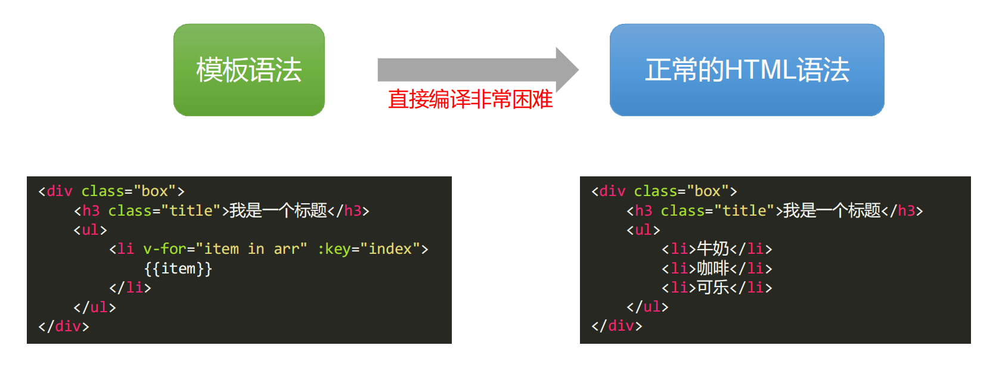
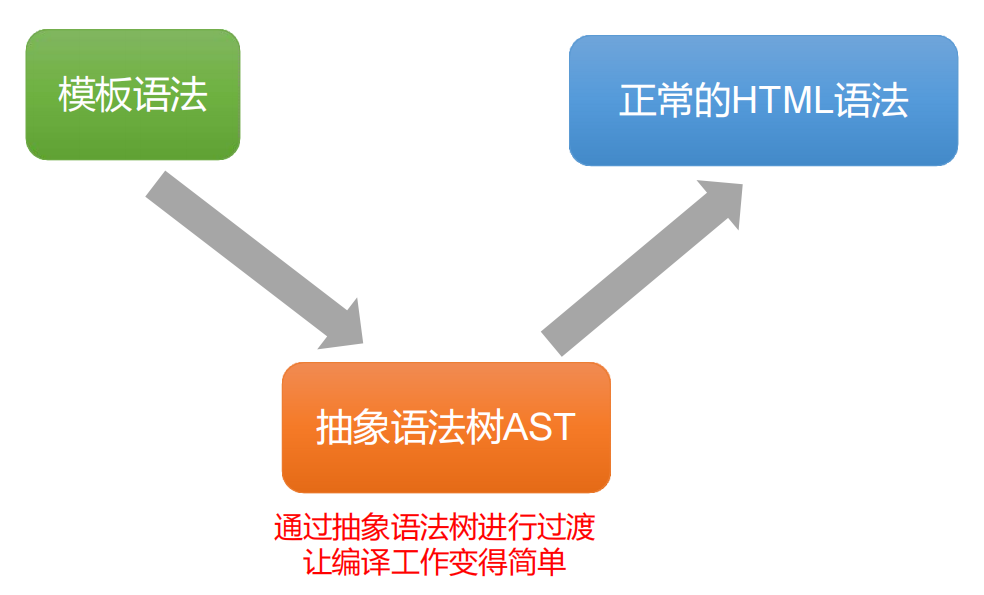
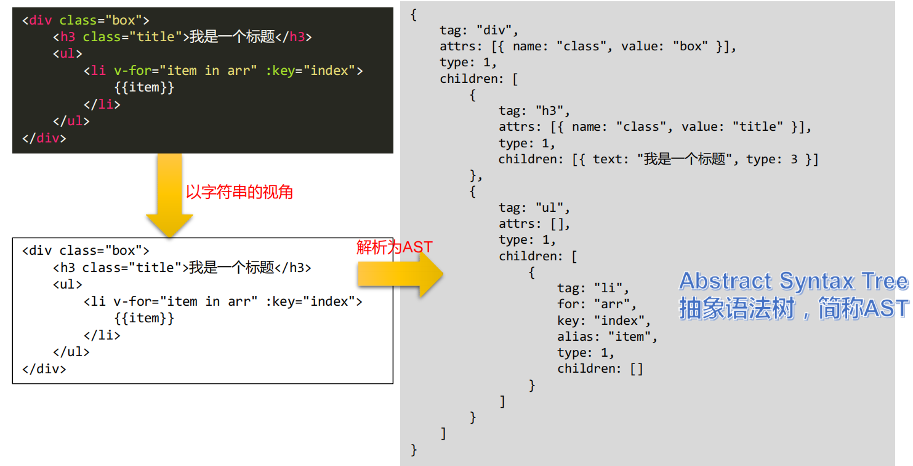
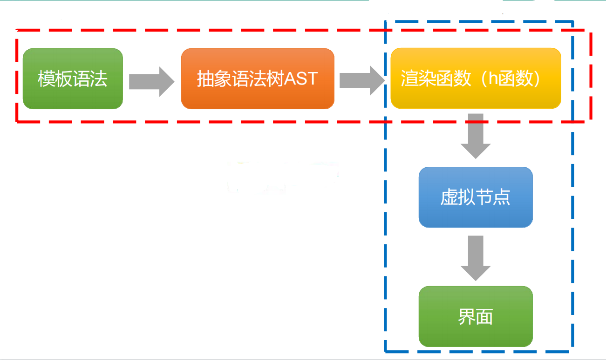

## 基本概念

### 什么是抽象语法树

抽象语法树（abstract syntax code，AST）是源代码的抽象语法结构的树状表示，树上的每个节点都表示源代码中的一种结构，这所以说是抽象的，是因为抽象语法树并不会表示出真实语法出现的每一个细节，比如说，嵌套括号被隐含在树的结构中，并没有以节点的形式呈现。

### 使用场景

- JS 反编译，语法解析
- Babel 编译 ES6 语法
- 代码高亮
- 关键字匹配
- 作用域判断
- 代码压缩


### 在Vue中的应用





**抽象语法树本质上就是一个js对象**



### 抽象语法树与模板引擎以及虚拟节点是怎样的关系？

**梳理一下几个名称概念：**

- 抽象语法树，是对模板字符串解析后得到的一个js对象
- 模板引擎，是将模板字符串编译为tokens形式，然后将tokens结合数据，解析为DOM字符串
- 虚拟节点，是用JS对象来模拟真实DOM中的节点
- 渲染函数h函数是一个产生Vnode虚拟节点的函数，虚拟节点最终会通过patch函数变为真正的DOM节点即html界面

**如下图所示，从Vue模板到界面所经历的过程：**

将模板字符串转换为AST，然后AST会被转换成渲染函数中的内容，这个内容可以称为代码字符串，代码字符串可以被包装在函数中执行，这个函数就是我们通常所说的渲染函数，渲染函数被执行之后，可以生成一份VNode，而虚拟DOM可以通过这个VNode来渲染视图。




## 实现

### 实现逻辑

- 识别标签tag
- 识别标签中的属性attribute

### 实现代码

#### 处理标签

```js
import parseAttrsString from "./parseAttrsString";

/**
 * parse函数
 * @param {*} templateString
 * @returns
 */
export default function parse(templateString) {
  // 定义一个指针
  let i = 0;
  // 剩余部分
  let rest = "";

  // 开始标记正则
  let startRegExp = /^\<([a-z1-6]+)(\s[^\<]+)?\>/;
  // 结束标记正则
  let endRegExp = /^\<\/([a-z1-6]+)\>/;
  // 结束标记之前的文字【前面不是是<】
  let wordRegExp = /^([^\<]+)\<\/[a-z0-9]+\>/;

  // 准备两个栈
  let stack1 = []; // 辅助栈，存标签名
  let stack2 = [{ children: [] }];

  while (i < templateString.length - 1) {
    rest = templateString.substring(i);

    // 识别开始标签
    if (startRegExp.test(rest)) {
      let tag = rest.match(startRegExp)[1];
      let attrsString = rest.match(startRegExp)[2];
      console.log(i, "检测到开始标记", tag);

      const attrsStringLength = attrsString == null ? 0 : attrsString.length;
      // 将开始标记 入栈1
      stack1.push(tag);
      // 处理标签属性
      const attrsArray = parseAttrsString(attrsString);
      // 将空数组 入栈2
      stack2.push({ tag: tag, children: [], attrs: attrsArray });

      i += tag.length + 2 + attrsStringLength;
    } else if (endRegExp.test(rest)) {
      // 遇见结束标签
      let tag = rest.match(endRegExp)[1];
      console.log(i, "检测到结束标记", tag);

      let pop_tag = stack1.pop();
      // 此时tag一定与stack1的栈顶相同
      if (tag === pop_tag) {
        let pop_arr = stack2.pop();

        if (stack2.length > 0) {
          stack2[stack2.length - 1].children.push(pop_arr);
        }
      } else {
        throw new Error(pop_tag + "标签没有封闭好");
      }

      i += tag.length + 3;
    } else if (wordRegExp.test(rest)) {
      let word = rest.match(wordRegExp)[1];
      // 看word是不是全空
      if (!/^\s+$/.test(word)) {
        // 不为空
        console.log(i, "检测到文字", word);
        // 改变stack2的栈顶元素
        stack2[stack2.length - 1].children.push({ text: word, type: 3 });
      }
      i += word.length;
    } else {
      i++;
    }
  }
  return stack2[0].children[0];
}

```


#### 处理属性

```js
/**
 * 将attrsString变为数组返回
 * @param {*} attrsString
 */
export default function parseAttrsString(attrsString) {
  let result = [];
  // 当前是否在引号内
  let isQuote = false;
  let point = 0;
  if (attrsString === undefined) return [];

  for (let i = 0; i < attrsString.length; i++) {
    let char = attrsString[i];
    if (char === '"') {
      isQuote = !isQuote;
    } else if (char === " " && !isQuote) {
      // 是空格且不在引号之中
      let str = attrsString.substring(point, i);
      // 不是纯空格
      if (!/^\s*$/.test(str)) {
        result.push(str.trim());
        point = i;
      }
    }
  }
  // 循环结束之后，最后一个也要加进去
  result.push(attrsString.substring(point).trim());

  result = result.map((item) => {
    // 根据等号拆分
    const o = item.match(/^(.+)="(.+)"$/);
    return {
      name: o[1],
      value: o[2],
    };
  });

  return result;
}
```


