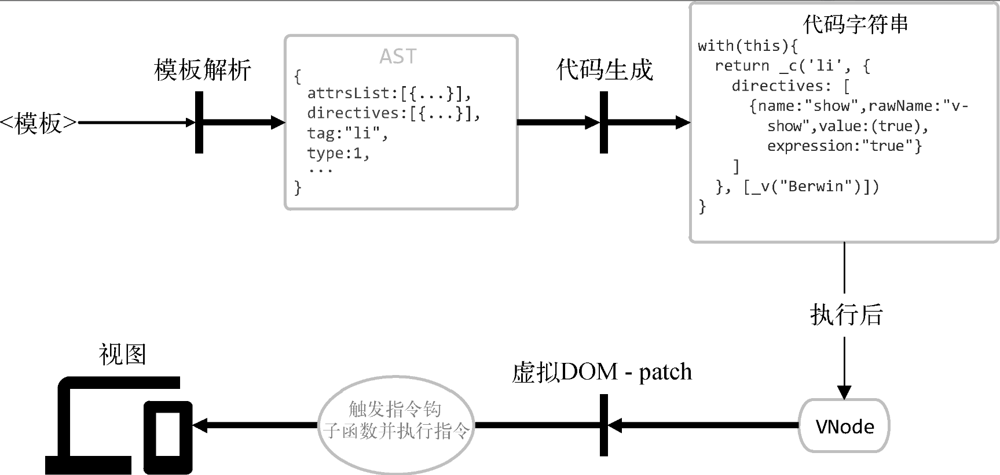

## 基本概念

### 什么是指令？

指令（directive）是Vue.js提供的带有v-前缀的特殊特性。指令属性的值预期是单个JavaScript表达式。指令的职责是，当表达式的值改变时，将其产生的连带影响响应式地作用于DOM。


### 指令原理

在模板解析阶段，我们在将指令解析到AST，然后使用**AST生成代码字符串的过程中实现某些内置指令**的功能，最后**在虚拟DOM渲染的过程中触发自定义指令的钩子函数使指令生效**。





在模板解析阶段，会将节点上的指令解析出来并添加到AST的directives属性中。随后directives数据会传递到VNode中，接着就可以通过vnode.data.directives获取一个节点所绑定的指令。

最后，当虚拟DOM进行修补时，会根据节点的对比结果触发一些钩子函数。更新指令的程序会监听create、update和destroy钩子函数，并在这三个钩子函数触发时对VNode和oldVNode进行对比，最终根据对比结果触发指令的钩子函数。（使用自定义指令时，可以监听5种钩子函数：bind、inserted、update、componentUpdated与unbind。）指令的钩子函数被触发后，就说明指令生效了。


### v-if原理

```html
01  <li v-if="has">if</li>
02  <li v-else>else</li>
```

生成的代码字符串

```js
01  (has)
02    ? _c('li',[_v("if")])
03    : _c('li',[_v("else")])
```

这样一段代码字符串在最终被执行时，会根据has变量的值来选择创建哪个节点。


### v-on原理

v-on指令的作用是绑定事件监听器，事件类型由参数指定。它用在普通元素上时，可以监听原生DOM事件；用在自定义元素组件上时，可以监听子组件触发的自定义事件。

```html
01  <button v-on:click="doThat">我是按钮</button>
```

在最终生成的VNode中，我们可以通过vnode.data.on读出下面的事件对象：

```js
01  {
02    click: function () {}
03  }
```


### v-model原理


