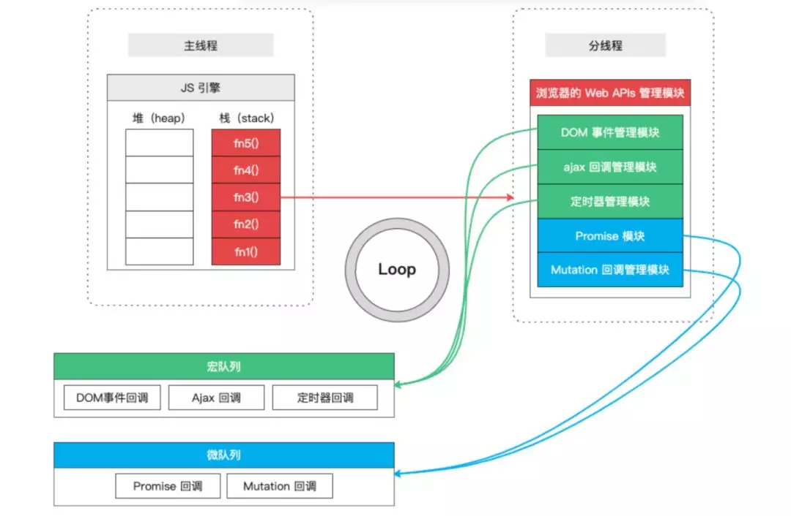

## Promise基本概念

Promise 是异步编程的一种解决方案，比传统的解决方案——回调函数和事件——更合理和更强大。它由社区最早提出和实现，ES6 将其写进了语言标准，统一了用法，原生提供了`Promise`对象。Promise 可以理解是一个容器，里面保存着某个将来才会结束的事件（异步操作）的结果；从语法上说，Promise 是一个对象，从它可以获取 JavaScript 中异步操作的状态（pending, resolve, reject）及结果(data)。Promise 提供了统一的 API ，各种异步操作都可以用同样的方法进行处理

```js
const promise = new Promise(function(resolve, reject) {
  // ... some code

  if (/* 异步操作成功 */){
    resolve(value);
  } else {
    reject(error);
  }
});
```

**特点：**

- 对象的状态不受外界影响，只有异步操作的结果，可以决定当前是哪一种状态
- 一旦状态改变（从`pending`变为`fulfilled`和从`pending`变为`rejected`），就不会再变，任何时候都可以得到这个结果

### 相关方法

#### Promise.prototype.then()

Promise 实例具有`then`方法，也就是说，`then`方法是定义在原型对象`Promise.prototype`上的。它的作用是为 Promise 实例添加状态改变时的回调函数。前面说过，`then`方法的第一个参数是`resolved`状态的回调函数，第二个参数是`rejected`状态的回调函数，它们都是可选的。

`then`方法返回的是一个新的`Promise`实例（注意，不是原来那个`Promise`实例）。因此可以采用链式写法，即`then`方法后面再调用另一个`then`方法。

#### Promise.prototype.catch()

`Promise.prototype.catch()`方法是`.then(null, rejection)`或`.then(undefined, rejection)`的别名，用于指定发生错误时的回调函数。

```js
promise.then(function(posts) {
  // ...
}).catch(function(error) {
  //  和 前一个回调函数运行时发生的错误
  console.log('发生错误！', error);
});
```


#### Promise.prototype.finally()

`finally()`方法用于指定不管 Promise 对象最后状态如何，都会执行的操作。该方法是 ES2018 引入标准的。

```js
promise
.then(result => {···})
.catch(error => {···})
.finally(() => {···});
```


#### Promise.all()

`Promise.all()`方法用于将多个 Promise 实例，包装成一个新的 Promise 实例。

```javascript
const p = Promise.all([p1, p2, p3]);
```

上面代码中，`Promise.all()`方法接受一个数组作为参数，`p1`、`p2`、`p3`都是 Promise 实例，如果不是，就会先调用下面讲到的`Promise.resolve`方法，将参数转为 Promise 实例，再进一步处理。另外，`Promise.all()`方法的参数可以不是数组，但必须具有 Iterator 接口，且返回的每个成员都是 Promise 实例。

`p`的状态由`p1`、`p2`、`p3`决定，分成两种情况。

（1）只有`p1`、`p2`、`p3`的状态都变成`fulfilled`，`p`的状态才会变成`fulfilled`，此时`p1`、`p2`、`p3`的返回值组成一个数组，传递给`p`的回调函数。

（2）只要`p1`、`p2`、`p3`之中有一个被`rejected`，`p`的状态就变成`rejected`，此时第一个被`reject`的实例的返回值，会传递给`p`的回调函数。

#### Promise.race()

`Promise.race()`方法同样是将多个 Promise 实例，包装成一个新的 Promise 实例。

```javascript
const p = Promise.race([p1, p2, p3]);
```

上面代码中，只要`p1`、`p2`、`p3`之中有一个实例率先改变状态，`p`的状态就跟着改变。那个率先改变的 Promise 实例的返回值，就传递给`p`的回调函数。

`Promise.race()`方法的参数与`Promise.all()`方法一样，如果不是 Promise 实例，就会先调用下面讲到的`Promise.resolve()`方法，将参数转为 Promise 实例，再进一步处理。

#### Promise.allSettled()

`Promise.allSettled()`方法接受一个数组作为参数，数组的每个成员都是一个 Promise 对象，并返回一个新的 Promise 对象。只有等到参数数组的所有 Promise 对象都发生状态变更（不管是`fulfilled`还是`rejected`），返回的 Promise 对象才会发生状态变更。

```js
const promises = [
  fetch('/api-1'),
  fetch('/api-2'),
  fetch('/api-3'),
];

await Promise.allSettled(promises)
```


#### Promise.any()

ES2021 引入了[`Promise.any()`方法](https://github.com/tc39/proposal-promise-any)。该方法接受一组 Promise 实例作为参数，包装成一个新的 Promise 实例返回。

只要参数实例有一个变成`fulfilled`状态，包装实例就会变成`fulfilled`状态；如果所有参数实例都变成`rejected`状态，包装实例就会变成`rejected`状态。

`Promise.any()`跟`Promise.race()`方法很像，只有一点不同，就是`Promise.any()`不会因为某个 Promise 变成`rejected`状态而结束，必须等到所有参数 Promise 变成`rejected`状态才会结束。

#### Promise.resolve()

有时需要将现有对象转为 Promise 对象，`Promise.resolve()`方法就起到这个作用。

#### Promise.reject()

`Promise.reject(reason)`方法也会返回一个新的 Promise 实例，该实例的状态为`rejected`。


## Promise基本使用

ES6 规定，`Promise`对象是一个构造函数，用来生成`Promise`实例。
- `Promise`构造函数接受一个函数作为参数，该函数的两个参数分别是`resolve`和`reject`。它们是两个函数，由 JavaScript 引擎提供，不用自己部署。
- `resolve`函数的作用是，将`Promise`对象的状态从“未完成”变为“成功”（即从 pending 变为 resolved），在异步操作成功时调用，并将异步操作的结果，作为参数传递出去；`reject`函数的作用是，将`Promise`对象的状态从“未完成”变为“失败”（即从 pending 变为 rejected），在异步操作失败时调用，并将异步操作报出的错误，作为参数传递出去。
- `Promise`实例生成以后，可以用`then`方法分别指定`resolved`状态和`rejected`状态的回调函数。
- `then`方法可以接受两个回调函数作为参数。第一个回调函数是`Promise`对象的状态变为`resolved`时调用，第二个回调函数是`Promise`对象的状态变为`rejected`时调用。这两个函数都是可选的，不一定要提供。它们都接受`Promise`对象传出的值作为参数。
- 注意：**Promise 新建后就会立即执行**。代码中，Promise 新建后立即执行，所以首先输出的是`启动异步定时任务...`。然后，`then`方法指定的回调函数，将在当前脚本所有同步任务执行完才会执行，所以`result`或`reason`最后输出。

```js
function delay(waitTime) {
  return new Promise((resolve, reject)=>{
    console.info("启动异步定时任务...")
    setTimeout(()=>{
      const now = Date.now();
      if(now % 2 == 1) {
        resolve("中奖了！" + now);
      } else {
        reject("失败了~" + now);
      }
    }, waitTime);
  });
}
const promise = delay(1000);

promise.then((result)=>{
  console.log("result： ", result);
}, (reason)=>{
  console.log("reason： ", reason);  
});

/*输出结果：
启动异步定时任务...
result：  中奖了！1671590891655
*/
```

## Promise实现原理

从语法上说，Promise 是一个对象，从它可以获取 JavaScript 中异步操作的状态（pending, resolve, reject）及结果(data)。

### 	a) promise 的状态

实例对象中的一个属性 『PromiseState』

* pending  未决定的
* resolved / fullfilled  成功
* rejected  失败


### 	b) promise 的状态改变

1. pending 变为 resolved 

2. pending 变为 rejected

**说明:** 只有这 2 种, 且**一个 promise 对象只能改变一次**，无论变为成功还是失败, 都会有一个结果数据，成功的结果数据一般称为 value, 失败的结果数据一般称为 reason

**如何保证状态只被修改一次？**

添加判断` if(self.PromiseState !== 'pending') return;`，如果进入函数时状态不为`pending`直接退出，这样就能做到状态只能从`pending`改至其他状态且做到只能改一次


### c) promise执行流程


### d) 使用setTimeout函数模拟异步效果

详细可参考拓展知识部分的宏任务和微任务。

JS中代码的执行顺序：①初始化同步代码 ②微任务代码 ③宏任务代码

setTimeout属于宏任务代码，是在同步代码后执行。因此我们可以使用setTimeout来包裹需要实现异步效果的代码。也就是说被setTimeout包裹的代码会依次进入宏队列。

那么哪些地方的代码需要放在异步队列里面去执行呢？

① 执行resolve/reject改变promise状态后调用成功/失败的回调函数这部分的代码

② then方法内部检测到promise状态为“fulfilled”或“rejected”后执行回调函数这部分的代码

根据队列元素先进先出这个特点，意味着then部分的代码执行时已经可以获取到promise状态改变后的值了。

整体上：

**同步代码部分：**

- 首先PromiseState的值会初始化为“pending”

- 在then方法内部判断PromiseState==“pending”时，会同步保存用户传入的两个参数（onResolved和onRejected回调函数）到Promise的callbacks数组属性中

**异步代码部分：**

- 执行resolve/reject函数中的异步代码：即从callbacks数组中取出用户传入的回调函数并执行
- 执行then方法内部的异步代码：promise状态为“fulfilled”时执行用户传入的onResolved回调函数，promise状态为“rejected”时执行用户传入的onRejected回调函数


**也就是说只有调用到了resolve/reject函数才会触发promise状态的改变，而只有promise状态不为pending时才会去执行用户在then方法中传入的回调函数。**


### 骨架核心代码

```js
function Promise(fn) {
  this.cbs = [];

  const resolve = (value) => {
    setTimeout(() => {
      this.data = value;
      this.cbs.forEach((cb) => cb(value));
    });
  }

  fn(resolve);
}

Promise.prototype.then = function (onResolved) {
  return new Promise((resolve) => {
    this.cbs.push(() => {
      const res = onResolved(this.data);
      if (res instanceof Promise) {
        res.then(resolve);
      } else {
        resolve(res);
      }
    });
  });
};
```


## Promise实现代码

### Promise对象结构

```js
// 定义Promise函数对象, 其参数为一个执行器函数
function Promise(executor){}
// 添加then方法
Promise.prototype.then = function(onResolved, onRejected){}
// 添加catch方法
Promise.prototype.catch = function(onRejected){}
// 添加Promise静态方法
Promise.resolve = function(value)
Promise.reject = function(reason)
Promise.all = function(promises)
Promise.race = function(promises)
```


### resolve 与 reject实现

构造函数 Promise 必须接收一个函数（handle）作为参数，函数又包含 resolve 和 reject ；这两个参数都是回调函数，这两个回调函数可以接收一个结果参数，用户可以通过该参数来指明当执行resolve或reject后的结果数据。

而Promise的状态（记作PromiseState）则是通过执行resolve函数和reject函数来转换的。当用户创建一个Promise对象后，执行器函数executor会立即执行，`resolve`函数的作用是，将`Promise`对象的状态从“未完成”变为“成功”（即从 pending 变为 resolved），在异步操作成功时调用，并将异步操作的结果，作为参数传递出去；`reject`函数的作用是，将`Promise`对象的状态从“未完成”变为“失败”（即从 pending 变为 rejected），在异步操作失败时调用，并将异步操作报出的错误，作为参数传递出去。这样用户就可以通过调用这两个回调函数来控制promise状态和数据了。

```js
function Promise(executor) {
    this.PromiseState = "pending";
    this.PromiseResult = null;
    // 保存回调函数
    this.callbacks = [];

    resolve = (data) => {
      console.log('resolve被调用...')
      // 控制状态只能修改一次
      if(this.PromiseState !== 'pending') return;
      this.PromiseState = "fulfilled";
      this.PromiseResult = data;
      // 放在定时器里，实现异步效果
      setTimeout(()=>{
        // 调用成功的回调函数
        this.callbacks.forEach(item => {
          item.onResolved(data);
        });
      });
    };
  
    reject = (data) => {
      console.log('reject被调用...')
      if(this.PromiseState !== 'pending') return;
      this.PromiseState = "rejected";
      this.PromiseResult = data;
      // 放在定时器里，实现异步效果
      setTimeout(()=>{
        // 调用失败的回调函数
        this.callbacks.forEach(item => {
          item.onRejected(data);
        });
      });
    };

    try {
      // 同步调用【执行器函数】
      executor(resolve, reject);
    } catch (error) {
      // 修改promise的状态为【失败】
      reject(error);
    }
}
```

**测试：**

```js
let p1 = new Promise((resolve, reject) => {
  console.log("我是promise...")
  setTimeout(() => {resolve('OK');});
});
```

**输出：**

```shell
我是promise...
resolve被调用...
```


### then方法实现

`then`方法可以接受两个回调函数作为参数。第一个回调函数是`Promise`对象的状态变为`resolved`时调用，第二个回调函数是`Promise`对象的状态变为`rejected`时调用。这两个函数都是可选的，不一定要提供。它们都接受`Promise`对象传出的值作为参数，这也是我们可以在`then`方法获取状态、结果的关键。

`then`方法返回的是一个新的`Promise`实例（注意，不是原来那个`Promise`实例）。因此可以采用链式写法，即`then`方法后面再调用另一个`then`方法。

```js
Promise.prototype.then = function (onResolved, onRejected) {
  const self = this;
  // 实现异常穿透
  if (typeof onRejected !== "function") {
    onRejected = (reason) => {
      throw reason;
    };
  }
  if (typeof onResolved !== "function") {
    onResolved = (value) => value;
  }
  return new Promise((resolve, reject) => {
    // 封装函数
    let callback = (func) => {
      try {
        // 获取回调函数的执行结果
        let result = func(this.PromiseResult);
        if (result instanceof Promise) {
          result.then(
            (v) => {
              resolve(v);
            },
            (r) => {
              reject(r);
            }
          );
        } else {
          // 结果的对象状态为【成功】
          resolve(result);
        }
      } catch (error) {
        reject(error);
      }
    };
    // 调用回调函数
    if (this.PromiseState === "fulfilled") {
      // 放在定时器里，实现异步效果
      setTimeout(() => {
        callback(onResolved);
      });
    }
    if (this.PromiseState === "rejected") {
      // 放在定时器里，实现异步效果
      setTimeout(() => {
        callback(onRejected);
      });
    }
    if (this.PromiseState === "pending") {
      // 保存回调函数
      this.callbacks.push({
        onResolved: () => {
          callback(onResolved);
        },
        onRejected: () => {
          callback(onRejected);
        },
      });
    }
  });
};

```


### catch方法实现

实际上就是then方法第一个参数`onRejected`传`undefined`是的返回值

```js
Promise.prototype.catch = function(onRejected) {
  return this.then(undefined, onRejected);
}
```

**其在then方法内部执行的代码段：**

`onRejected`将被赋值为一个抛出异常的函数，当PromiseState为'rejected'时就会执行这个函数

```js
// 实现异常穿透
if (typeof onRejected !== "function") {
    onRejected = (reason) => {
      throw reason;
    };
}
...

if(this.PromiseState === 'rejected'){
  // 放在定时器里，实现异步效果
  setTimeout(()=>{
    callback(onRejected);
  });
}
```


### all静态方法实现

用于将多个 Promise 实例，包装成一个新的 Promise 实例。其参数是多个promise元素组成的数组。如`const p = Promise.all([p1, p2, p3]);`。`p`的状态由`p1`、`p2`、`p3`决定，分成两种情况。

（1）只有`p1`、`p2`、`p3`的状态都变成`fulfilled`，`p`的状态才会变成`fulfilled`，此时`p1`、`p2`、`p3`的返回值组成一个数组，传递给`p`的回调函数。

（2）只要`p1`、`p2`、`p3`之中有一个被`rejected`，`p`的状态就变成`rejected`，此时第一个被`reject`的实例的返回值，会传递给`p`的回调函数。

**其实现逻辑：**

遍历promises数组，对成功执行then方法的resolve回调的promise进行计数，计数等于promises的个数则可resolve(arr)，而有任意一次成功执行then的reject回调则reject(r)。

```js
// 全部成功时，返回所有成功的promise
Promise.all = function(promises){
  //返回结果为promise对象
  return new Promise((resolve, reject) => {
    let count = 0;
    let arr = [];
    for (let index = 0; index < promises.length; index++) {
      // 获取每个promise的状态结果
      promises[index].then(v=>{
        count++;
        arr[index] = v;
        // 全部成功则返回数组
        if(count == promises.length) {
          resolve(arr);
        }
      }, r=>{
        reject(r);
      });
    }
  });
}
```


### race静态方法实现

`Promise.race()`方法同样是将多个 Promise 实例，包装成一个新的 Promise 实例。

```javascript
const p = Promise.race([p1, p2, p3]);
```

上面代码中，只要`p1`、`p2`、`p3`之中有一个实例率先改变状态，`p`的状态就跟着改变。那个率先改变的 Promise 实例的返回值，就传递给`p`的回调函数。

**其实现逻辑：**

遍历promises数组，第一个成功执行then参数回调函数的promise回传给p

```js
// 直接谁先执行就返回谁的运行结果即可
Promise.race = function(promises){
  //返回结果为promise对象
  return new Promise((resolve, reject) => {
    for (let index = 0; index < promises.length; index++) {
      // 获取每个promise的状态结果
      promises[index].then(v=>{
        //修改返回对象的状态为 『成功』
        resolve(v);
      }, r=>{
        //修改返回对象的状态为 『失败』
        reject(r);
      });
    }
  }); 
}
```


### resolve静态方法

有时需要将现有对象转为 Promise 对象，`Promise.resolve()`方法就起到这个作用。实际上就是一个返回包装的promise的函数，该函数的参数值如果是一个Promise对象则调用该对象的then方法，将其结果值通过resolve或reject传递出来，如果是非Promise对象则直接使用resolve将其作为结果传递出来。

```js
Promise.resolve = function(value) {
  return new Promise((resolve, reject)=>{
    if(value instanceof Promise){
      value.then(v => {
        resolve(v);
      }, r=>{
        reject(r);
      });
    } else {
      // 结果的对象状态为【成功】
      resolve(value);
    }
  });
}

```


### reject静态方法

`Promise.reject(reason)`方法也会返回一个新的 Promise 实例，该实例的状态为`rejected`。实际上就是一个返回包装的（恒触发reject回调的）promise的函数

```js
Promise.reject = function(reason){
  return new Promise((resolve, reject)=>{
    return reject(reason);
  });
}
```


## 总结

- resolve和reject用于触发promise状态转换
- then方法可获取状态转换后的结果


## 拓展知识

### eventLoop与宏队列和微队列

事件循环机制的执行过程简单提一点：js代码从上至下执行，遇到宏（微）任务，将宏（微）任务存在宏（微）任务事件队列中等待，等待js代码执行完后，再到微任务事件队列中查找是否还有任务在等待执行，如果微任务事件队列没有任务，再到宏任务事件队列执行。直到宏任务微任务都执行完毕。

**JS中用来存储待执行回调函数的队列包含2个不同特定的列队：**

1. **宏队列**：用来保存待执行的宏任务(回调)，比如：定时器回调/ajax回调/dom事件回调
   -  js代码
   - setTimeout
   -  setIntervel
   - setImmediate
2. **微队列**：用来保存待执行的微任务(回调)，比如：Promise的回调/mutation回调
   - js自带API
   -  queuemMicrotask
   -  Promise

**JS执行时会区别这2个队列:**

1. JS执行引擎首先必须执行所有的“初始化同步任务”代码

2. 每次准备取出第一个宏任务执行前，都要将所有的微任务一个一个取出来执行

**执行顺序：**①初始化同步代码 ②微任务代码 ③宏任务代码




