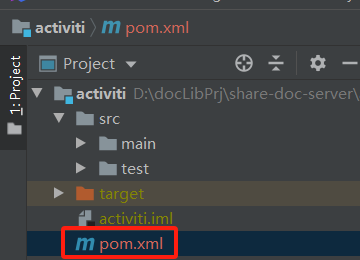
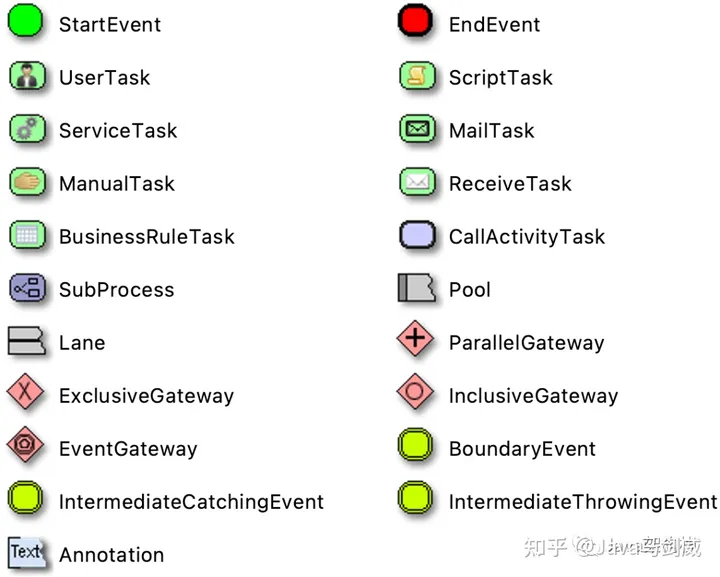

## 一、引入依赖包

新增一个activiti模块，模块下的pom.xml文件



```xml
<?xml version="1.0" encoding="UTF-8"?>
<project xmlns="http://maven.apache.org/POM/4.0.0"
         xmlns:xsi="http://www.w3.org/2001/XMLSchema-instance"
         xsi:schemaLocation="http://maven.apache.org/POM/4.0.0 http://maven.apache.org/xsd/maven-4.0.0.xsd">
    <parent>
        <artifactId>projectName</artifactId>
        <groupId>com.projectName</groupId>
        <version>1.0.0</version>
    </parent>
    <modelVersion>4.0.0</modelVersion>

    <artifactId>activiti</artifactId>

    <dependencies>
        <dependency>
            <groupId>org.activiti</groupId>
            <artifactId>activiti-spring-boot-starter</artifactId>
            <version>${activiti.version}</version>
        </dependency>
        <dependency>
            <groupId>org.activiti.dependencies</groupId>
            <artifactId>activiti-dependencies</artifactId>
            <version>${activiti.version}</version>
            <type>pom</type>
        </dependency>
    </dependencies>
</project>
```

项目下的pom.xml文件，引入activiti模块

```xml
<?xml version="1.0" encoding="UTF-8"?>
<project xmlns="http://maven.apache.org/POM/4.0.0"
         xmlns:xsi="http://www.w3.org/2001/XMLSchema-instance"
         xsi:schemaLocation="http://maven.apache.org/POM/4.0.0 http://maven.apache.org/xsd/maven-4.0.0.xsd">
   <modelVersion>4.0.0</modelVersion>
   
    <groupId>com.projectName</groupId>
    <artifactId>projectName</artifactId>
    <version>1.0.0</version>

    <name>projectName</name>
    <url>http://www.projectName.com</url>
    <description>项目名称</description>
    
    <properties>
        <projectName.version>1.0.0</projectName.version>
        <activiti.version>7.0.0.GA</activiti.version>
    </properties>

    <!-- 依赖声明 -->
    <dependencyManagement>
        <dependencies>

            <!-- SpringBoot的依赖配置-->
            <dependency>
                <groupId>org.springframework.boot</groupId>
                <artifactId>spring-boot-dependencies</artifactId>
                <version>2.5.15</version>
                <type>pom</type>
                <scope>import</scope>
            </dependency>

            <!-- 阿里数据库连接池 -->
            <dependency>
                <groupId>com.alibaba</groupId>
                <artifactId>druid-spring-boot-starter</artifactId>
                <version>${druid.version}</version>
            </dependency>
            
						<!-- 其他模块... -->
						
            <!-- activiti模块-->
            <dependency>
                <groupId>com.projectName</groupId>
                <artifactId>activiti</artifactId>
                <version>${projectName.version}</version>
            </dependency>
        </dependencies>
    </dependencyManagement>

    <modules>
        <module>activiti</module>
    </modules>
    <packaging>pom</packaging>

    <build>
        <plugins>
            <plugin>
                <groupId>org.apache.maven.plugins</groupId>
                <artifactId>maven-compiler-plugin</artifactId>
                <version>3.1</version>
                <configuration>
                    <source>${java.version}</source>
                    <target>${java.version}</target>
                    <encoding>${project.build.sourceEncoding}</encoding>
                </configuration>
            </plugin>
        </plugins>
    </build>

    <repositories>
        <repository>
            <id>public</id>
            <name>aliyun nexus</name>
            <url>https://maven.aliyun.com/repository/public</url>
            <releases>
                <enabled>true</enabled>
            </releases>
        </repository>
    </repositories>

    <pluginRepositories>
        <pluginRepository>
            <id>public</id>
            <name>aliyun nexus</name>
            <url>https://maven.aliyun.com/repository/public</url>
            <releases>
                <enabled>true</enabled>
            </releases>
            <snapshots>
                <enabled>false</enabled>
            </snapshots>
        </pluginRepository>
    </pluginRepositories>

</project>
```


## 二、 Activiti 相关配置

1、修改 application.yml 配置文件

```xml
spring:
...

# 工作流
activiti:
    deployment-mode: never-fail # 关闭 SpringAutoDeployment
    check-process-definitions: false #自动部署验证设置:true-开启（默认）、false-关闭
    database-schema-update: true #true表示对数据库中所有表进行更新操作。如果表不存在，则自动创建。
    history-level: full #full表示全部记录历史，方便绘制流程图
    db-history-used: true #true表示使用历史表
main:
    allow-bean-definition-overriding: true #不同配置文件中存在id或者name相同的bean定义，后面加载的bean定义会覆盖前面的bean定义

```

2、修改 application-druid.yml ，修改 mysql 连接字符串，添加 &nullCatalogMeansCurrent=true

```
# 数据源配置
spring:
    datasource:
        type: com.alibaba.druid.pool.DruidDataSource
        driverClassName: com.mysql.cj.jdbc.Driver
        druid:
            # 主库数据源
            master:
                url: jdbc:mysql://localhost:3306/dbname?useUnicode=true&characterEncoding=utf8&zeroDateTimeBehavior=convertToNull&useSSL=true&serverTimezone=GMT%2B8&nullCatalogMeansCurrent=true
                username: root
                password: 123456
```

从mysql-connector-java 5.x 版本起，nullCatalogMeansCurrent属性由原来的默认true改为了false

```
nullCatalogMeansCurrent = true: 返回指定库涉及表

nullCatalogMeansCurrent = false: 返回所有库涉及表
```

我们在使用activiti 或者flowable的时候，如果存在了相应的测试库，那么在创建表的时候就会报错。

报不存在，而不是已存在。

```
jdbc:mysql://localhost:3306/flowable?serverTimezone=UTC&nullCatalogMeansCurrent=true
```

 

## 三、启动项目自动生成相关数据表


## 四、**BPMN建模符号**

Activiti框架基于BPM（Bussiness Process Manage）规范，通过BPMN(Bussiness Process Modeling Notation)进行建模。BPMN2.0规范作为一种标准，定义了流程图的标准符号系统，用于对业务流程进行建模。我们来看一些BPMN定义的符号。



这些符号用于表示流程中的关键环节，比如开始流程、结束流程、任务节点、网关节点、事件节点等等。

可以使用这些流程图符号来定义流程图。可以为每个节点指定参数、表达式等，实现对每个节点的控制。

Activiti通过绘制的流程图BPMN文件部署到数据库汇中，生成流程定义信息。再根据流程定义信息创建流程实例，每一个流程实例就是一个审批流程业务。


## 五、相关API方法


### 1、部署流程

#### 通过bpmn文件部署流程

```java
@Autowired
private RepositoryService repositoryService;

@Test
public void initDeploymentBPMN() {
    String filename = "BPMN/Part1_Deployment.bpmn20.xml";
    Deployment deployment = repositoryService.createDeployment()
            .addClasspathResource(filename)
            .name("流程部署测试BPMN_v2")
            .deploy();
    System.out.println(deployment.getName());
}
```

#### 通过zip部署流程

```java
@Autowired
private RepositoryService repositoryService;

@Test
public void initDeploymentZIP() {
    InputStream fileInputStream = this.getClass()
            .getClassLoader()
            .getResourceAsStream("BPMN/Part1_DeploymentV2.zip");
    assert fileInputStream != null;
    ZipInputStream zip = new ZipInputStream(fileInputStream);
    Deployment deployment = repositoryService.createDeployment()
            .addZipInputStream(zip)
            .name("流程部署测试zip")
            .deploy();
    System.out.println(deployment.getName());
}
```


### 2、查询流程

实际是遍历 ACT RE DEPLOYMENT 表

```java
@Autowired
private RepositoryService repositoryService;

@Test
public void getDeployments() {
    repositoryService.createDeploymentQuery().list().forEach(deployment -> {
        System.out.println("Id：" + deployment.getId());
        System.out.println("Name：" + deployment.getName());
        System.out.println("DeploymentTime：" + deployment.getDeploymentTime());
        System.out.println("Key：" + deployment.getKey() + "\n\r");
    });
}
```


### 3、删除流程

```java
@Autowired
private RepositoryService repositoryService;

@Test
public void delProcessDefinition() {
    // 上面打印的 DeploymentId
    String pid = "e59fe37d-7388-11ec-92c7-5e879ca31830";
    // true 情况下，会删除所有的流程定义、历史等，如果是 false 是会保留历史，一般情况下是 false
    repositoryService.deleteDeployment(pid,true);
    System.out.println("删除流程定义成功");
}
```


### 4、初始化流程实例

ProcessDefinition与Processlnstance 是一对多的关系，类似于类和实例的关系

```java
@Autowired
private RuntimeService runtimeService;

@Test
public void initProcessInstance() {
    //1、获取页面表单填报的内容，请假时间，请假事由，String fromData
    //2、fromData 写入业务表，返回业务表主键ID==businessKey
    //3、把业务数据与Activiti7流程数据关联
    ProcessInstance processInstance = runtimeService.startProcessInstanceByKey("myProcess_Part1", "bKey001");
    //
    System.out.println("流程实例ID：" + processInstance.getProcessDefinitionId());
}
```


### 任务处理

用户任务属性面板(User Task)

- Assignee:执行人/代理人

- Due Date:任务到期时间。Candidate Users:候选人
- Candidate Groups:候选组

#### 查询代办任务

```java
/**
* 查询我的代办任务
*/
@Test
public void getTasksByAssignee() {
   taskService.createTaskQuery()
           .taskAssignee("bajie")
           .list().forEach(task -> {
               System.out.println("Id：" + task.getId());
               System.out.println("Name：" + task.getName());
               System.out.println("Assignee：" + task.getAssignee());
           });
}
```


#### 查询历史任务

- 历史综合信息:HistoricTasklnstance
- 历史变量:HistoricVariablelnstance

根据用户名称查询历史任务

```java
@Autowired
private HistoryService historyService;

@Test
public void HistoricTaskInstanceByUser() {
    historyService
            .createHistoricTaskInstanceQuery()
            .orderByHistoricTaskInstanceEndTime()
            .asc()
            .taskAssignee("bajie")
			      //.finished()
            .list().forEach(historicTaskInstance -> {
                System.out.println("Id：" + historicTaskInstance.getId());
                System.out.println("ProcessInstanceId：" + historicTaskInstance.getProcessInstanceId());
                System.out.println("Name：" + historicTaskInstance.getName());
            });
}
```

根据流程实例id称查询历史任务

```java
@Autowired
private HistoryService historyService;

@Test
public void HistoricTaskInstanceByPiID(){
    historyService
            .createHistoricTaskInstanceQuery()
            .orderByHistoricTaskInstanceEndTime()
            .asc()
            .processInstanceId("56174151-7421-11ec-80e4-5e879ca31830")
            .list().forEach(historicTaskInstance -> {
                System.out.println("Id："+ historicTaskInstance.getId());
                System.out.println("ProcessInstanceId："+ historicTaskInstance.getProcessInstanceId());
                System.out.println("Name："+ historicTaskInstance.getName());
            });
}
```


#### 已知businesskey查询任务流程实例id

```java
ProcessInstance processInstance = runtimeService.createProcessInstanceQuery().processInstanceBusinessKey(objId).includeProcessVariables().singleResult();
if (processInstance==null){
  return ReturnResult.errorMsg("此流程已终结");
}
processInstance.getProcessInstanceId()
```


#### 已知businesskey查询任务id

```java
 public String getIdByTaskId(String taskId) {
        // 根据businessKey获取流程实例
        ProcessInstance processInstance = runtimeService.createProcessInstanceQuery().processInstanceBusinessKey(taskId).includeProcessVariables().singleResult();
        // 根据流程实例 ID 获取当前活动任务
        org.activiti.engine.task.Task task = taskService.createTaskQuery().processInstanceId(processInstance.getProcessInstanceId()).active().singleResult();
        return task.getId();
    }
```


#### 删除任务流程信息

直接删除任务流程，传入流程实例ID，结束一个流程。执行此方法后，流程实例的当前任务act_ru_task会被删除，流程历史act_hi_taskinst不会被删除，并且流程历史的状态置为finished完成。

```java
runtimeService.deleteProcessInstance(instanceId, deleteReason);
```


#### 删除流程历史信息

```java
historyService.deleteHistoricProcessInstance(processInstance.getId());
```


#### 任务撤回


#### 排他网关ExclusiveGateway（条件分支）

当流程执行到排他网关时，排他网关会选择第一条符合条件路由走出。

