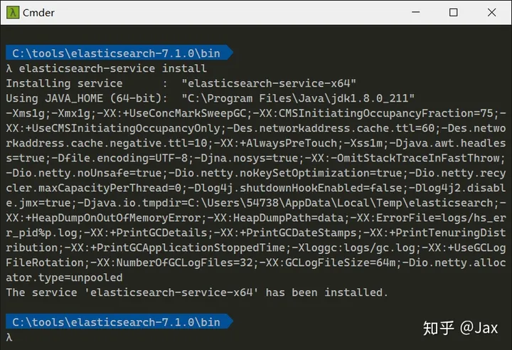
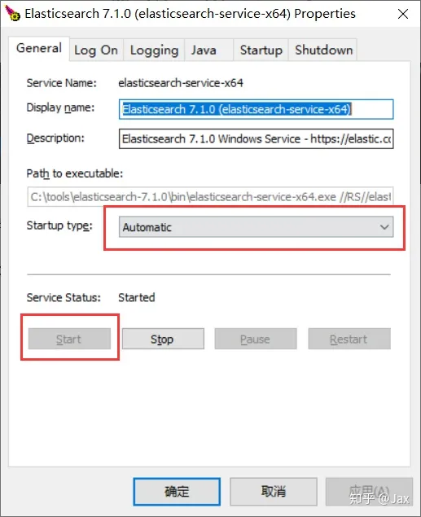
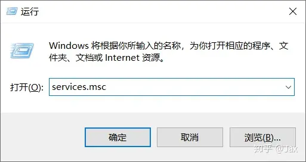
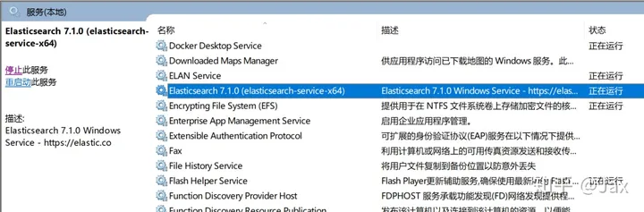

### elasticsearch-head插件跨域报错解决

浏览器控制台报错：

```
Access to XMLHttpRequest at 'http://localhost:9200/_cluster/health' from origin 'http://localhost:9100' has been blocked by CORS policy: Request header field content-type is not allowed by Access-Control-Allow-Headers in preflight response.
1
```

更改ES配置文件[elasticsearch](https://so.csdn.net/so/search?q=elasticsearch&spm=1001.2101.3001.7020).yml

```
# 添加
http.cors.enabled: true 
http.cors.allow-origin: /.*/ 
```


### Windows后台运行es服务

**进入命令行切到 ElasticSearch 安装目录下的 bin 文件夹，并执行：**

```bash
elasticsearch-service.bat install
```



(如果删除 ElasticSearch 服务替换 install 为 remove 执行)

**执行命令 elasticsearch-service.bat manager**

执行后会弹出对话框，将启动类型 Startup type改为 “Automatic" 自动

点击 Start 按钮启动服务，启动后点击确定即可



**查看是否成功**

win+R 运行 services.msc



ElasticSearch 已经加到服务并且状态为“正在运行”



以后每次开机时 ElasticSearch 都会以服务形式自动启动


### kibana汉化

修改配置文件kibana.xml

```xml
i18n.locale: "zh-CN"
```


### spring boot集成spring-boot-starter-data-elasticsearch

#### 引入依赖

修改所在模块的pom.xml文件

```xml
<?xml version="1.0" encoding="UTF-8"?>
<project xmlns="http://maven.apache.org/POM/4.0.0"
         xmlns:xsi="http://www.w3.org/2001/XMLSchema-instance"
         xsi:schemaLocation="http://maven.apache.org/POM/4.0.0 http://maven.apache.org/xsd/maven-4.0.0.xsd">
    <parent>
        <artifactId>sharedoc</artifactId>
        <groupId>com.sharedoc</groupId>
        <version>1.0.0</version>
    </parent>
    <modelVersion>4.0.0</modelVersion>

    <artifactId>doc</artifactId>

    <description>
        doc系统模块
    </description>
    <properties>
        <elasticsearch.version>7.12.1</elasticsearch.version>
    </properties>
    <dependencies>
        <!--spring boot 整合 elasticsearch -->
        <dependency>
            <groupId>org.springframework.boot</groupId>
            <artifactId>spring-boot-starter-data-elasticsearch</artifactId>
        </dependency>
    </dependencies>

</project>
```

修改framework框架模块下pom.xml文件（如若依框架），引入有es的模块

```xml
<?xml version="1.0" encoding="UTF-8"?>
<project xmlns="http://maven.apache.org/POM/4.0.0"
         xmlns:xsi="http://www.w3.org/2001/XMLSchema-instance"
         xsi:schemaLocation="http://maven.apache.org/POM/4.0.0 http://maven.apache.org/xsd/maven-4.0.0.xsd">
    <parent>
        <artifactId>sharedoc</artifactId>
        <groupId>com.sharedoc</groupId>
        <version>1.0.0</version>
    </parent>
    <modelVersion>4.0.0</modelVersion>

    <artifactId>framework</artifactId>

    <description>
        framework框架核心
    </description>

    <dependencies>

        <!-- SpringBoot Web容器 -->
         <dependency>
            <groupId>org.springframework.boot</groupId>
            <artifactId>spring-boot-starter-web</artifactId>
        </dependency>

        <!-- SpringBoot 拦截器 -->
        <dependency>
            <groupId>org.springframework.boot</groupId>
            <artifactId>spring-boot-starter-aop</artifactId>
        </dependency>

        <!-- 阿里数据库连接池 -->
        <dependency>
            <groupId>com.alibaba</groupId>
            <artifactId>druid-spring-boot-starter</artifactId>
        </dependency>

        <!-- 验证码 -->
        <dependency>
            <groupId>pro.fessional</groupId>
            <artifactId>kaptcha</artifactId>
            <exclusions>
                <exclusion>
                    <artifactId>servlet-api</artifactId>
                    <groupId>javax.servlet</groupId>
                </exclusion>
            </exclusions>
        </dependency>

        <!-- 获取系统信息 -->
        <dependency>
            <groupId>com.github.oshi</groupId>
            <artifactId>oshi-core</artifactId>
        </dependency>

        <!-- 系统模块-->
        <dependency>
            <groupId>com.sharedoc</groupId>
            <artifactId>system</artifactId>
        </dependency>

        <!-- 添加doc模块-->
        <dependency>
            <groupId>com.sharedoc</groupId>
            <artifactId>doc</artifactId>
        </dependency>
    </dependencies>

</project>
```

#### 添加配置

在application.xml下新增es的配置

```xml
# Spring配置
spring:
  # elasticsearch配置
  elasticsearch:
    rest:
      host: 127.0.0.1
      port: 9200
      scheme: http
      connection-timeout: 1s
      read-timeout: 30s
```

新增es配置类

```java
package com.sharedoc.framework.config;

import org.apache.http.HttpHost;
import org.elasticsearch.client.RestClient;
import org.elasticsearch.client.RestHighLevelClient;
import org.springframework.beans.factory.annotation.Value;
import org.springframework.context.annotation.Bean;
import org.springframework.context.annotation.Configuration;

/**
 * ElasticSearch配置类
 * @author sophie
 */
@Configuration
public class ElasticSearchConfig {
    @Value("${spring.elasticsearch.rest.host}")
    private String host;

    @Value("${spring.elasticsearch.rest.port}")
    private int port;

    @Value("${spring.elasticsearch.rest.scheme}")
    private String scheme;

    @Bean
    public RestHighLevelClient restHighLevelClient() {
        return new RestHighLevelClient(
                RestClient.builder(
                        new HttpHost(host, port, "http")));
    }
}

```

#### 定义实体类

```java
package com.sharedoc.doc.domain.es;


import org.springframework.data.annotation.Id;
import org.springframework.data.elasticsearch.annotations.Document;
import org.springframework.data.elasticsearch.annotations.Field;
import org.springframework.data.elasticsearch.annotations.FieldType;

/**
 * @author sophie
 *
 * indexName = "doc_info"          // es 的索引名称
 */

@Document(indexName = "doc_info")
public class EsDocBean {
    //@Id 文档主键 唯一标识
    @Id
    //@Field 每个文档的字段配置（类型、是否分词、是否存储、分词器 ）
    @Field(store=true, index = false,type = FieldType.Integer)
    private String id;

    @Field(index=true,analyzer="ik_smart",store=true,searchAnalyzer="ik_smart",type = FieldType.Text)
    private String title;

    @Field(index=true,analyzer="ik_smart",store=true,searchAnalyzer="ik_smart",type = FieldType.Text)
    private String content;

    public String getId() {
        return id;
    }

    public void setId(String id) {
        this.id = id;
    }

    public String getTitle() {
        return title;
    }

    public void setTitle(String title) {
        this.title = title;
    }

    public String getContent() {
        return content;
    }

    public void setContent(String content) {
        this.content = content;
    }
}
```


	#### 定义Repository数据仓库类

```java
package com.sharedoc.doc.service;

import com.sharedoc.doc.domain.es.EsDocBean;
import org.springframework.data.elasticsearch.annotations.Highlight;
import org.springframework.data.elasticsearch.annotations.HighlightField;
import org.springframework.data.elasticsearch.annotations.HighlightParameters;
import org.springframework.data.elasticsearch.core.SearchHit;
import org.springframework.data.elasticsearch.repository.ElasticsearchRepository;
import org.springframework.stereotype.Repository;
import java.util.List;

@Repository
public interface EsDocRepository extends ElasticsearchRepository<EsDocBean, Integer> {

    /**
     * 查询内容标题查询
     * @param title 标题
     * @param content 内容
     * @return 返回关键字高亮的结果集
     */
    @Highlight(
            fields = {@HighlightField(name = "title"), @HighlightField(name = "content")},
            parameters = @HighlightParameters(preTags = {"<span style='color:red'>"}, postTags = {"</span>"}, numberOfFragments = 0)
    )
    List<SearchHit<EsDocBean>> findByTitleOrContent(String title, String content);

}
```


#### 定义IEsDocService接口

```java
package com.sharedoc.doc.service;

import com.sharedoc.doc.domain.es.EsDocBean;
import org.springframework.data.elasticsearch.core.SearchHit;
import org.springframework.data.elasticsearch.repository.ElasticsearchRepository;

import java.util.List;

public interface IEsDocService extends ElasticsearchRepository<EsDocBean,Integer> {

    List<SearchHit<EsDocBean>> findByTitleOrContent(String title, String content);

}
```


#### 定义EsDocServiceImpl类

```java
package com.sharedoc.doc.service.impl;

import com.sharedoc.doc.domain.es.EsDocBean;
import com.sharedoc.doc.service.EsDocRepository;
import com.sharedoc.doc.service.IEsDocService;
import org.springframework.data.domain.Page;
import org.springframework.data.domain.Pageable;
import org.springframework.data.domain.Sort;
import org.springframework.data.elasticsearch.core.SearchHit;
import org.springframework.stereotype.Service;

import javax.annotation.Resource;
import java.util.List;
import java.util.Optional;

@Service
public class EsDocServiceImpl implements IEsDocService {
    @Resource
    private EsDocRepository esDocRepository;

    @Override
    public void deleteById(Integer id) {
        esDocRepository.deleteById(id);
    }

    @Override
    public void delete(EsDocBean entity) {

    }

    @Override
    public void deleteAllById(Iterable<? extends Integer> integers) {

    }

    @Override
    public void deleteAll(Iterable<? extends EsDocBean> entities) {

    }

    @Override
    public void deleteAll() {

    }

    @Override
    public long count() {
        return esDocRepository.count();
    }

    @Override
    public <S extends EsDocBean> S save(S entity) {
        return esDocRepository.save(entity);
    }

    @Override
    public <S extends EsDocBean> Iterable<S> saveAll(Iterable<S> entities) {
        return null;
    }

    @Override
    public Optional<EsDocBean> findById(Integer integer) {
        return Optional.empty();
    }

    @Override
    public boolean existsById(Integer id) {
        return esDocRepository.existsById(id);
    }

    @Override
    public Iterable<EsDocBean> findAll() {
        return null;
    }

    @Override
    public Iterable<EsDocBean> findAllById(Iterable<Integer> integers) {
        return null;
    }

    @Override
    public List<SearchHit<EsDocBean>> findByTitleOrContent(String title, String content) {
        return esDocRepository.findByTitleOrContent(title,content);
    }

    @Override
    public Page<EsDocBean> searchSimilar(EsDocBean entity, String[] fields, Pageable pageable) {
        return null;
    }

    @Override
    public Iterable<EsDocBean> findAll(Sort sort) {
        return null;
    }

    @Override
    public Page<EsDocBean> findAll(Pageable pageable) {
        return null;
    }
}

```


#### 在控制器类中使用

```java
package com.sharedoc.doc.controller;

import com.sharedoc.common.core.controller.BaseController;
import com.sharedoc.common.core.domain.AjaxResult;
import com.sharedoc.common.core.page.TableDataInfo;
import com.sharedoc.doc.domain.DocLibDocument;
import com.sharedoc.doc.domain.es.EsDocBean;
import com.sharedoc.doc.service.impl.EsDocServiceImpl;
import org.springframework.beans.factory.annotation.Autowired;
import org.springframework.data.elasticsearch.core.SearchHit;
import org.springframework.security.access.prepost.PreAuthorize;
import org.springframework.web.bind.annotation.GetMapping;
import org.springframework.web.bind.annotation.PostMapping;
import org.springframework.web.bind.annotation.RequestMapping;
import org.springframework.web.bind.annotation.RestController;

import java.util.List;
/**
 * 文库文档
 * @author sophie
 */
@RestController
@RequestMapping("/doc/docLibDocument")
public class DocLibDocumentController extends BaseController {

    @Autowired
    private EsDocServiceImpl esDocService;

    @GetMapping("/query")
    public TableDataInfo query(EsDocBean esDocBean)
    {
        startPage();
        List<SearchHit<EsDocBean>> list = esDocService.findByTitleOrContent(esDocBean.getTitle(), esDocBean.getContent());
        return getDataTable(list);
    }

    @PostMapping("/addDoc")
    public AjaxResult addDoc(EsDocBean esDocBean)
    {
        esDocService.save(esDocBean);
        return AjaxResult.success();
    }
}

```

