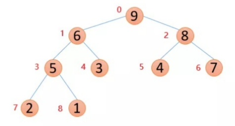

## 0.排序算法复杂度

## 1.冒泡排序(BubbleSort)
算法的时间复杂度为 O(N^2)
### 实现思路(Introduction)

> 这里以降序排列为例子

- 对于n个元素的冒泡排序，分为n-1轮冒泡
- 其中每一轮会通过相邻元素依次进行比较选出最小的那个，并且这个数会被冒泡到无序列表(即本轮待冒泡列表)的末尾
- 相邻元素进行比较时，如果当前数比后一个数小则交换
- 每一轮冒泡结束后即进行下一轮，下一轮的列表即为上一轮冒泡除开末尾已经排列好的元素的列表


### C语言实现

```c
#include<stdio.h>

void Swap(int *a,int *b)
{
	int tmp = *a;
	*a = *b;
	*b = tmp;
}

void BubbleSort(int *arr, int len)
{
	for (int j = len - 1; j > 0; j--)
	{
		for (int i = 0; i < j; i++)
		{
			if (arr[i] < arr[i+1])
			{
				Swap(&arr[i], &arr[i + 1]);
			}
		}
	}
}

void PrintArray(int *arr, int len)
{
	for (int i = 0; i < len; i++)
	{
		printf("arr[%d]:%d    ", i, arr[i]);
	}
	printf("\n");
}

int main()
{
	int num[] = { 5, 8, 4, 7};
	// print before sort
	printf("before sort:\n");
	PrintArray(num, sizeof(num) / sizeof(num[0]));

	// sort
	BubbleSort(num, sizeof(num) / sizeof(num[0]));

	// print after sort
	printf("after sort:\n");
	PrintArray(num, sizeof(num) / sizeof(num[0]));

	system("pause");
	return 0;
}
```

### Go语言实现

```go
package main

import "fmt"

func BubbleSort(arr []int) {
	leng := len(arr)
	for j := leng - 1; j > 0; j-- {
		for i := 0; i < j; i++ {
			if arr[i] < arr[i+1] {

				arr[i], arr[i+1] = arr[i+1], arr[i]
			}
		}
	}
}
func main() {
	arr := []int{5, 8, 4, 7}
	fmt.Println(arr)
	BubbleSort(arr)
	fmt.Println(arr)
}

```


## 2.改进版冒泡排序(BubbleSort)

### 实现思路

- 基本思路同基本的冒泡排序一样
- 通过添加全局标识符变量flag记录序列是否已经有序，如已经有序则不再进行下一轮外层遍历
- 因此在某些情况下(序列较有序)可减少循环次数。


### C语言实现

```c
#include<stdio.h>
void Swap(int *a, int *b)
{
	int tmp = *a;
	*a = *b;
	*b = tmp;
}

void ImprovedBubbleSort(int *arr, int len)
{
    int flag = 1;
	for (int j = len - 1; j > 0 && flag; j--)
	{
		flag = 0;
		for (int i = 0; i < j; i++)
		{
			if (arr[i] < arr[i + 1])
			{
				flag = 1;
				Swap(&arr[i], &arr[i + 1]);
			}
		}
	}
}

void PrintArray(int *arr, int len)
{
	for (int i = 0; i < len; i++)
	{
		printf("arr[%d]:%d    ", i, arr[i]);
	}
	printf("\n");
}

int main()
{
	int num[] = { 5, 8, 7,3};

	// print before sort
	printf("before sort:\n");
	PrintArray(num, sizeof(num) / sizeof(num[0]));

	// sort
	ImprovedBubbleSort(num, sizeof(num) / sizeof(num[0]));

	// print after sort
	printf("after sort:\n");
	PrintArray(num, sizeof(num) / sizeof(num[0]));

	system("pause");
	return 0;
}
```


### Go语言实现

```go
package main
import "fmt"
func ImprovedBubbleSort(arr []int) {
	flag := true
	leng := len(arr)
	for j := leng - 1; j > 0 && flag; j-- {
		flag = false
		for i := 0; i < j; i++ {
			if arr[i] < arr[i+1] {
				flag = true
				arr[i], arr[i+1] = arr[i+1], arr[i]
			}
		}
	}
}
func main() {
	arr := []int{5, 8, 7, 3}
	fmt.Println(arr)
	ImprovedBubbleSort(arr)
	fmt.Println(arr)
}

```


## 3.选择排序(select sort)
算法的时间复杂度为 O(N^2)

### 实现思路(Introduction)

- 与冒泡排序有点类似，每一轮排序会选出最小或最大的那个数，将其放入有序序列中
- 不同之处在与，冒泡排序是相邻元素间逐次进行比较，而选择排序则是与上一次选出的那个最小或最大元素进行比较，从而选出每轮的最小或最大元素，此外它记录的是每轮最小元素的下标值。


### C语言实现

```c
#include <stdio.h>
void Swap(int *a, int *b)
{
	int tmp = *a;
	*a = *b;
	*b = tmp;
}

void PrintArray(int *arr, int len)
{
	for (int i = 0; i < len; i++)
	{
		printf("arr[%d]:%d    ", i, arr[i]);
	}
	printf("\n");
}

void SelectSort(int *arr, int length)
{
	int min = 0;

	for (int i = 0; i < length; i++)
	{
		min = i;
		for (int j = i + 1; j < length; j++)
		{
			if (arr[min] > arr[j])
			{
				min = j;
			}
		}

		if (min != i) // 如果有更小的值出现则交换它们
		{
			Swap(&arr[min], &arr[i]); // 交换
		}
	}
}


int main()
{
	int num[] = {3,5,1,6 };

	// print before sort
	printf("before sort:\n");
	PrintArray(num, sizeof(num) / sizeof(num[0]));

	// sort
	SelectSort(num, sizeof(num) / sizeof(num[0]));

	// print after sort
	printf("after sort:\n");
	PrintArray(num, sizeof(num) / sizeof(num[0]));

	system("pause");
	return 0;

}
```


### Go语言实现

```go
package main

import "fmt"

func SelectSort(arr []int) {
	length := len(arr)
	min := 0
	for i := 0; i < length; i++ {
		min = i
		for j := i + 1; j < length; j++ {
			if arr[min] > arr[j] {
				min = j
			}
		}
		if min != i {
			arr[min], arr[i] = arr[i], arr[min]
		}
	}

}

func main() {
	arr := []int{3, 5, 1, 6}

	fmt.Println(arr)

	SelectSort(arr)

	fmt.Println(arr)
}

```


## 4.插入排序(InsertSort)

### 实现思路(Introduction)（升序）

【1】将一组序列分成两拨，一拨为有序序列，另一拨为待排序的序列，
【2】可以设第一个元素为有序序列，第二个元素及之后的为无序序列
【3】将无序序列的首元素与有序序列的尾部元素进行比较，若小于，则将该首元素缓存，否则无序的指针挪向下一个元素再如此比较
【4】并用缓存元素与有序序列中的元素从右至左依次进行比较，碰到大于自己的则将其往后挪一个位置， 碰到小于等于自己的则结束比较将缓存值插入结束位置的后一个位置
【5】此时一轮比较结束，无序序列的首元素下标+1，继续下一轮比较


> 插入排序：
> 在什么情况下效率最高？
> 1、如果序列基本有序的情况下
> 2、数据序列比较少
> 插入排序总结
> 稳定性：
> 插入排序是稳定的排序算法
> 插入排序效率：O（n²）


### C语言实现

```c
#include<stdio.h>
void PrintArray(int *arr, int len)
{
	for (int i = 0; i < len; i++)
	{
		printf("arr[%d]:%d    ", i, arr[i]);
	}
	printf("\n");
}


// 升序
void InsertSort(int *arr, int length)
{
	// 假定第一个元素为有序序列，而其后的元素为无序序列
	for (int i = 1; i < length; i++)
	{
		if (arr[i] < arr[i - 1]) //  从无序序列中选出一个比有序序列尾元素小的来
		{
			int temp = arr[i];
			int j;
			for (j = i - 1; j >= 0 && temp < arr[j]; j--) // 将选出的元素放入有序序列合适的位置
			{
				arr[j + 1] = arr[j]; // 向右边移动元素
			}
			// 将元素放入有序序列
			arr[j + 1] = temp;
		}
	}
}

int main()
{
	int num[] = { 5,3,6,7,2 };

	// print before sort
	printf("before sort:\n");
	PrintArray(num, sizeof(num) / sizeof(num[0]));

	// sort
	InsertSort(num, sizeof(num) / sizeof(num[0]));

	// print after sort
	printf("after sort:\n");
	PrintArray(num, sizeof(num) / sizeof(num[0]));

	system("pause");
	return 0;

}
```


### Go语言实现

```go
package main

import "fmt"

func InsertSort(arr []int) {
	length := len(arr)
	for i := 1; i < length; i++ {
		if arr[i] < arr[i-1] {
			temp := arr[i]
			var j int
			for j = i - 1; j >= 0 && arr[j] > temp; j-- {
				arr[j+1] = arr[j]
			}
			arr[j+1] = temp
		}
	}
}

func main() {
	arr := []int{5, 3, 6, 7, 2}

	fmt.Println(arr)

	InsertSort(arr)

	fmt.Println(arr)
}

```


## 5.希尔排序(ShellSort)

### 实现思路(Introduction)

**希尔排序的实质就是分组插入排序**，该方法又称缩小增量排序。

**先将整个待排元素序列分割成若干个子序列**（由相隔某个“增量”的元素组成的）分别进行直接插入排序，然后依次缩减增量再进行排序，待整个序列中的元素基本有序（增量足够小）时，再对全体元素进行一次直接插入排序。因为**直接插入排序在元素基本有序的情况下（接近最好情况），效率是很高的**，因此希尔排序在时间效率上比前前面几种方法有较大提高。


### C语言实现

```c
#include<stdio.h>

void PrintArray(int *arr, int len)
{
	for (int i = 0; i < len; i++)
	{
		printf("arr[%d]:%d    ", i, arr[i]);
	}
	printf("\n");
}

void ShellSort(int *arr, int length)
{

	int increasement = length;

	do{

		increasement = increasement / 3 + 1; // 分组算法

		for (int k = 0; k < increasement; k++)
		{
			// 插入排序
			for (int i = increasement + k; i < length; i += increasement)
			{
				if (arr[i] > arr[i - increasement]) // 从无序列表找较大的元素
				{
					int temp = arr[i];
					// 在有序列表里找一个合适的位置(直到找不到比自己还大的元素)
					int j;
					for (j = i - increasement; j >= 0 && temp > arr[j]; j -= increasement) 
					{
						arr[j + increasement] = arr[j]; // 向右边挪动元素
					}
					
					arr[j + increasement] = temp; // 将元素插入有序列表
					
				}
			}
		}

	} while (increasement > 1);

}

int main()
{

	//int num[] = { 5,9,4,7,3,6 };
	int num[] = { 5,9,4,7,3,6,19,6,3,4,2,99,100,45,32,2,1,8 };

	// print before sort
	printf("before sort:\n");
	PrintArray(num, sizeof(num) / sizeof(num[0]));

	// sort
	ShellSort(num, sizeof(num) / sizeof(num[0]));

	// print after sort
	printf("after sort:\n");
	PrintArray(num, sizeof(num) / sizeof(num[0]));

	system("pause");
	return 0;
}

```


### Go语言实现

```go
package main

import "fmt"

func ShellSort(arr []int) {
	length := len(arr)
	increasement := length
	for {

		increasement = increasement/3 + 1

		for k := 0; k < increasement; k++ {
			for i := increasement + k; i < length; i += increasement {
				if arr[i] > arr[i-increasement] {
					temp := arr[i]
					var j int
					for j = i - increasement; j >= 0 && temp > arr[j]; j -= increasement {
						arr[j+increasement] = arr[j]
					}
					arr[j+increasement] = temp
				}
			}
		}

		if increasement <= 1 {
			break
		}

	}
}

func main() {
	arr := []int{5, 9, 4, 7, 3, 6, 19, 6, 3, 4, 2, 99, 100, 45, 32, 2, 1, 8}

	fmt.Println(arr)

	ShellSort(arr)

	fmt.Println(arr)
}

```


## 6. 归并排序(mergeSort)
> 归并排序是建立在归并操作上的一种有效的排序算法。该算法是采用分治法（Divide and Conquer）的一个非常典型的应用。
### 基本思想
将数组分成二组 A，B，如果这二组组内的数据都是有序的，那么就可以很方便的将这二组数据进行排序。可以将 A，B 组各自再分成二组。依次类推，当分出来的小组只有一个数据时，可以认为这个小组组内已经达到了有序，然后再合并相邻的二个小组就可以了。这样通过先递归的分解数列，再合并数列就完成了归并排序。


### C语言实现
```c
#include <stdio.h>

void PrintArray(int *arr, int len)
{
	for (int i = 0; i < len; i++)
	{
		printf("arr[%d]:%d    ", i, arr[i]);
	}
	printf("\n");
}

void Merge(int *arr, int start, int end, int mid, int *temp){
	
	int i_start = start; // 序列1开始位置
	int i_end = mid; // 序列1末尾位置

	int j_start = mid + 1; // 序列2开始位置
	int j_end = end; // 序列2末尾位置

	int len = 0;

	// 开始合并两个序列
	while (i_start <= i_end && j_start <= j_end)
	{
		if (arr[i_start] < arr[j_start])
		{
			temp[len] = arr[i_start]; // 将小的数放入缓存数组中
			i_start++;
		}
		else
		{
			temp[len] = arr[j_start]; // 将小的数放入缓存数组中
			j_start++;
		}
		len++;
	}

	// 针对两个序列不对称(较长的那部分)进行收尾处理
	while (i_start <= i_end)
	{
		temp[len] = arr[i_start]; 
		i_start++;
		len++;
	}

	while (i_start <= i_end)
	{
		temp[len] = arr[j_start]; 
		j_start++;
		len++;
	}

	// 将缓存数组替换到原数组去
	for (int i = 0; i < len; i++)
	{
		arr[start + i] = temp[i];
	}
}

void MergeSort(int *arr, int start, int end, int *temp){

	if (start >= end){
		return;
	}

	int mid = (start + end) / 2;

	MergeSort(arr, start, mid, temp);

	MergeSort(arr, mid + 1, end, temp);

	Merge(arr, start, end, mid, temp);
}

int main(){

	int num[] = { 5, 9, 4, 7, 3, 6, 19, 6, 3 };

	int temp[9];

	// print before sort
	printf("before sort:\n");
	PrintArray(num, sizeof(num) / sizeof(num[0]));

	// sort
	MergeSort(num, 0, (sizeof(num) / sizeof(num[0])) - 1,temp);

	// print after sort
	printf("after sort:\n");
	PrintArray(num, sizeof(num) / sizeof(num[0]));

	system("pause");
	return 0;

}
```

### Go语言实现
```go
package main

import "fmt"

// 合并两个序列
func Merge(arr []int, start int, end int, mid int, temp []int) {
	i := start
	j := mid + 1
	length := 0
	for i <= mid && j <= end {
		if arr[i] < arr[j] {
			temp[length] = arr[i]
			i++
		} else {
			temp[length] = arr[j]
			j++
		}
		length++
	}

	// 处理两序列不对称部分
	for i <= mid {
		temp[length] = arr[i]
		i++
		length++
	}
	for j <= end {
		temp[length] = arr[j]
		j++
		length++
	}

	// 将temp里的处理结果替换回arr
	for i := 0; i < length; i++ {
		arr[start+i] = temp[i]
	}
}

func MergeSort(arr []int, start int, end int, temp []int) {
	if start >= end {
		return
	}

	mid := (start + end) / 2

	MergeSort(arr, start, mid, temp)

	MergeSort(arr, mid+1, end, temp)

	Merge(arr, start, end, mid, temp)
}

func main() {
	arr := []int{5, 9, 4, 7, 3, 6, 19, 6, 3}
	temp := make([]int, len(arr))

	fmt.Println(arr)
	MergeSort(arr, 0, len(arr)-1, temp)
	fmt.Println(arr)
}
```


## 7.快速排序(QuickSort)
### 基本思想

快速排序是 C.R.A.Hoare 于 1962 年提出的**一种划分交换排序**。 它**采用了一种分治的策略**，通常称其为分治法(Divide-and-ConquerMethod)。

分治法基本思想

- 先从数列中取出一个数作为基准数（枢轴）。
-  **分区过程将比这个数大的数全放到它的右边，小于或等于它的数全放到它的左边。**(升序)


- 再对左右区间重复第二步，直到各区间只有一个数。
- 其效果就是要将一个大的序列拆分成小序列，对小序列进行排序，一旦小序列排序完成了，大序列的排序也就完成了


### C语言实现
```c
#include<stdio.h>
void PrintArray(int *arr, int len)
{
	for (int i = 0; i < len; i++)
	{
		printf("arr[%d]:%d    ", i, arr[i]);
	}
	printf("\n");
}
void QuickSort(int *arr,int start,int end)
{
	// 起始位置
	int i = start;
	int j = end;

	int temp = arr[i]; //设基准数为第一个元素
	if (i < j)
	{
		while (i < j)
		{
			// 从右往左找小于基准数的
			while (i < j && arr[j] > temp)
			{
				j--;
			}
			// 找到了就放在i位置
			if (i < j)
			{
				arr[i] = arr[j];
				i++;
			}

			// 从左往右找大于基准数的
			while (i < j && arr[j] < temp)
			{
				i++;
			}
			// 找到了就放在j位置
			if (i < j)
			{
				arr[j] = arr[i];
				j--;
			}
		}

		arr[i] = temp;

		// 对左半部分进行排序
		QuickSort(arr, start, i - 1);
		// 对右半部分进行排序
		QuickSort(arr, i + 1, end);


	}
}

int main()
{

	//int num[] = { 5,9,4,7,3,6 };
	int num[] = { 5, 9, 4, 7, 3, 6, 19, 6, 3, 4, 2, 99, 100, 45, 32, 2, 1, 8 };

	// print before sort
	printf("before sort:\n");
	PrintArray(num, sizeof(num) / sizeof(num[0]));

	// sort
	QuickSort(num, 0, (sizeof(num) / sizeof(num[0]))-1);

	// print after sort
	printf("after sort:\n");
	PrintArray(num, sizeof(num) / sizeof(num[0]));

	system("pause");
	return 0;
}

```


### Go语言实现

```go
package main

import "fmt"

func QuickSort(arr []int, start, end int) {
	i := start
	j := end
	if i < j {
		temp := arr[i]

		for i < j {
			// from left to right to find greater
			for i < j && temp < arr[j] {
				j--
			}
			if i < j {
				arr[i] = arr[j]
				i++
			}

			// from right to left to find smaller
			for i < j && temp > arr[i] {
				i++
			}

			if i < j {
				arr[j] = arr[i]
				j--
			}
		}

		arr[i] = temp

		// left part
		QuickSort(arr, start, i-1)
		// right part
		QuickSort(arr, i+1, end)
	}
}
func main() {

	arr := []int{5, 9, 4, 7, 3, 6, 19, 6, 3, 4, 2, 99, 100, 45, 32, 2, 1, 8}
	fmt.Println(arr)
	QuickSort(arr, 0, len(arr)-1)
	fmt.Println(arr)

}

```

## 8.堆排序
> 堆排序是利用堆（完全二叉树）这种数据结构而设计的一种排序算法，堆排序是一种选择排序，它的最坏最好，平均时间复杂度均为O(nlogn)，他也是不稳定排序。
- 时间复杂度：O(NlogN)。
- 空间复杂度：O(1)。
- 大顶堆
每个节点的值都大于或等于其左右孩子节点的值，称为大顶堆

大顶堆特点：arr[i]>=arr[2i+1]&&arr[i]>=arr[2i+2]
- 小顶堆
每个结点的值都小于或等于其左右孩子节点的值，称为小顶堆

小顶堆特点：arr[i]<=arr[2i+1]&&arr[i]<=arr[2i+2]
- 最后一个非叶子结点的下标为：length / 2 - 1 ; 
- 假设根节点的下标为i，其左孩子的下标为2 * i + 1，右孩子的下标为2 * i + 2;
**一般升序采用大顶堆，降序采用小顶堆**

### 堆排序的基本思想
1. 将待排序序列构造成一个大顶堆
2. 此时整个序列的最大值就是顶堆的根节点
3. 将其与末尾元素进行交换，此时末尾就为最大值
4. 然后将剩余n-1个元素重新构造成一个堆，这样会得到n个元素的次小值。如此反复执行，便能得到一个有序序列了。可以看到在构建大顶堆的过程中，元素的个数逐渐减少，最后就得到一个有序序列了


### C语言实现
```c
#include <stdio.h>

void PrintArray(int *arr, int len)
{
	for (int i = 0; i < len; i++)
	{
		printf("arr[%d]:%d    ", i, arr[i]);
	}
	printf("\n");
}

void MySwap(int arr[], int a, int b){
	int temp = arr[a];
	arr[a] = arr[b];
	arr[b] = temp;
}

// 调整堆
// arr 待调整的序列
// pos 待调整的点
// len 待调整序列的长度
void AdjustHeap(int *arr, int pos, int len){

	// 左子节点
	int left = pos * 2 + 1;
	// 右子节点
	int right = pos * 2 + 2;
	int max = pos;

	// 比较，将较大的数调整到堆顶
	if (left < len && arr[max] < arr[left])
	{
		max = left;
	}
	if (right < len && arr[max] < arr[right])
	{
		max = right;
	}

	if (max != pos) // 说明有被调整
	{
		MySwap(arr, max, pos);
		// 对应的被调整的那个点也可能需要再做下调整
		AdjustHeap(arr, max, len);
	}
}

void HeapSort(int *arr,int start,int end){

	int len = end + 1;
	// 初始化堆，从最后一个非叶子节点开始
	for (int i = (len / 2) - 1; i >= 0; i--)
	{
		AdjustHeap(arr, i, len);
	}

	// 交换堆顶元素和未排序序列最后一个元素
	for (int i = len - 1; i >= 0; i--)
	{
		MySwap(arr, 0, i);
		// 从堆顶开始调整
		AdjustHeap(arr, 0, i);
	}
}

int main(){

	int num[] = { 5, 9, 4, 7, 3, 6, 19, 6, 3 };
	

	// print before sort
	printf("before sort:\n");
	PrintArray(num, sizeof(num) / sizeof(num[0]));

	// sort
	HeapSort(num, 0, (sizeof(num) / sizeof(num[0])) - 1);

	// print after sort
	printf("after sort:\n");
	PrintArray(num, sizeof(num) / sizeof(num[0]));

	system("pause");
	return 0;
}
```

### Go语言实现
```go
package main

import "fmt"

func swap(arr []int, pos1 int, pos2 int) {
	arr[pos1], arr[pos2] = arr[pos2], arr[pos1]
}

func HeapAdjust(arr []int, pos int, length int) {
	left := pos*2 + 1
	right := pos*2 + 2
	max := pos
	if left < length && arr[left] > arr[max] {
		max = left
	}
	if right < length && arr[right] > arr[max] {
		max = right
	}
	if max != pos {
		swap(arr, max, pos)
		HeapAdjust(arr, max, length)
	}
}

func HeapSort(arr []int) {
	length := len(arr)
	// 初始化堆
	for i := length/2 + 1; i >= 0; i-- {
		HeapAdjust(arr, i, length)
	}

	// 调整后的堆顶元素与未排序的末元素交换
	for i := length - 1; i >= 0; i-- {
		swap(arr, 0, i)
		HeapAdjust(arr, 0, i)
	}
}

func main() {
	arr := []int{5, 9, 4, 7, 3, 6, 19, 6, 3}
	fmt.Println(arr)
	HeapSort(arr)
	fmt.Println(arr)
}
```

## 9.计数排序
### 实现思路
- 花O(n)的时间扫描一下整个序列 A，获取最小值 min 和最大值 max
- 开辟一块新的空间创建新的数组 B，长度为 ( max - min + 1)
- 数组 B[index]的元素记录的值是 A 中某元素(index)出现的次数
- 最后输出目标整数序列，具体的逻辑是遍历数组 B，输出相应元素以及对应的个数


## 参考
- 归并排序图片引用自https://blog.csdn.net/qq_40472328/article/details/81531874
- 推排序图片引用自https://www.cnblogs.com/9dragon/p/10778074.html