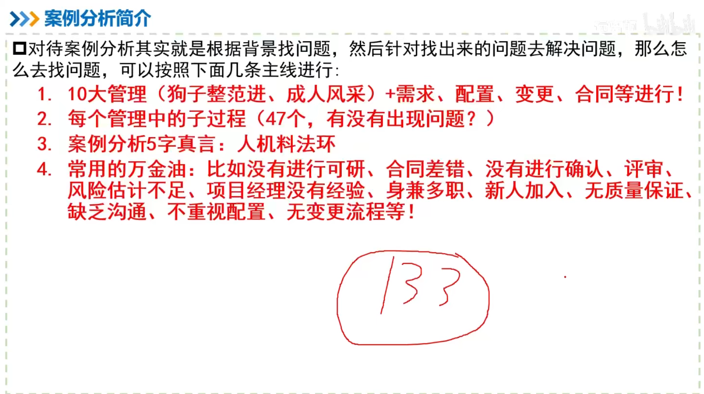
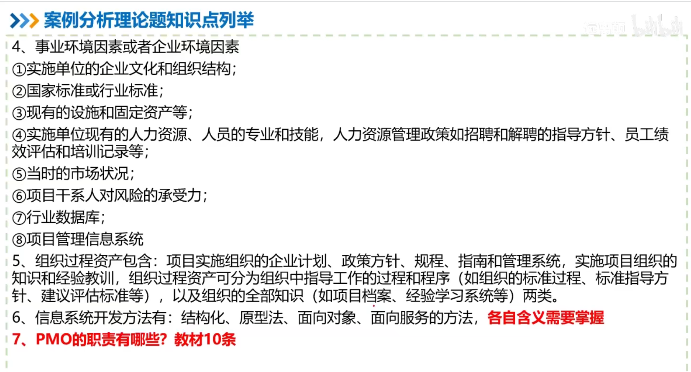

### 案例分析简介

### 中项案例分析考试大纲

### 中项案例分析考试大纲-历年考点大数据分析

### 案例分析复习建议

### 案例分析答题技巧

### 案例分析答题模板

### 案例分析理论题历年考点分析

### 案例分析理论题知识点列举

#### 项目管理一般知识

#### 立项管理

#### 整体管理

#### 范围管理

#### 进度管理

#### 成本管理

#### 质量管理

#### 人力资源管理

#### 沟通管理、干系人管理

#### 合同管理

#### 采购管理

#### 配置管理

#### 变更管理

#### 风险管理

#### 收尾管理

