### 关键路径

从起点到终点最大长度为关键路径，关键路径上活动之和为总工期，关键路径上活动为关键活动。

关键路径分析是通过对各条路径的分析，**用时最长的那条路径为关键路径**，关键路径只有一个决定因素就是路径用时，如果有两个或两个以上的路径长度一样，就有**可能存在多个关键路径**。**项目进度用时是由关键路径决定的，在关键路径上的活动叫做关键活动**，其时差为零，如果关键路径中的一个活动延迟，将会影响整个项目计划。在项目进展过程中，由于资源平衡，关键路径可能用时缩短，比其他的路径用时还少，这时关键路径就发生变更。**关键路径并不包含全部项目活动，因此关键路经不能包括所有项目进度控制点。**


**活动历时估算的依据有：**

活动清单、活动清单属性、项目范围说明书、项目成本估算、活动资源需求、资源可用性、组织的过程资产和风险记录。

**赶进度、赶工：**

对成本和进度进行权衡，确定如何尽量少增加费用的前提下最大限度地缩短项目所需要的时间。

**快速跟进：**

调整逻辑关系，**通过对各种逻辑关系并行确定来缩短项目周期**。在进行项目设计中，当风险不大时，通过精心安排而使项目的前后阶段相互搭接以加快项目进展速度的做法叫快速跟进。

**资源平衡:** 

资源平衡是一种进度网络分析技术，**用于已经利用关键路线法分析过的进度模型之中**。资源平衡的用途是调整时间安排需要满足规定交工日期的计划活动，处理只有在某些时间动用或只能动用有限数量的必要的共用或关键资源的局面，或者用于在项目工作具体时间段按照某种水平均匀地使用选定资源。这种均匀使用资源的办法可能会改变原来的关键路线。**使资源利用更合理，会导致进度计划延长**。调整任务的时间安排以使得资源不被过分使用，这被称为资源平衡。**资源平衡通常不会被用来缩短进度。**

**资源日历：**

在项目日历上定义的工作时间和休息日是每个资源或资源组的默认工作时间。换句话说，资源日历初始确定为项目日历。

**工作量**

是指完成一项活动或其他项目单元所需的人工单位的数量。通常用人小时、人日或人周表示。工作量=项目规模／单个资源的工作效率。


### **项目进度网络图**

项目进度网络图使用图形来展示项目各计划活动及逻辑关系（依赖关系），同时要附有简要的文字，来说明活动排序使用的基本方法。凡不寻常的活动序列均应在这段文字中加以详细说明。

**编制项目进度网络图**

可以采用前导图法（Precedence Diagramming Method，PDM）或者箭线圈法(Arrow Diagramming Method，ADM)，它们都是的具体绘图方法。

**活动排序的输入包括：**

项目范围说明书、活动清单、活动属性、里程碑清单、批准的变更请求。

**制定进度计划的输出包括：**

项目进度表、进度模型数据、进度基准、资源要求（更新）、活动属性（更新）、项目日历（更新）、请求的变更、项目管理计划（更新）、进度管理计划（更新）。


### **计划评审技术（PERT)——三点估算法**

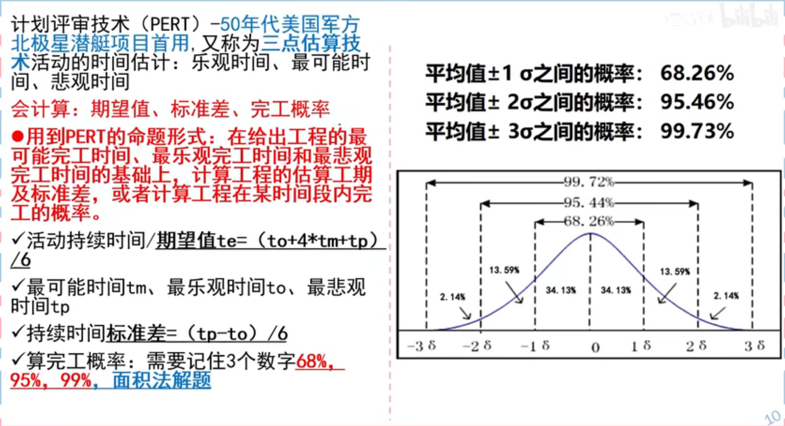

#### **例题1：**

```
完成活动A所需的时间，悲观（P）的估计需36天，最可能（ML）的估计需21天，乐观（O）的估计需6天。活动A在16天至26天内完成的概率是（ ）。
A. 55.70%
B. 68.26%
C. 95.43%
D. 99.73%
```

**答案：**B

**解析：**

在PERT网络计划中，某些活动或全部工序的持续时间事先不能准确肯定，适用于不可预知因素较多的、过去未曾做过的新项目或复杂的项目，或研制新产品的工作中。

使用PERT计划评审技术估算某活动i，j的历时Di，j，其公式为：

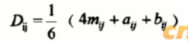

其中：

​     mij为完成活动i，j所需的最可能时间；

​     aij为完成活动i，j所需的乐观估计时间；

​     bij为完成活动i，j所需的被关估计时间。

​     其估算的方差为：

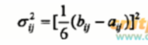

根据上述公式，完成活动A需要的历时为：

​          （4*21+6+36）/6=126/6=21天

其估算的方差为：

​          （36-6）/6=5天

因PERT方法估算出的活动历时概率分布符合标准的正态分布，固活动A在一个方差（21-5,21+5）内完成的概率为68.26%。

#### 例题2：

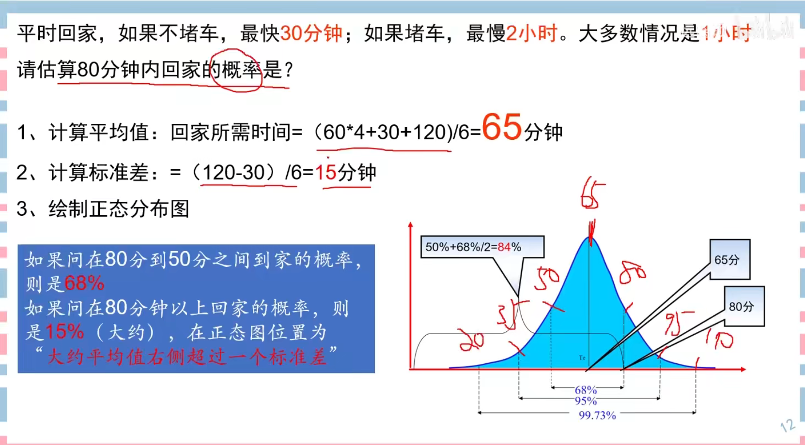

### **活动资源估算所采用的主要方法和技术**

**1．专家判断**

在评价本过程同资源有关的依据时，经常要求利用专家判断。任何具有资源规划与估算专门知识的集体或个人都可以提供这方面的专业知识。
**2．多方案分析**

很多计划活动都可利用多种形式完成。其中包括利用各种水平的资源能力或技能，各种大小或类型的机器，各种工具（手工操作或自动化工具），以及有关资源自制或购买的决策。

**3．出版的估算数据**

有许多公司定期更新并出版不同国家与各国不同地理位置资源的生产率和单价，这些数据涉及门类众多的各工种劳动力、材料与设备。

**4．项目管理软件**

项目管理软件能够协助规划、组织与管理备用资源，并提出资源估算。软件的复杂程度彼此之问相差悬殊，不但可用来确定资源日历，而且还可以确定资源分解结构、资源的有无与多寡，以及资源单价。

**5．自下而上估算**

当估算计划活动无足够把握时，则将其范围内的工作进一步分解。然后估算下层每个更具体的工作资源需要，接着将这些估算按照计划活动需要的每一种资源汇集出总量。计划活动之间可能存在也可能不存在影响资源利用的依赖关系。如果存在，资源的这种利用方式反映在计划活动的要求估计之中，并形成文件。


### 单代号网络图和双代号网络图

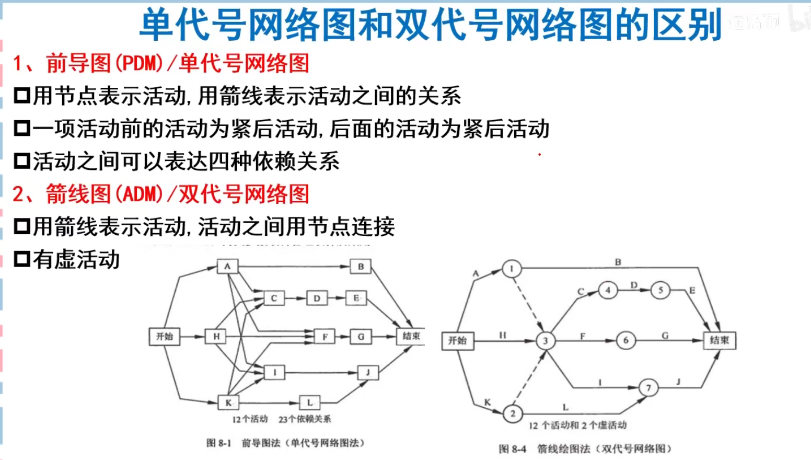

#### **前导图法活动之间存在的4种类型依赖关系：**

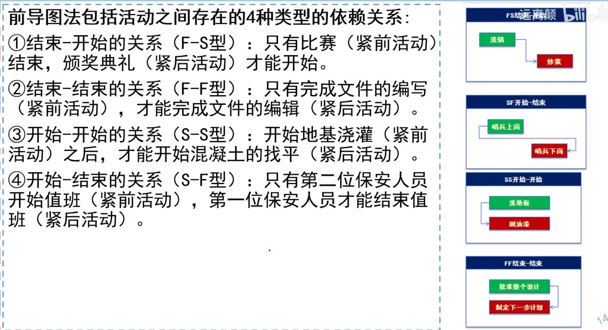

#### 单代号网络图

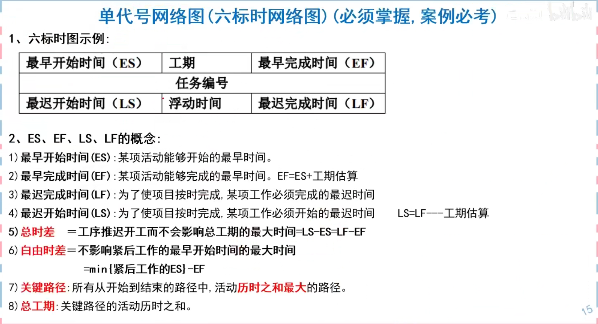


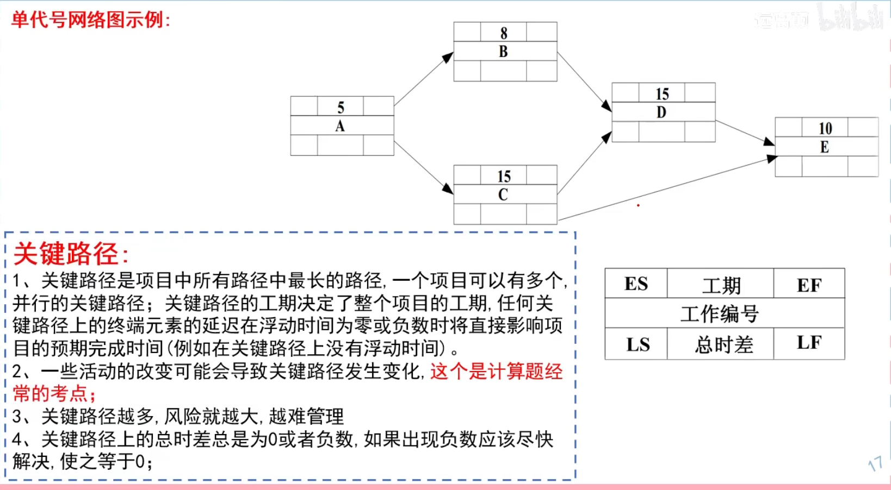

**Tips：**

最早开始/结束活动时间：从前往后推

最迟开始/结束活动时间：从后往前推

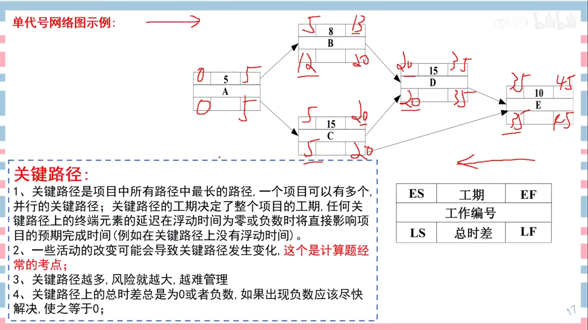

 ##### 例题1


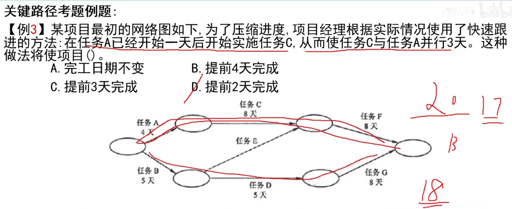


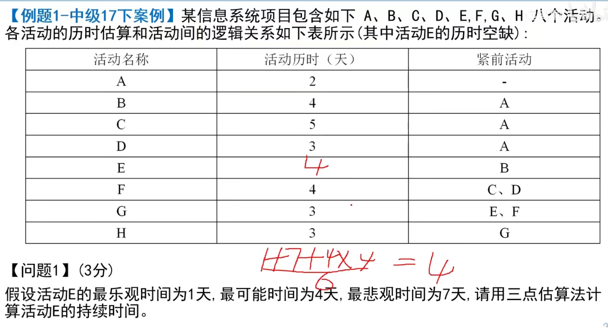


