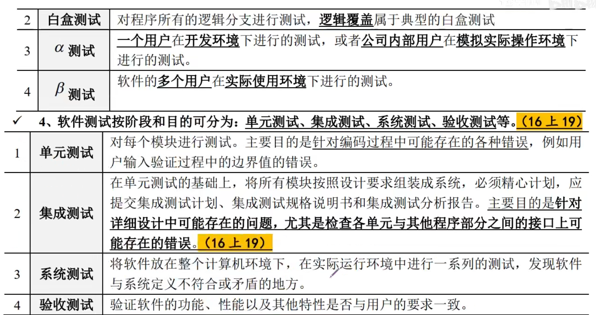
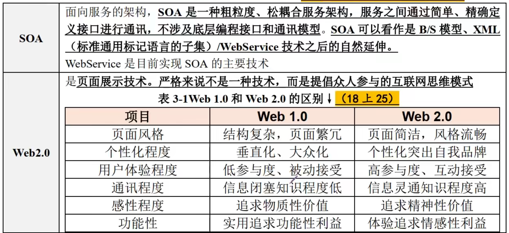

## 信息系统集成专业技术知识 

### 考点1、2：系统集成的特点、信息系统的生命周期

### 考点3：信息系统的开发方法

### 考点4：信息系统设计

### 考点5：设备、DBMS及技术选项

### 考点6：软件需求

### 考点7：软件测试

### 考点8：软件维护

### 考点9：软件质量保证和质量评价

### 考点10：软件复用

### 考点11：面向对象

### 考点12：UML

### 考点13：软件架构

### 考点14：软件中间件

### 考点15：数据库和数据仓库

### 考点16： Web Service

### 考点17：J2EE和.NET

### 考点18：软件引擎技术

### 考点19：组件

## 计算机网络知识

### 考点1：OSI模型

### 考点2：网络的分类

### 考点3 网络交换技术

### 考点4：网络存储技术

### 考点5：无线网络技术、网络接入技术

### 考点6 网络接入技术

### 考点7：综合布线工程、网络设计

### 考点8：网络安全

## 新一代网络技术

### 考点1：物联网

### 考点2：云计算

### 考点3：互联网+

### 考点4：大数据

### 考点5：移动互联网

### 考点6：智慧城市

 ### 考点7：智能制造2025与工业4.0、人工智能

### 考点8：区块链

### 重要考点9：IPV6

### 考点10：4G/5G技术、操作系统、一带一路

